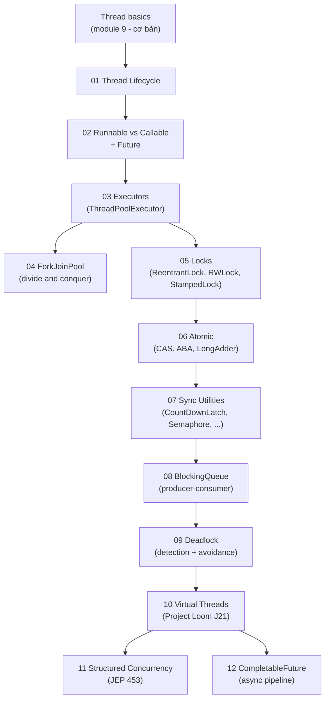

# Module 11 — Concurrency Advanced

> Module mở rộng tách từ `module_9_multithreading`. Tập trung vào `java.util.concurrent` — phần kiến thức **bắt buộc** ở vị trí senior backend.

## Tổng quan

## Mục lục

| # | Folder | Chủ đề | Phụ thuộc |
|---|--------|--------|-----------|
| 01 | [`01_thread_lifecycle/`](01_thread_lifecycle/concept.md) | Thread states, transition diagram, daemon | — |
| 02 | [`02_runnable_vs_callable/`](02_runnable_vs_callable/concept.md) | `Runnable` vs `Callable`, `Future`, `FutureTask` | 01 |
| 03 | [`03_executors/`](03_executors/concept.md) | `ThreadPoolExecutor` chuẩn, antipattern `newCachedThreadPool` | 02 |
| 04 | [`04_fork_join_pool/`](04_fork_join_pool/concept.md) | Divide & conquer với `RecursiveTask`/`RecursiveAction` | 03 |
| 05 | [`05_locks/`](05_locks/concept.md) | `ReentrantLock`, `ReadWriteLock`, `StampedLock` | 03 |
| 06 | [`06_atomic/`](06_atomic/concept.md) | `Atomic*`, CAS, ABA, `LongAdder` | 05 |
| 07 | [`07_sync_utilities/`](07_sync_utilities/concept.md) | `CountDownLatch`, `CyclicBarrier`, `Semaphore`, `Phaser` | 03 |
| 08 | [`08_blocking_queue/`](08_blocking_queue/concept.md) | Producer-Consumer pattern, `BlockingQueue` | 03 |
| 09 | [`09_deadlock_demo/`](09_deadlock_demo/concept.md) | Deadlock, livelock, starvation, lock ordering | 05 |
| 10 | [`10_virtual_threads/`](10_virtual_threads/concept.md) | Java 21 Project Loom — JEP 444 | 03 |
| 11 | [`11_structured_concurrency/`](11_structured_concurrency/concept.md) | `StructuredTaskScope` — JEP 453 | 10, 12 |
| 12 | [`12_completable_future/`](12_completable_future/concept.md) | Async pipeline, timeout, retry | 02, 03 |

## Tham chiếu chính

- *Java Concurrency in Practice* — Brian Goetz, Tim Peierls, Joshua Bloch (sách bắt buộc đọc).
- [java.util.concurrent — Doug Lea](https://gee.cs.oswego.edu/dl/concurrency-interest/).
- JLS §17 — Threads and Locks ([`module_1_concepts/09_jmm.md`](../module_1_concepts/09_jmm.md)).
- [JEP 444: Virtual Threads](https://openjdk.org/jeps/444).
- [JEP 453: Structured Concurrency](https://openjdk.org/jeps/453).

## Quy tắc đọc module này

1. Mọi chương đều có `concept.md` giải thích lý thuyết + pitfall + interview Q.
2. Code demo có thể chứa **race condition cố ý** để minh hoạ — luôn đọc comment.
3. Một số demo cần **Java 21+** (virtual threads, structured concurrency, scoped values).
4. Lab profiling: dùng `jstack`, `jcmd`, JMC, `async-profiler` — xem [`module_1_concepts/13_memory_leaks_profiling.md`](../module_1_concepts/13_memory_leaks_profiling.md).
