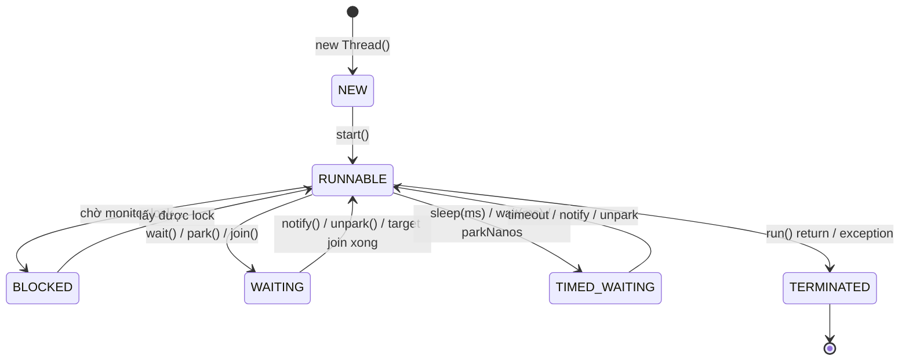

# 01 — Thread Lifecycle

## Lý thuyết

Mỗi `Thread` trong Java có **1 trong 6 trạng thái** (`Thread.State` enum):



| State | Khi nào |
|-------|---------|
| `NEW` | đã tạo, chưa `start()` |
| `RUNNABLE` | đang chạy CPU **hoặc** đợi CPU schedule (không phân biệt) hoặc đợi I/O blocking |
| `BLOCKED` | đợi vào `synchronized` block đang bị thread khác giữ |
| `WAITING` | `Object.wait()`, `Thread.join()`, `LockSupport.park()` không timeout |
| `TIMED_WAITING` | `Thread.sleep(ms)`, `wait(ms)`, `join(ms)`, `parkNanos`, `parkUntil` |
| `TERMINATED` | `run()` đã hoàn tất hoặc throw uncaught exception |

> **Lưu ý**: JVM không phân biệt thread đang chạy CPU và thread đang block I/O — cả 2 đều là `RUNNABLE`. Nếu cần biết, dùng `jstack` hoặc OS tool.

## Daemon thread

```java
thread.setDaemon(true);   // BẮT BUỘC gọi trước start()
```

- JVM thoát khi mọi **non-daemon** thread kết thúc (kể cả daemon còn chạy → bị kill cứng).
- Use case: GC, JIT compiler, finalizer, monitoring thread, scheduled task background.
- **Không** dùng cho task I/O quan trọng — bị kill giữa chừng có thể corrupt data.

## Interrupt — cooperative cancellation

Java **không có** `Thread.stop()` an toàn (deprecated). Cách dừng thread chuẩn là **interrupt**:

```java
thread.interrupt();   // set flag interrupt
```

Trong worker:

```java
while (!Thread.currentThread().isInterrupted()) {
    try {
        Thread.sleep(100);
    } catch (InterruptedException e) {
        Thread.currentThread().interrupt();   // re-set flag!
        break;
    }
}
```

### Quy tắc xử lý `InterruptedException` (rất quan trọng)

`Thread.sleep`, `Object.wait`, `BlockingQueue.take`, `Future.get` ném `InterruptedException` **VÀ XOÁ** flag interrupt → bạn phải:

1. **Re-throw** lên caller (tốt nhất — preserve thông tin), HOẶC
2. **Set lại flag** bằng `Thread.currentThread().interrupt();`.

KHÔNG bao giờ:

- `catch (InterruptedException) { /* ignore */ }` — phá khả năng cancel toàn bộ chuỗi.
- `catch (InterruptedException e) { log("oops"); }` — quên flag.

## Thread name & UncaughtExceptionHandler

```java
Thread t = new Thread(task, "WorkerPool-1");        // tên có ý nghĩa cho jstack
t.setUncaughtExceptionHandler((thread, ex) -> log.error("Uncaught", ex));
```

Mọi production thread **phải** có tên + handler. Default handler chỉ in stderr — production rất dễ mất exception.

## Pitfall

- **`stop()`, `suspend()`, `resume()`** đều deprecated (có thể corrupt state).
- **`Thread.yield()`** chỉ là *hint* — không có guarantee.
- **Flag `volatile boolean stop`** vẫn hợp lệ, nhưng `interrupt` mạnh hơn vì xử lý được cả `sleep`/`wait` đang block.
- **Đếm thread bằng `ThreadGroup`** đã legacy. Dùng `Thread.getAllStackTraces()`.
- **`Thread.getState()`** chỉ là snapshot — đọc xong có thể đã đổi.

## Câu hỏi phỏng vấn

1. 6 thread state là gì? Khác nhau giữa `WAITING` và `BLOCKED`?
2. Tại sao `RUNNABLE` không phân biệt đang chạy CPU và đợi I/O?
3. Daemon thread khác user thread thế nào?
4. Vì sao `Thread.stop()` deprecated?
5. Cách dừng thread đúng?
6. Khi `catch (InterruptedException)`, phải làm gì?
7. `Thread.sleep(0)` có ý nghĩa gì? (Hint: tương đương `yield`.)
8. Mỗi thread tốn bao nhiêu memory? (Default `Xss` ~ 512 KB - 1 MB stack.)

## Tham chiếu

- [`Thread` Javadoc](https://docs.oracle.com/en/java/javase/21/docs/api/java.base/java/lang/Thread.html)
- [`Thread.State` enum](https://docs.oracle.com/en/java/javase/21/docs/api/java.base/java/lang/Thread.State.html)
- *Java Concurrency in Practice* — Chapter 7: Cancellation and Shutdown.
- [JEP 444: Virtual Threads](https://openjdk.org/jeps/444) — virtual thread không có state mới, dùng cùng enum.
