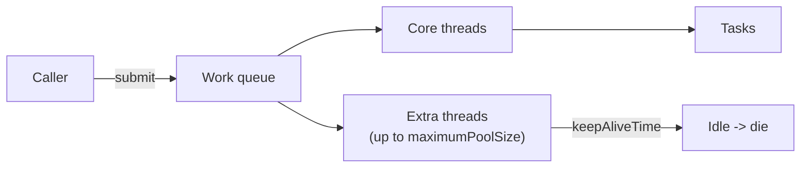

# 03 — Executors & `ThreadPoolExecutor`

## Lý thuyết

Tạo thread thủ công (`new Thread(...)`) tốn kém + khó manage. `ExecutorService` (Java 5+) là abstraction:

- **Tách rời** task submission và task execution.
- **Tái sử dụng** thread (pool) → giảm cost.
- **Bounded resource** — control tổng số thread + queue.



## `ThreadPoolExecutor` — 7 tham số

```java
new ThreadPoolExecutor(
    int corePoolSize,
    int maximumPoolSize,
    long keepAliveTime, TimeUnit unit,
    BlockingQueue<Runnable> workQueue,
    ThreadFactory threadFactory,
    RejectedExecutionHandler handler
);
```

### Quy luật điều phối khi submit task

1. Nếu `running threads < corePoolSize` → tạo thread mới chạy ngay.
2. Còn lại → enqueue vào `workQueue`.
3. Nếu queue **full** & `running threads < maximumPoolSize` → tạo thread mới (extra).
4. Nếu queue full **và** thread = max → gọi `RejectedExecutionHandler`.
5. Extra thread idle vượt `keepAliveTime` → bị xoá.

### `ThreadFactory`

Tạo `Thread` với:

- **Name** dễ debug (`"orders-worker-1"`).
- `setDaemon(false/true)` rõ ràng.
- `UncaughtExceptionHandler` — log exception bị unhandled (rất quan trọng production).

### `RejectedExecutionHandler` — 4 chính sách built-in

| Class | Hành vi |
|-------|---------|
| `AbortPolicy` (default) | Throw `RejectedExecutionException` |
| `CallerRunsPolicy` | Caller tự chạy task → **back-pressure tự nhiên** |
| `DiscardPolicy` | Silently drop |
| `DiscardOldestPolicy` | Drop oldest in queue, retry submit |

→ Trong production, **`CallerRunsPolicy` + bounded queue** là combo phổ biến nhất.

## `Executors` factory antipatterns

| Factory | Vấn đề |
|---------|--------|
| `Executors.newFixedThreadPool(n)` | `LinkedBlockingQueue()` **không bound** → producer nhanh hơn consumer → OOM heap |
| `Executors.newCachedThreadPool()` | `SynchronousQueue` + `Integer.MAX_VALUE` thread → traffic burst → tạo hàng nghìn thread → OOM/native error |
| `Executors.newSingleThreadExecutor()` | Cũng dùng `LinkedBlockingQueue()` không bound |
| `ForkJoinPool.commonPool()` | Shared toàn JVM — task I/O block sẽ ảnh hưởng `parallelStream`, `CompletableFuture` default |

→ **Khuyến nghị**: tạo `ThreadPoolExecutor` thủ công, chọn:

- `BlockingQueue` **bounded** (`ArrayBlockingQueue(N)`).
- Max pool size = computed (xem sizing dưới).
- `CallerRunsPolicy` để bị overload.

## Sizing thread pool

| Workload | Công thức |
|----------|----------|
| **CPU-bound** | core ≈ `Runtime.availableProcessors()` |
| **I/O-bound** | core ≈ `N_cores × U × (1 + W/C)` (Little's law) |

Trong đó:
- `U` = utilization mục tiêu (0..1).
- `W` = wait time per task (I/O).
- `C` = compute time per task.

→ I/O ratio cao (vd HTTP call 200 ms, compute 10 ms) → thread cần >> số core.

> **Java 21 virtual threads** giải quyết bài toán này — không cần tính sizing nữa cho I/O. Xem [`10_virtual_threads/`](../_10_virtual_threads/concept.md).

## Shutdown đúng

```java
pool.shutdown();                  // không nhận task mới, đợi running tasks xong
boolean ok = pool.awaitTermination(30, SECONDS);
if (!ok) pool.shutdownNow();      // interrupt running tasks
```

KHÔNG `kill -9` JVM — task có thể đang giữ resource. Production luôn có shutdown hook:

```java
Runtime.getRuntime().addShutdownHook(new Thread(() -> {
    pool.shutdown();
    try { pool.awaitTermination(30, SECONDS); } catch (InterruptedException ignored) {}
}));
```

## Spring `@Async` & ExecutorService

Spring Boot mặc định dùng `SimpleAsyncTaskExecutor` cho `@Async` (KHÔNG phải pool!) → mỗi call tạo thread mới. Phải config `ThreadPoolTaskExecutor` rõ ràng:

```java
@Bean
ThreadPoolTaskExecutor taskExecutor() {
    var ex = new ThreadPoolTaskExecutor();
    ex.setCorePoolSize(10);
    ex.setMaxPoolSize(50);
    ex.setQueueCapacity(200);
    ex.setRejectedExecutionHandler(new ThreadPoolExecutor.CallerRunsPolicy());
    ex.initialize();
    return ex;
}
```

## Pitfall

- **Submit `Runnable`** → exception không hiện đâu hết. Wrap qua `Callable` + `Future.get()` để bắt.
- **`shutdown()` không cancel running tasks** — chỉ cấm submit thêm.
- **`shutdownNow()` chỉ interrupt** — task không xử lý interrupt sẽ chạy tiếp.
- **Shared `commonPool`** — `parallelStream`, `CompletableFuture.async` mặc định dùng nó. Tránh I/O blocking ở đây.
- **Pool quá to** → context switch overhead, OS scheduler kém. Đo bằng `jstack` xem có quá nhiều BLOCKED.

## Câu hỏi phỏng vấn

1. 7 tham số của `ThreadPoolExecutor` là gì?
2. Vì sao `Executors.newFixedThreadPool` được coi là antipattern?
3. `Executors.newCachedThreadPool` rủi ro gì?
4. Liệt kê 4 chính sách rejection. Production thường chọn cái nào?
5. Sizing pool cho CPU-bound vs I/O-bound khác nhau ra sao?
6. `shutdown()` vs `shutdownNow()`?
7. Vì sao virtual threads (J21) thay đổi cách nghĩ về pool?
8. Làm sao bắt exception trong task submitted?

## Tham chiếu

- [`ThreadPoolExecutor` Javadoc](https://docs.oracle.com/en/java/javase/21/docs/api/java.base/java/util/concurrent/ThreadPoolExecutor.html)
- *Java Concurrency in Practice* — Chapter 8: Applying Thread Pools.
- [Brian Goetz — Executors antipatterns](https://www.infoworld.com/article/2071829/java-concurrency-tale-of-an-overburdened-thread-pool.html)
