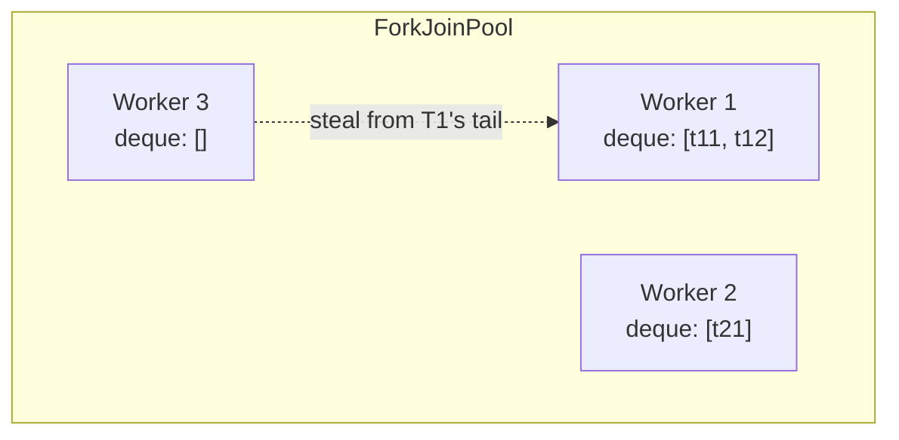

# 04 — `ForkJoinPool` & Divide-and-Conquer

## Lý thuyết

`ForkJoinPool` (Java 7, JEP 155) là loại pool đặc biệt với 2 đặc điểm chính:

1. **Work-stealing**: thread idle tự "steal" task từ deque của thread khác → cân bằng tải tự nhiên.
2. **Recursive task** (`fork`/`join`) — phù hợp với divide-and-conquer.



Mỗi worker có **deque riêng**. Push/pop ở đầu (LIFO — nhanh, cache-friendly), steal ở đuôi (FIFO — giảm contention).

## API

### `RecursiveTask<V>` — trả giá trị

```java
class Sum extends RecursiveTask<Long> {
    protected Long compute() {
        if (small) return sequentialSum();
        var left  = new Sum(...);  left.fork();      // submit, không đợi
        var right = new Sum(...);
        long r = right.compute();                     // self-compute
        return left.join() + r;                       // đợi left
    }
}
```

### `RecursiveAction` — void

```java
class Sort extends RecursiveAction {
    protected void compute() {
        if (small) { sortSequential(); return; }
        invokeAll(new Sort(left), new Sort(right));   // đợi cả 2
    }
}
```

### `commonPool` — JVM-wide

```java
ForkJoinPool.commonPool()
```

- Mặc định parallelism = `Runtime.availableProcessors() - 1`.
- Dùng bởi:
  - `Stream.parallel()`.
  - `CompletableFuture.supplyAsync(...)` (default executor).
  - `Arrays.parallelSort`.

→ **Đừng** chạy I/O blocking ở đây — sẽ chiếm worker, ảnh hưởng cả ứng dụng.

## Khi nào dùng ForkJoin

| Use case | Phù hợp? |
|----------|----------|
| Sort/search large array | yes |
| Tree traversal | yes |
| Aggregation (sum, max, ...) | yes |
| Image processing | yes |
| Web request handling | **không** (I/O bound) |
| Database query | **không** |
| File I/O | **không** |

→ I/O work nên dùng `ThreadPoolExecutor` thường hoặc **virtual threads**.

## So sánh với `ThreadPoolExecutor`

| | `ThreadPoolExecutor` | `ForkJoinPool` |
|-|----------------------|-----------------|
| Mục tiêu | I/O + general | CPU divide-and-conquer |
| Queue | 1 shared (BlockingQueue) | mỗi thread 1 deque |
| Work-stealing | không | **có** |
| Task | `Runnable` / `Callable` | `ForkJoinTask` (`RecursiveTask`/`Action`) |
| Reuse trong recursion | tệ (thread block đợi sub-task) | tốt (`compute` không block thread thực sự) |

> Note: từ Java 9, `ForkJoinPool` cũng implement `ExecutorService` đầy đủ — submit `Callable`/`Runnable` thường được. Nhưng chỉ tận dụng work-stealing tốt khi dùng `RecursiveTask`/`Action`.

## Pitfall

- **`fork().get()` vs `compute()` cho task tự thân**: nên `compute()` 1 nửa, `fork()+join()` 1 nửa — như demo. Tránh `fork().get()` cho cả 2 (lãng phí 1 thread).
- **Threshold size** cho base case: nhỏ quá → overhead fork; to quá → mất song song. Thử nghiệm `1k - 10k` thường hợp lý.
- **Throw exception** trong task → `join()` re-throw. `RuntimeException` tự bị wrap qua `ForkJoinTask`.
- **Common pool parallelism**:
  - `-Djava.util.concurrent.ForkJoinPool.common.parallelism=N`.
  - Chạy trên container cgroup nhỏ thì JVM tự nhận `Runtime.availableProcessors()` đúng (J10+).
- **Block I/O** → dùng `ManagedBlocker` để pool tạm tăng worker:
  ```java
  ForkJoinPool.managedBlock(blocker);   // hint pool: tôi sắp block, mở thêm thread
  ```

## Câu hỏi phỏng vấn

1. ForkJoinPool khác ThreadPoolExecutor ở đâu?
2. Work-stealing là gì? Vì sao tốt hơn shared queue cho CPU work?
3. `fork()` và `compute()` khác nhau như thế nào? Nên dùng cái nào cho task "tự thân"?
4. ParallelStream dùng pool nào? Có vấn đề gì khi block I/O?
5. Common pool size mặc định là bao nhiêu? Cách tăng?
6. `ManagedBlocker` để làm gì?
7. Vì sao virtual threads (J21) làm ForkJoinPool ít quan trọng hơn cho I/O?

## Tham chiếu

- [`ForkJoinPool` Javadoc](https://docs.oracle.com/en/java/javase/21/docs/api/java.base/java/util/concurrent/ForkJoinPool.html)
- [`RecursiveTask`](https://docs.oracle.com/en/java/javase/21/docs/api/java.base/java/util/concurrent/RecursiveTask.html)
- [JEP 155: Concurrency Updates (J7)](https://openjdk.org/jeps/155)
- *Java Concurrency in Practice* — Section 11.4: Reducing lock contention.
- [Doug Lea — A Java Fork/Join Framework](https://gee.cs.oswego.edu/dl/papers/fj.pdf)
