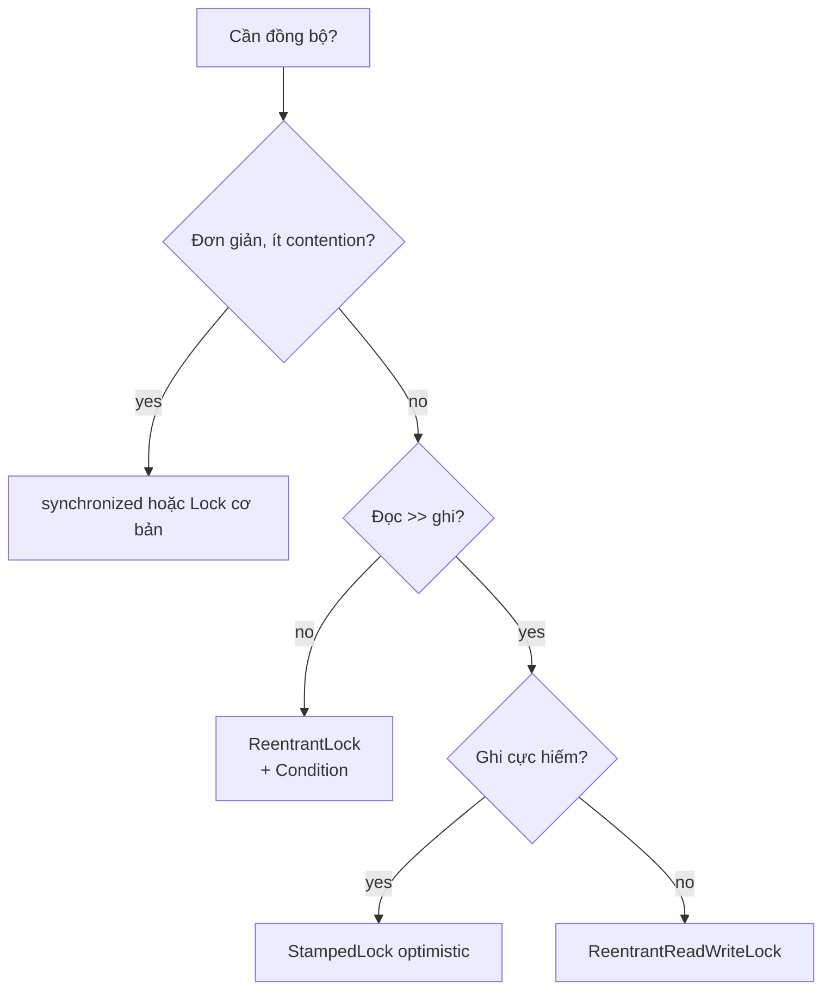

# 05 — Locks: `ReentrantLock`, `ReadWriteLock`, `StampedLock`

## Lý thuyết

Java 5 thêm package `java.util.concurrent.locks` cung cấp **explicit lock** linh hoạt hơn `synchronized`.

| Lock | Mục đích | Reentrant | Fair option | Conditions |
|------|----------|-----------|-------------|-----------|
| `ReentrantLock` | exclusive | yes | yes | nhiều |
| `ReentrantReadWriteLock` | RW shared/exclusive | yes | yes | nhiều |
| `StampedLock` (J8) | RW + optimistic | **no** | no | không (nhưng tích hợp tốt với CAS) |

## `ReentrantLock` vs `synchronized`

| | `synchronized` | `ReentrantLock` |
|-|----------------|-----------------|
| Reentrant | yes | yes |
| Fairness | no | option (`new ReentrantLock(true)`) |
| `tryLock()` | no | yes |
| `tryLock(timeout)` | no | yes — tránh deadlock |
| `lockInterruptibly()` | no | yes — cancel được khi đợi |
| Multiple condition | 1 (`wait/notify`) | nhiều (`newCondition()`) |
| Auto release | yes (block scope) | **không** — phải `unlock()` trong `finally` |
| Performance (J8+) | ngang | ngang |

→ Default chọn `synchronized` (đơn giản, ít lỗi). Khi cần **timeout / interruptible / nhiều condition / fair** → `ReentrantLock`.

## Pattern dùng `ReentrantLock` an toàn

```java
lock.lock();
try {
    // critical section
} finally {
    lock.unlock();      // BẮT BUỘC trong finally — nếu không sẽ leak lock
}
```

Quên `unlock()` → các thread khác chờ vô hạn.

## `Condition` — thay `wait/notify`

```java
private final Condition notFull  = lock.newCondition();
private final Condition notEmpty = lock.newCondition();

public void put(...) {
    lock.lock();
    try {
        while (full) notFull.await();
        ...
        notEmpty.signal();
    } finally { lock.unlock(); }
}
```

**Lợi ích**: tách biệt "không đầy" và "không rỗng" → `signal` chính xác → tránh wake up nhầm.

## `ReadWriteLock`

```java
rw.readLock().lock();   // nhiều reader song song
rw.writeLock().lock();  // 1 writer độc quyền
```

Khi **đọc >> ghi**, cải thiện throughput đáng kể vs `synchronized`.

Vấn đề:

- **Writer starvation**: nếu reader liên tục → writer không bao giờ được lock. Cài fairness mode để tránh.
- **Lock upgrade** (read → write) **không tự động** → phải release read trước, có race window.

## `StampedLock` (Java 8)

3 mode:

```java
long stamp = sl.writeLock();        // exclusive
sl.unlockWrite(stamp);

long stamp = sl.readLock();         // shared
sl.unlockRead(stamp);

long stamp = sl.tryOptimisticRead();
double v = field;
if (!sl.validate(stamp)) {
    // fallback to readLock()
}
```

**Optimistic read** không acquire lock thực — chỉ trả `stamp` (version). Đọc field rồi `validate(stamp)`. Nếu writer đã commit giữa chừng → stamp invalid → fallback đọc bằng `readLock`.

→ Throughput cực cao khi **ghi hiếm**.

⚠️ Pitfall:

- **Không reentrant** — gọi `readLock` 2 lần trong cùng thread sẽ deadlock.
- Không có `Condition`.
- Không hỗ trợ try-with-resources tự nhiên.

## Khi chọn lock nào



## Pitfall

1. **Quên `unlock()` trong `finally`** → leak lock → deadlock toàn app.
2. **`StampedLock` không reentrant** — đệ quy hoặc gọi callback giữ lock dễ chết.
3. **Lock upgrade** từ read → write không tự động ở `ReentrantReadWriteLock` — cần release read trước (có race).
4. **Fairness mode tốn performance** — chỉ bật khi cần.
5. **`Condition.await()` spurious wakeup** — luôn dùng `while (!cond) await();` không phải `if`.
6. **Lock + GC** — đừng giữ lock khi gọi method có thể allocate nặng → kéo dài critical section.

## Câu hỏi phỏng vấn

1. `synchronized` vs `ReentrantLock`?
2. Vì sao phải `unlock()` trong `finally`?
3. `Condition` thay thế `wait/notify` để làm gì?
4. `tryLock(timeout)` giúp giải quyết bug gì? (Deadlock.)
5. `ReadWriteLock` khi nào hơn `ReentrantLock`?
6. `StampedLock` optimistic read hoạt động như thế nào?
7. `StampedLock` có reentrant không? Có Condition không?
8. Spurious wakeup là gì? Cách phòng?

## Tham chiếu

- [`ReentrantLock`](https://docs.oracle.com/en/java/javase/21/docs/api/java.base/java/util/concurrent/locks/ReentrantLock.html)
- [`ReadWriteLock`](https://docs.oracle.com/en/java/javase/21/docs/api/java.base/java/util/concurrent/locks/ReadWriteLock.html)
- [`StampedLock`](https://docs.oracle.com/en/java/javase/21/docs/api/java.base/java/util/concurrent/locks/StampedLock.html)
- *Java Concurrency in Practice* — Chapter 13: Explicit Locks.
