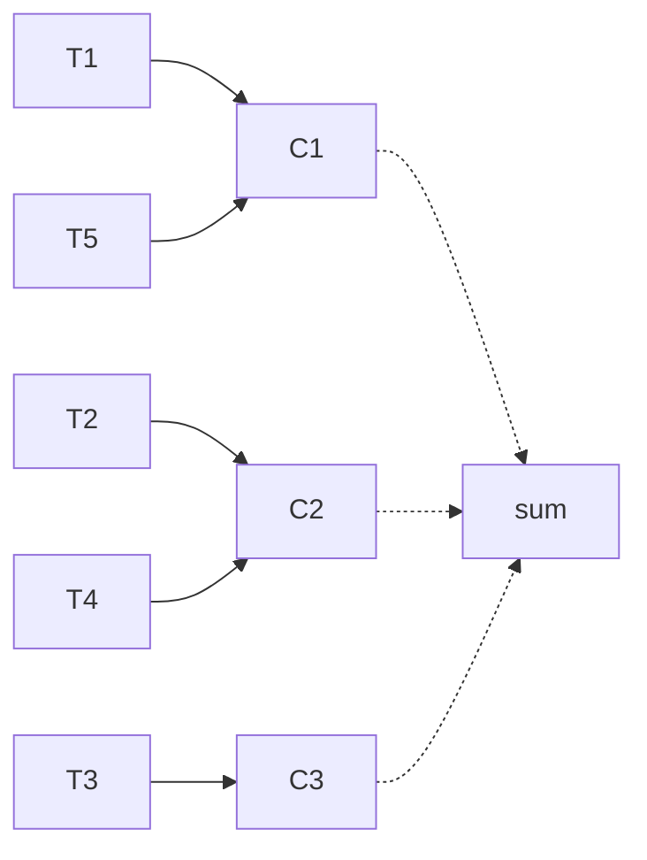

# 06 — Atomic, CAS, `LongAdder`, ABA

## Lý thuyết

`java.util.concurrent.atomic` cung cấp class **lock-free** dựa trên **CAS** (Compare-And-Swap).

### CAS — Compare-And-Swap

CPU instruction (x86: `LOCK CMPXCHG`, ARM: `LL/SC`) đảm bảo atomic:

```
CAS(addr, expected, newValue):
    if (*addr == expected) {
        *addr = newValue;
        return true;
    } else {
        return false;
    }
```

Java expose qua `Atomic*.compareAndSet(expected, newValue)`. Pattern dùng:

```java
do {
    oldVal = ref.get();
    newVal = compute(oldVal);
} while (!ref.compareAndSet(oldVal, newVal));
```

→ Đây là **CAS retry loop** — non-blocking. Thread không bị suspend, chỉ retry khi đụng.

## Atomic class chính

| Class | Mô tả |
|-------|-------|
| `AtomicInteger`, `AtomicLong`, `AtomicBoolean` | primitive wrapper |
| `AtomicReference<V>` | object reference |
| `AtomicIntegerArray`, `AtomicLongArray`, `AtomicReferenceArray` | array element atomic |
| `AtomicMarkableReference` | reference + 1-bit flag |
| `AtomicStampedReference` | reference + stamp (tránh ABA) |
| `LongAdder`, `DoubleAdder` (J8) | counter striped (xem dưới) |
| `LongAccumulator` (J8) | `LongAdder` cho function bất kỳ |
| `VarHandle` (J9) | low-level atomic ops bất kỳ field |

## Khi nào atomic > lock?

- **Counter / sequence** đơn giản → `AtomicLong`/`LongAdder`.
- **Lock-free data structure**: stack, queue dùng CAS.
- **Hot path** với contention thấp → `synchronized` cũng nhanh không kém.
- Contention **cao** → atomic tốt hơn lock thông thường nhiều lần.

## ABA problem

Bug kinh điển của CAS:

```
T1: read A
T2: change A -> B -> A (back to A, but state changed)
T1: CAS(A, A') succeeds!  ← nhưng thực tế đã có thay đổi
```

Ví dụ lock-free stack: pop A khỏi stack, push lại với cùng node A → CAS không phát hiện.

### Cách phòng

- `AtomicStampedReference` — gắn stamp tăng dần mỗi lần modify:
  ```java
  ref.compareAndSet(expectedRef, newRef, expectedStamp, expectedStamp + 1);
  ```
- `AtomicMarkableReference` — flag 1 bit (đủ cho boolean state).

## `LongAdder` — striped counter

Khi contention cao trên `AtomicLong.incrementAndGet`, mọi thread CAS cùng cell → retry rất nhiều → throughput sụp.

`LongAdder` chia counter thành **nhiều cell** (1 per CPU core ý tưởng), thread phân tán ghi:



`sum()` cộng tất cả cell. Trade-off: **read tốn hơn** nhưng **write rẻ hơn nhiều**.

| | `AtomicLong` | `LongAdder` |
|-|--------------|--------------|
| Memory | 1 long | nhiều cell (lazy alloc) |
| Write contention thấp | đều nhanh | đều nhanh |
| Write contention cao | **chậm** (CAS retry) | **nhanh** |
| Read | O(1) | O(cells) |
| Use case | sequence, ID gen | metric counter, hit count |

## `VarHandle` (Java 9, JEP 193)

Thay `Unsafe` API trước đây — cung cấp atomic ops trên field bất kỳ:

```java
private static final VarHandle V_HANDLE;
static {
    try {
        V_HANDLE = MethodHandles.lookup()
            .findVarHandle(MyClass.class, "field", long.class);
    } catch (Exception e) { throw new Error(e); }
}

V_HANDLE.compareAndSet(this, expected, newValue);
V_HANDLE.getAcquire(this);
V_HANDLE.setRelease(this, x);
```

Cấp độ memory ordering: `plain`, `opaque`, `acquire/release`, `volatile`.

## Memory ordering

CAS atomic = full **volatile** semantic (acquire + release barrier). Đảm bảo `happens-before` xuyên thread (xem [`module_1_concepts/09_jmm.md`](../../module_1_concepts/09_jmm.md)).

## Pitfall

- **CAS retry storm** dưới contention cực cao → CPU 100% nhưng throughput thấp. Đo qua flame graph.
- **ABA** trong lock-free data structure — luôn dùng stamp.
- **`compareAndSwap`** với `Double` chú ý NaN comparison; nên dùng `Double.doubleToRawLongBits` qua `AtomicLong`.
- **`AtomicLong` không = thread-safe class** — chỉ atomic ops trên field đó.
- **`LongAdder.sum()` không atomic snapshot** — nếu có concurrent write, sum có thể không khớp một thời điểm cụ thể.

## Câu hỏi phỏng vấn

1. CAS là gì? Compare instruction CPU nào hỗ trợ?
2. Vì sao atomic không cần lock?
3. ABA problem là gì? Cách phòng?
4. `LongAdder` khác `AtomicLong` ở đâu?
5. `LongAdder.sum()` có atomic snapshot không?
6. Khi nào dùng atomic, khi nào dùng lock?
7. `VarHandle` là gì? Thay thế cái gì?
8. CAS retry loop có phải "lock-free" thật không? (Có — thread nào complete cũng đảm bảo progress của hệ thống.)

## Tham chiếu

- [`java.util.concurrent.atomic` overview](https://docs.oracle.com/en/java/javase/21/docs/api/java.base/java/util/concurrent/atomic/package-summary.html)
- [`LongAdder` Javadoc](https://docs.oracle.com/en/java/javase/21/docs/api/java.base/java/util/concurrent/atomic/LongAdder.html)
- [JEP 193: Variable Handles](https://openjdk.org/jeps/193)
- *Java Concurrency in Practice* — Chapter 15: Atomic Variables and Nonblocking Synchronization.
