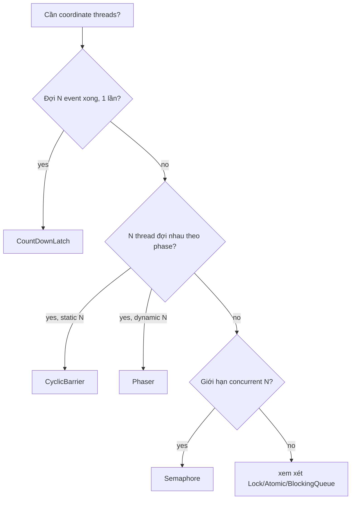

# 07 — Sync Utilities: `CountDownLatch`, `CyclicBarrier`, `Semaphore`, `Phaser`

`java.util.concurrent` cung cấp 4 utility chính cho coordination giữa threads. Mỗi cái phục vụ pattern riêng — phải dùng đúng tool.

## So sánh nhanh

| | `CountDownLatch` | `CyclicBarrier` | `Semaphore` | `Phaser` |
|-|------------------|------------------|-------------|----------|
| Mục đích | đợi N sự kiện | N thread đợi nhau | giới hạn concurrent N | barrier phân tán theo phase |
| Phiên bản | J5 | J5 | J5 | J7 |
| Reusable | **không** | có | có | có |
| Số party có thể đổi | không | không | n/a | **có** |
| Có barrier action | không | có | không | có (override `onAdvance`) |
| Use case kinh điển | startup gate, test wait | parallel batch theo phase | connection pool, rate limit | dynamic worker pool |

## `CountDownLatch`

```java
CountDownLatch latch = new CountDownLatch(N);

// Producer (gọi N lần)
latch.countDown();

// Consumer (block 1 lần)
latch.await();
```

- Counter giảm dần. Khi về 0 → mọi thread đợi `await()` được unblock.
- **Một lần duy nhất** — về 0 rồi không reset được. Nếu cần reset → dùng `CyclicBarrier`.

### Pattern 1: Startup gate

```java
CountDownLatch start = new CountDownLatch(1);
// N worker thread:
start.await(); doWork();
// main:
start.countDown();   // tất cả worker bắt đầu cùng lúc
```

### Pattern 2: Wait for completion

```java
CountDownLatch done = new CountDownLatch(N);
for (int i = 0; i < N; i++) pool.submit(() -> { work(); done.countDown(); });
done.await();   // đợi tất cả xong
```

## `CyclicBarrier`

```java
CyclicBarrier barrier = new CyclicBarrier(N, () -> onPhaseEnd());

for (int phase = 0; phase < phases; phase++) {
    workForThisPhase();
    barrier.await();   // đợi đủ N -> tất cả cùng tiếp
}
```

- Tự reset sau mỗi lần đủ N → "cyclic".
- Có **barrier action** chạy bởi 1 trong N thread khi đủ — set up cho phase sau (e.g. swap buffer, log).
- Nếu 1 thread bị interrupt khi đợi → barrier **broken**, tất cả nhận `BrokenBarrierException`.

Use case: simulation step, parallel matrix operation theo phase, game frame.

## `Semaphore`

```java
Semaphore permits = new Semaphore(N, fair);
permits.acquire();        // blocks if 0
try { criticalSection(); }
finally { permits.release(); }
```

- Counting semaphore — N permit.
- `tryAcquire()` non-blocking, `tryAcquire(timeout)` time-bound.
- **Permit không thuộc thread cụ thể** — thread A `acquire`, thread B có thể `release` → flexible nhưng dễ leak.

Use case:

- **Connection pool** — N kết nối DB.
- **Rate limit** — chỉ N request đồng thời tới external API.
- **Bounded concurrency** — không muốn parallelStream/CompletableFuture overload downstream.

```java
// Bounded parallelism với CompletableFuture
Semaphore sem = new Semaphore(10);
List<CompletableFuture<X>> fs = items.stream().map(item ->
    CompletableFuture.supplyAsync(() -> {
        sem.acquireUninterruptibly();
        try { return slowApi(item); }
        finally { sem.release(); }
    }, executor)
).toList();
```

## `Phaser` (Java 7)

`CyclicBarrier++` — hỗ trợ:

- **Dynamic party count**: `register()`, `arriveAndDeregister()`.
- **Hierarchy**: phaser con `register` lên phaser cha.
- Override `onAdvance(int phase, int registered)` để control khi nào terminate.

```java
Phaser phaser = new Phaser(1);   // main party
for (int i = 0; i < workers; i++) {
    phaser.register();
    new Thread(() -> {
        for (int p = 0; p < phases; p++) {
            doWork(p);
            phaser.arriveAndAwaitAdvance();
        }
        phaser.arriveAndDeregister();
    }).start();
}
phaser.arriveAndDeregister();
```

Use case: dynamic worker pool, monte-carlo simulation thêm worker giữa chừng.

## Pitfall

- **`CountDownLatch` không reset** — đếm hết là xong. Cần reset → dùng `CyclicBarrier`.
- **`CyclicBarrier.await()` BrokenBarrierException** — 1 thread interrupt → cả barrier bị fail. Đảm bảo handle.
- **`Semaphore` permit leak** — quên release trong `finally` → pool dần cạn.
- **Fair vs unfair `Semaphore`** — fair giảm throughput nhưng tránh starvation. Default unfair.
- **`Phaser` complexity** — chỉ dùng khi thực sự cần dynamic. CountDownLatch/CyclicBarrier đủ trong 90% case.
- **Không nên** đợi sync utility khi giữ lock khác → dễ deadlock.

## Cây quyết định



## Câu hỏi phỏng vấn

1. `CountDownLatch` vs `CyclicBarrier` khác gì?
2. Khi nào `Phaser` hơn `CyclicBarrier`?
3. `Semaphore.release()` có cần thread đã `acquire()` không?
4. Fair semaphore tốn gì?
5. Cách rate-limit `CompletableFuture` (10 concurrent max)?
6. `BrokenBarrierException` xảy ra khi nào?
7. Dùng `CountDownLatch` để bench thread (start cùng lúc) ra sao?

## Tham chiếu

- [`CountDownLatch`](https://docs.oracle.com/en/java/javase/21/docs/api/java.base/java/util/concurrent/CountDownLatch.html)
- [`CyclicBarrier`](https://docs.oracle.com/en/java/javase/21/docs/api/java.base/java/util/concurrent/CyclicBarrier.html)
- [`Semaphore`](https://docs.oracle.com/en/java/javase/21/docs/api/java.base/java/util/concurrent/Semaphore.html)
- [`Phaser`](https://docs.oracle.com/en/java/javase/21/docs/api/java.base/java/util/concurrent/Phaser.html)
- *Java Concurrency in Practice* — Section 5.5: Synchronizers.
