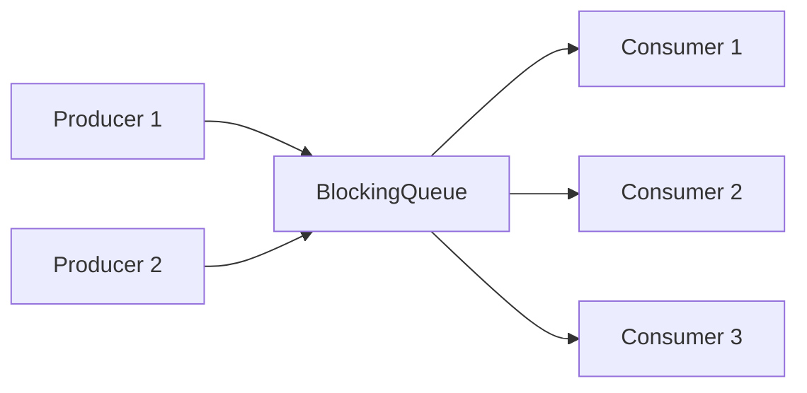

# 08 — `BlockingQueue` & Producer-Consumer

## Lý thuyết

`BlockingQueue<E>` là interface trung tâm cho pattern **producer-consumer** — tách rời tốc độ producer và consumer, làm buffer giữa 2 thành phần.



## 4 cặp method

| Operation | Throw exception | Special value | Block | Time-bound |
|-----------|-----------------|----------------|--------|-----------|
| Insert | `add(e)` | `offer(e)` | `put(e)` | `offer(e, t, u)` |
| Remove | `remove()` | `poll()` | `take()` | `poll(t, u)` |
| Examine | `element()` | `peek()` | n/a | n/a |

→ Production thường dùng **`put`/`take`** (blocking) hoặc **`offer`/`poll` với timeout** (graceful shutdown).

## Implementations chính

| Class | Bounded | Order | Cấu trúc | Đặc biệt |
|-------|---------|-------|----------|----------|
| `ArrayBlockingQueue` | **bắt buộc** | FIFO | array + 1 lock | Cấp memory cố định, predictable |
| `LinkedBlockingQueue` | optional (default: `Integer.MAX_VALUE`!) | FIFO | linked node + 2 locks (head + tail) | Throughput cao hơn ArrayBQ vì 2 lock |
| `SynchronousQueue` | 0 | n/a | hand-off | Producer block đến khi consumer lấy. Dùng trong `Executors.newCachedThreadPool` |
| `PriorityBlockingQueue` | unbounded | by `Comparable` | heap | Order theo priority |
| `DelayQueue` | unbounded | by deadline | heap | Element implement `Delayed`, `take()` chỉ trả khi deadline ≤ now |
| `LinkedTransferQueue` (J7) | unbounded | FIFO | linked, lock-free + sync | `transfer()` block đến khi consumer take |
| `LinkedBlockingDeque` | optional | double-ended | linked | Ưu tiên cho work-stealing custom |

> **Cảnh báo**: `LinkedBlockingQueue()` no-arg = unbounded → producer nhanh hơn consumer = **OOM**. Luôn pass capacity.

## Producer-Consumer pattern

### Loop chuẩn

```java
// Producer
while (running) {
    Event e = produce();
    queue.put(e);   // block khi queue full
}

// Consumer
while (running) {
    Event e = queue.take();   // block khi empty
    consume(e);
}
```

### Shutdown — Poison pill pattern

```java
sealed interface Event permits LogEvent, ShutdownEvent {}

// Producer khi xong
queue.put(new ShutdownEvent());

// Consumer
while (true) {
    Event e = queue.take();
    if (e instanceof ShutdownEvent) return;
    process(e);
}
```

Với nhiều consumer → put N poison pill (mỗi consumer ăn 1 cái) hoặc dùng `volatile boolean running` + `interrupt`.

### Multiple producer + multiple consumer

`BlockingQueue` thread-safe — N producer + M consumer hợp lệ. Throughput tốt nhất khi N ≈ M ≈ số core.

## Use case thực tế

- **Log async** — main thread `offer` log entry, dedicated thread flush ra disk.
- **Task queue** — chính là internal của `ThreadPoolExecutor`.
- **Pipeline batch processing** — stage 1 → queue → stage 2 → queue → stage 3.
- **Backpressure** — bounded queue + `put()` block → tốc độ producer tự throttle theo consumer.
- **Rate limit** — producer đẩy event, consumer xử lý chậm hơn → tự nhiên giới hạn.

## So sánh `SynchronousQueue` vs `LinkedTransferQueue`

`SynchronousQueue`:
- Capacity = 0.
- `put` block đến khi `take`.
- Direct hand-off, không có buffer.
- Dùng cho thread pool muốn **mỗi task đẩy thẳng vào worker** (không queue trung gian).

`LinkedTransferQueue` (J7):
- Có buffer + `transfer()` (block đến khi consumer lấy).
- Lock-free CAS internal — nhanh hơn.
- Best practice cho mọi single producer/consumer mới (J7+).

## Pitfall

- **`LinkedBlockingQueue` no-arg** = unbounded → OOM.
- **`PriorityBlockingQueue` size unlimited** → producer fast → OOM.
- **Element nhỏ** trong `LinkedBlockingQueue` tốn nhiều memory hơn `ArrayBlockingQueue` vì node overhead.
- **`take()` không timeout** trong consumer → không thể shutdown gracefully. Dùng `poll(timeout)` hoặc poison pill.
- **Mất exception** trong consumer thread → nuốt event. Wrap với try/catch + log.
- **`offer` trả false** khi full → producer phải xử lý (drop, retry, hoặc fail).

## Câu hỏi phỏng vấn

1. 4 cặp method của `BlockingQueue` khác gì nhau?
2. `ArrayBlockingQueue` vs `LinkedBlockingQueue` chọn cái nào?
3. `LinkedBlockingQueue()` no-arg có vấn đề gì?
4. `SynchronousQueue` có size bao nhiêu? Dùng làm gì?
5. Poison pill pattern là gì?
6. Backpressure tự nhiên xảy ra như thế nào với BlockingQueue?
7. Producer 2, Consumer 1 — chọn implementation nào?
8. `ThreadPoolExecutor` mặc định dùng queue nào? Nguy hiểm gì?

## Tham chiếu

- [`BlockingQueue`](https://docs.oracle.com/en/java/javase/21/docs/api/java.base/java/util/concurrent/BlockingQueue.html)
- *Java Concurrency in Practice* — Section 5.3: Blocking Queues and the Producer-Consumer Pattern.
