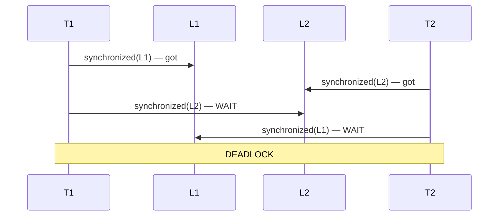

# 09 — Deadlock, Livelock, Starvation

## Lý thuyết

### Deadlock — 4 điều kiện Coffman

Deadlock xảy ra khi cả 4 điều kiện sau đều đúng:

1. **Mutual exclusion** — resource chỉ 1 thread giữ tại thời điểm bất kỳ.
2. **Hold and wait** — thread giữ resource và đợi resource khác.
3. **No preemption** — resource không thể bị thu hồi cưỡng chế.
4. **Circular wait** — chuỗi T1 → T2 → ... → Tn → T1 mỗi cái đợi cái sau.

→ Phá **bất kỳ** điều kiện nào = phòng deadlock.

### Ví dụ kinh điển



`synchronized` là deadlock cứng — `interrupt()` không cứu được, phải kill JVM.

## Phân biệt deadlock / livelock / starvation

| | Triệu chứng | Tiến triển | Cách thoát |
|-|-------------|------------|-----------|
| **Deadlock** | thread đứng yên (BLOCKED) | không có | break circular wait |
| **Livelock** | thread chạy nhưng không tiến triển | có hoạt động, không kết quả | random backoff |
| **Starvation** | 1 thread lâu không được CPU/lock | hệ thống vẫn chạy | fair scheduling |

### Livelock ví dụ

2 người trong hành lang né nhau cùng lúc cùng phía → vẫn di chuyển, không qua được.

Java code:

```java
while (!canProceed()) yieldAndRetry();   // mãi không proceed
```

**Cách phòng**: random backoff giữa mỗi retry.

### Starvation

- Priority cao luôn được schedule → priority thấp đói.
- `synchronized` non-fair → thread bị "đói" lock.
- Reader trong `ReadWriteLock` non-fair có thể đói writer.

## 5 cách phòng/giải deadlock

### 1. Lock ordering — phá circular wait

Luôn lấy lock theo **cùng 1 thứ tự** (sort theo `id`, `System.identityHashCode`, hoặc thứ tự fixed). Mọi thread tuân theo → không có cycle.

```java
Account a = from.id < to.id ? from : to;
Account b = from.id < to.id ? to   : from;
synchronized (a) { synchronized (b) { ... } }
```

### 2. `tryLock` với timeout

Phá điều kiện **hold and wait**: nếu không lấy được trong timeout → release lock đang giữ và retry sau:

```java
if (lockA.tryLock(100, MS)) {
    try {
        if (lockB.tryLock(100, MS)) {
            try { /* do work */ } finally { lockB.unlock(); }
        }
    } finally { lockA.unlock(); }
}
```

→ Đảm bảo dùng **`ReentrantLock`** thay `synchronized`.

### 3. Open call — không giữ lock khi gọi external

```java
// BAD
synchronized (lock) {
    listener.onEvent(e);   // listener có thể acquire lock khác
}

// GOOD
EventCopy copy;
synchronized (lock) { copy = state.snapshot(); }
listener.onEvent(copy);   // không giữ lock nữa
```

### 4. Single-threaded confinement

Tất cả mutable state thuộc 1 thread duy nhất, các thread khác giao tiếp qua `BlockingQueue`. Pattern này = actor model.

### 5. Immutable / lock-free

Object immutable không cần lock. Lock-free data structure (atomic CAS) cũng không deadlock được.

## Detection

### `jstack` / `jcmd Thread.print`

```bash
jcmd <pid> Thread.print
# hoặc
jstack <pid>
```

Output có dòng:

```
Found one Java-level deadlock:
=============================
"t2": waiting to lock <0xabc> (a Object), held by "t1"
"t1": waiting to lock <0xdef> (a Object), held by "t2"
```

→ JVM tự detect monitor deadlock và in.

### Programmatic — `ThreadMXBean`

```java
ThreadMXBean bean = ManagementFactory.getThreadMXBean();
long[] dead = bean.findDeadlockedThreads();
if (dead != null) {
    ThreadInfo[] info = bean.getThreadInfo(dead, true, true);
    // log + alert
}
```

Production tips: monitor task chạy mỗi 30s, alert nếu detect.

> JVM **không** detect deadlock của `Lock` / `Semaphore` / `BlockingQueue` đầy đủ — chỉ phát hiện monitor (synchronized) deadlock. `ReentrantLock` deadlock cũng được detect (J6+).

## Anti-pattern thường gặp

1. **`synchronized (this)` lặp đi lặp lại** trong nhiều method → public API caller có thể `synchronized(obj)` từ ngoài → deadlock với code nội bộ. → Dùng `private final Object lock = new Object();`.
2. **Static initializer cycle** — `class A` static init gọi `class B`, B static init gọi A → tự deadlock single-threaded. JVM phát hiện và throw.
3. **Lock từ DB transaction trong code Java** — DB cấp lock theo row/index, code Java cấp lock theo object. Hai cấp khác nhau → khó debug.
4. **Reentrancy bị phá** — viết code thread-safe nhưng dùng class lib không reentrant lồng vào.

## Câu hỏi phỏng vấn

1. 4 điều kiện Coffman cho deadlock?
2. Liệt kê 3 cách phòng deadlock.
3. Lock ordering hoạt động thế nào? Sort theo gì?
4. `tryLock` cứu deadlock bằng cách phá điều kiện nào?
5. Livelock vs deadlock?
6. Cách phát hiện deadlock production?
7. `synchronized` có thể `interrupt` được không? (Không — phải dùng `Lock.lockInterruptibly`.)
8. Vì sao không nên `synchronized (this)` cho public API?

## Tham chiếu

- *Java Concurrency in Practice* — Chapter 10: Avoiding Liveness Hazards.
- [`ThreadMXBean`](https://docs.oracle.com/en/java/javase/21/docs/api/java.management/java/lang/management/ThreadMXBean.html)
- [Coffman et al, 1971 — System Deadlocks](https://dl.acm.org/doi/10.1145/356586.356588)
