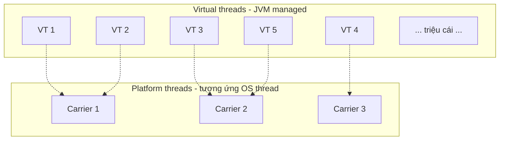

# 10 — Virtual Threads (Java 21, JEP 444)

## Lý thuyết

**Virtual threads** là loại thread mới được JVM quản lý (không phải OS thread):

- **Cực rẻ** — tạo và destroy ~1µs, mỗi cái chỉ vài KB memory.
- **Số lượng**: tạo hàng **triệu** virtual thread cùng lúc bình thường.
- **API tương thích** 100% với `Thread` cổ điển — code sync block không cần đổi.



Khi virtual thread block (I/O, `sleep`, `lock`) → JVM **unmount** nó khỏi carrier, để carrier chạy virtual thread khác. Khi unblock → schedule lại lên carrier.

→ **I/O blocking không còn tốn 1 OS thread**.

## API

### Tạo virtual thread

```java
Thread.ofVirtual().name("vt").start(runnable);
Thread.ofVirtual().unstarted(runnable);          // không start ngay
Thread.startVirtualThread(runnable);             // shortcut
```

### Executor virtual-per-task

```java
try (ExecutorService exec = Executors.newVirtualThreadPerTaskExecutor()) {
    for (int i = 0; i < 1_000_000; i++) {
        exec.submit(() -> sleepAndPrint());
    }
}   // close — đợi tất cả task xong
```

Mỗi task chạy trên 1 virtual thread mới. Không cần config size pool.

### Phân biệt

```java
Thread.currentThread().isVirtual();
Thread.ofPlatform().start(...);        // platform (OS) thread
Thread.ofVirtual().start(...);         // virtual thread
```

## Trước vs Sau (mental model)

| | Trước J21 | Sau J21 |
|-|-----------|---------|
| I/O blocking | tốn 1 OS thread + ~1MB | tốn 1 vt + vài KB |
| HTTP server scale | bị giới hạn ~ N pool size | giới hạn bởi memory + CPU |
| Code style | `CompletableFuture`/Reactive (callback hell) | sync block đơn giản |
| Sizing pool | quan trọng | không cần |
| `ThreadLocal` overhead | nhỏ | có thể lớn (nhiều vt) → dùng `ScopedValue` |

## Pinning

Virtual thread bị **pin** vào carrier (không thể unmount) khi:

1. Block bên trong **`synchronized`** block (J21–J23).
2. Đang trong **JNI native call**.

Khi pin → carrier kẹt theo, lãng phí. Tệ nhất nếu pin xảy ra trên I/O lâu.

### Cách phát hiện

```bash
java -Djdk.tracePinnedThreads=full -jar app.jar
```

In stack trace mỗi lần pin.

### Cách tránh

- Thay `synchronized` → `ReentrantLock` (J21+ đã handle park đúng).
- Tách JNI critical section ngắn.

> **Java 24 (JEP 491)** đã fix `synchronized` không còn pin nữa — nâng cấp khi có thể.

## Khi nào dùng

| Use case | Virtual threads? |
|----------|------------------|
| HTTP server I/O bound | **rất nên** |
| Microservice chain (API call A → B → C) | **rất nên** |
| Database query nhiều, song song | **rất nên** |
| CPU-bound (sort, image, math) | **không** — vẫn dùng platform / ForkJoin |
| Tight loop không block | không lợi gì |
| Có nhiều `synchronized` lock cũ | cẩn thận pinning |
| `ThreadLocal` nặng | xem xét `ScopedValue` |

## Ảnh hưởng đến framework

- **Spring Boot 3.2+** — `spring.threads.virtual.enabled=true` để Tomcat dùng vt.
- **Tomcat 10.1+** — hỗ trợ vt thread pool.
- **JDBC drivers** cần update để không dùng synchronized (nhiều driver còn pin).
- **Reactive (WebFlux, Mono)** — vẫn có chỗ đứng cho streaming, backpressure, nhưng nhiều use case I/O đơn giản nên xem xét vt + sync code.

## `ThreadLocal` & ScopedValue

Mỗi virtual thread có `ThreadLocal` riêng → 1 triệu vt × 1 entry = 1 triệu entry → memory lớn.

Java 21+ giới thiệu **`ScopedValue`** (JEP 446 preview, J23 official) — read-only context truyền theo scope, share giữa nhiều vt:

```java
ScopedValue<String> USER = ScopedValue.newInstance();
ScopedValue.where(USER, "alice").run(() -> {
    // bên trong này USER.get() == "alice"
    childTask();   // child vt cũng thấy
});
```

→ Thay `ThreadLocal` cho dữ liệu request-scoped.

## Pitfall

- **`ThreadLocal` quá nhiều entry** với 1M virtual thread → memory.
- **Pinning** với `synchronized` nặng + I/O → bottleneck.
- **Connection pool size** — vẫn phải bound số connection DB. Vt + 1M task = 1M lệnh DB → DB chết. Dùng `Semaphore`/connection pool.
- **Profiling** — thread dump 1M thread khổng lồ. JFR có support đặc biệt cho vt.
- **Carrier pool** mặc định `availableProcessors()` — config qua `-Djdk.virtualThreadScheduler.parallelism=N`.

## Câu hỏi phỏng vấn

1. Virtual thread khác platform thread thế nào?
2. Khi virtual thread block I/O, carrier làm gì?
3. Pinning là gì? Khi nào xảy ra?
4. Khi nào KHÔNG nên dùng virtual thread?
5. `ThreadLocal` với 1M vt có vấn đề gì? Giải pháp?
6. Vẫn cần connection pool DB khi có vt không? Vì sao?
7. Thread pool sizing còn quan trọng với vt không?
8. Spring Boot bật virtual thread như nào?

## Tham chiếu

- [JEP 444: Virtual Threads (J21)](https://openjdk.org/jeps/444)
- [JEP 491: Synchronize Virtual Threads without Pinning (J24)](https://openjdk.org/jeps/491)
- [JEP 446: Scoped Values (preview)](https://openjdk.org/jeps/446)
- [Loom Wiki — Ron Pressler](https://wiki.openjdk.org/display/loom)
- [Inside Java — Virtual Threads](https://inside.java/2023/09/19/the-state-of-loom-and-virtual-threads/)
