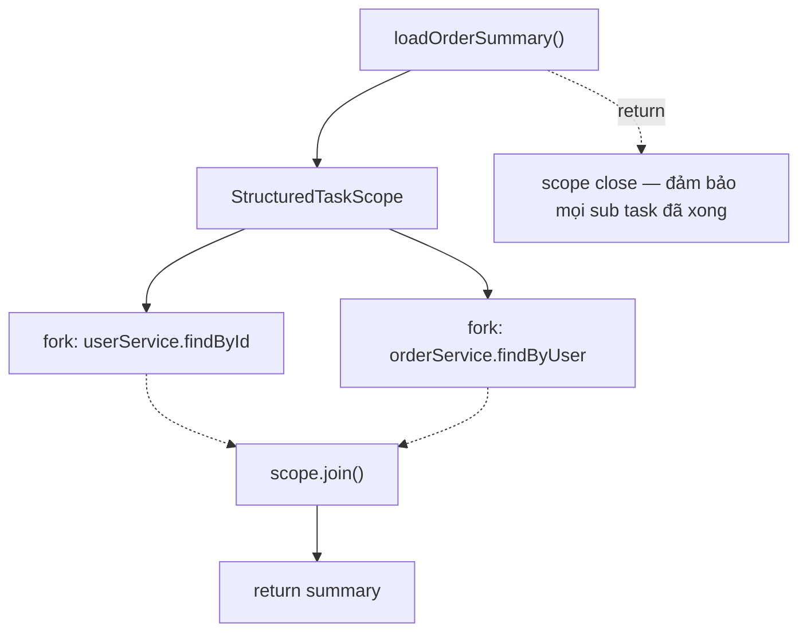

# 11 — Structured Concurrency (JEP 453 → JEP 480, Preview)

> **Trạng thái**: Preview ở Java 21 (`jdk.incubator.concurrent`), cập nhật ở J22, J23, J24. Chưa GA. Có thể thay đổi API.

## Vấn đề

Trước khi có structured concurrency, code Java async như:

```java
Future<User> userF  = pool.submit(() -> userApi.find(id));
Future<List<Order>> orderF = pool.submit(() -> orderApi.findByUser(id));

User user;       // có thể null nếu fail
List<Order> ords;
try {
    user = userF.get();    // block 1
    ords = orderF.get();   // block 2
} catch (Exception e) {
    userF.cancel(true);
    orderF.cancel(true);   // dễ quên
    throw e;
}
```

Vấn đề:

1. **Lifetime của task không bằng lifetime của caller** — task có thể "leak" ra ngoài method.
2. **Cancel không tự động propagate** — phải nhớ cancel mọi sibling khi 1 cái fail.
3. **Stack trace không có thread parent** — debug khó.
4. **Error handling phức tạp** — thread handling exception lẻ tẻ.

→ Tương tự "goto considered harmful" — async style hiện tại = "unstructured concurrency".

## Giải pháp — Structured Concurrency

Lấy cảm hứng từ [Trio (Python)](https://trio.readthedocs.io/en/stable/reference-core.html#tasks-let-you-do-multiple-things-at-once) và Kotlin coroutines.

**Nguyên tắc**: nếu code phân nhánh thành nhiều task con, mọi task con phải hoàn tất (hoặc cancel) trước khi method cha return.



## API (JEP 480 — J23 preview)

### Pattern 1: `ShutdownOnFailure`

```java
try (var scope = new StructuredTaskScope.ShutdownOnFailure()) {
    Subtask<User>        userT  = scope.fork(() -> userService.findById(id));
    Subtask<List<Order>> orderT = scope.fork(() -> orderService.findByUser(id));

    scope.join();           // đợi tất cả xong / fail
    scope.throwIfFailed();  // re-throw nếu bất kỳ fail

    return new OrderSummary(userT.get(), orderT.get());
}
```

→ **1 task fail → cancel mọi sibling** + throw exception.

### Pattern 2: `ShutdownOnSuccess`

```java
try (var scope = new StructuredTaskScope.ShutdownOnSuccess<String>()) {
    scope.fork(() -> queryServerA());
    scope.fork(() -> queryServerB());
    scope.fork(() -> queryServerC());
    scope.join();
    return scope.result();   // task đầu tiên success
}
```

→ **Task đầu tiên success → cancel còn lại** + trả result. Như `invokeAny` nhưng có lifecycle rõ ràng.

### Custom policy

```java
class CollectAll<T> extends StructuredTaskScope<T> {
    private final Queue<T> ok = new ConcurrentLinkedQueue<>();
    @Override
    protected void handleComplete(Subtask<? extends T> sub) {
        if (sub.state() == Subtask.State.SUCCESS) ok.add(sub.get());
    }
}
```

## Đặc điểm

1. **Lifetime container**: try-with-resources `scope` → mọi task fork trong scope phải xong trước khi exit block.
2. **Auto-cancel**: cancel parent scope → tự `interrupt` mọi subtask.
3. **Tree of tasks**: subtask có thể tự fork structured scope con → cây thread có cấu trúc.
4. **Combo với virtual threads**: mỗi `fork` chạy trên 1 virtual thread → cực rẻ.
5. **Stack trace cải thiện**: parent-child relationship hiện trong thread dump.

## Lợi ích so với `CompletableFuture`

| | `CompletableFuture` | Structured Concurrency |
|-|----------------------|------------------------|
| Lifetime | không bị bound bởi caller | bound trong scope |
| Cancel propagate | thủ công | tự động |
| Error handling | callback chains | exception thường |
| Code style | functional, callback | sync block |
| Debug stack trace | rời rạc | có cây |
| Compose | `thenCombine`, `allOf` | tự nhiên qua block |

→ Structured Concurrency thay thế **`invokeAll` + cancel logic** với cú pháp sạch hơn.

## Pitfall

- **Đang preview** — cú pháp đổi qua nhiều JEP (453 → 462 → 480 → 499). Code phải build với `--enable-preview`.
- **`fork` chỉ trong cùng thread chủ scope** — không được fork từ task khác.
- **`join()` bắt buộc** trước khi exit scope — nếu không, scope tự cancel hết.
- **`InterruptedException`** propagate từ `join()` — phải handle hoặc re-throw.
- **Không cho phép escape**: nếu return `Subtask` ra ngoài scope, lifetime không xác định → API ngăn.
- **Combine với `synchronized`** — vẫn pin virtual thread (xem module 10).

## Khi nào dùng

| Use case | Phù hợp? |
|----------|----------|
| Aggregate kết quả từ N service song song | yes |
| First-success race (multiple replica server) | yes |
| Batch process, fail-fast | yes |
| Long-running daemon thread | không — vt thường + executor pool tốt hơn |
| Pure CPU compute | không — ForkJoinPool tốt hơn |

## Câu hỏi phỏng vấn

1. Structured concurrency giải quyết vấn đề gì so với CompletableFuture?
2. `ShutdownOnFailure` vs `ShutdownOnSuccess` khác gì?
3. Cancel propagate hoạt động ra sao?
4. Tại sao cần `join()` trước khi exit scope?
5. Subtask chạy trên loại thread nào? (Virtual thread mặc định.)
6. Khi nào KHÔNG nên dùng structured concurrency?
7. Có thể nest scope không? (Có — tạo cây thread.)

## Tham chiếu

- [JEP 453: Structured Concurrency (Preview J21)](https://openjdk.org/jeps/453)
- [JEP 480: Structured Concurrency 3rd Preview (J23)](https://openjdk.org/jeps/480)
- [Project Loom — Structured Concurrency Notes](https://wiki.openjdk.org/display/loom/Structured+Concurrency)
- [Notes on structured concurrency (Nathaniel J. Smith — origin idea)](https://vorpus.org/blog/notes-on-structured-concurrency-or-go-statement-considered-harmful/)
