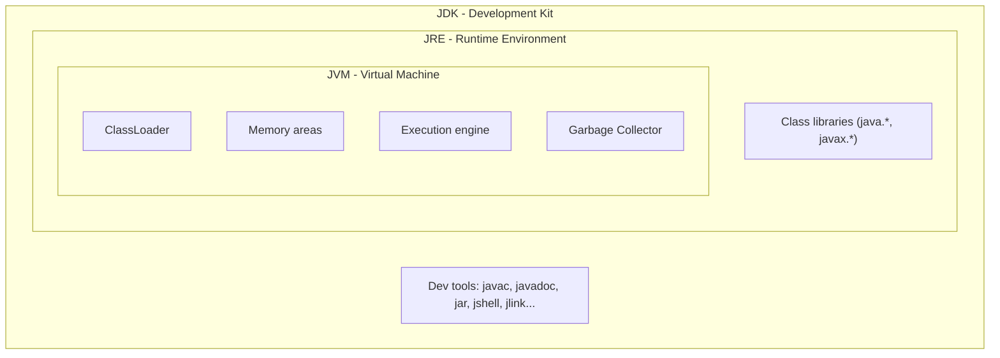

# 01 — `JDK` vs `JRE` vs `JVM`

## 1. Định nghĩa & vai trò

| Thuật ngữ | Viết tắt của | Vai trò |
|-----------|--------------|---------|
| `JVM` | Java Virtual Machine | **Máy ảo** thực thi bytecode `.class`. Là **đặc tả** (`JVMS`) — mỗi vendor tự implement (HotSpot, OpenJ9, GraalVM, Zulu Prime). |
| `JRE` | Java Runtime Environment | `JVM` + thư viện chuẩn (`java.base`, `java.util`, ...) + tài nguyên cấu hình. Đủ để **chạy** ứng dụng Java. |
| `JDK` | Java Development Kit | `JRE` + công cụ phát triển: `javac`, `javadoc`, `jar`, `jdb`, `jshell`, `jlink`, `jpackage`, `jdeps`, ... Đủ để **viết & build** ứng dụng. |

> Quan hệ: `JDK ⊃ JRE ⊃ JVM`.



---

## 2. Java SE platform là gì?

`Java SE` (Standard Edition) là **đặc tả** (`JCP/JSR`) định nghĩa:

- Ngôn ngữ Java (`JLS` — Java Language Specification).
- Máy ảo (`JVMS` — JVM Specification).
- Thư viện chuẩn (Class Libraries).

Một bản phân phối (distribution) là **implementation** của Java SE. Khi cài "Java", thực ra bạn đang cài 1 bản phân phối cụ thể.

---

## 3. Các bản phân phối (distributions) phổ biến

| Distribution | Vendor | Đặc điểm | Use case |
|--------------|--------|----------|----------|
| **OpenJDK** | Oracle + community | Reference, mã nguồn mở `GPLv2 + Classpath Exception` | Upstream cho mọi distro |
| **Oracle JDK** | Oracle | OpenJDK + commercial features (Flight Recorder cũ, ...). License `NFTC` từ Java 17 — free cả production | Enterprise muốn support Oracle |
| **Eclipse Temurin** (cũ là `AdoptOpenJDK`) | Eclipse Foundation | Build chính thống của community, được TCK certified | **Default lựa chọn cho production** |
| **Amazon Corretto** | AWS | Free, multi-platform, có security patches dài hạn | Workload trên AWS |
| **Azul Zulu / Zing** | Azul Systems | Zulu free, Zing commercial (low-pause GC `C4`) | Latency-critical (trading) |
| **Microsoft Build of OpenJDK** | Microsoft | Tối ưu cho Azure | Azure / .NET shop có Java |
| **GraalVM** | Oracle Labs | JIT thay thế (`Graal`), hỗ trợ `native-image` (AOT), polyglot | Microservice low-startup, serverless |
| **IBM Semeru** | IBM | Dùng `Eclipse OpenJ9` JVM thay HotSpot | Footprint thấp, container |
| **Liberica JDK** | BellSoft | Có phiên bản kèm `JavaFX` | Desktop app cần JavaFX |

> **Khuyến nghị mặc định cho dự án mới**: `Eclipse Temurin` (LTS) hoặc `Amazon Corretto` (LTS).

---

## 4. JVM HotSpot — implementation phổ biến nhất

`HotSpot` là JVM mặc định trong OpenJDK/Oracle JDK/Temurin. Nó được gọi là HotSpot vì phát hiện các method "nóng" (hot) để JIT compile.

Thành phần chính:

- **ClassLoader subsystem** — nạp class.
- **Runtime Data Areas** — Heap, Stack, Metaspace, ...
- **Execution Engine** — Interpreter, JIT (`C1`, `C2`), GC.
- **Native Method Interface** (`JNI`) — gọi C/C++ code.

> Xem chi tiết tại [`06_runtime_memory_areas.md`](06_runtime_memory_areas.md), [`07_jit_compilation.md`](07_jit_compilation.md).

---

## 5. Các công cụ trong `JDK`

| Lệnh | Công dụng |
|------|-----------|
| `javac` | Biên dịch `.java` → `.class` |
| `java` | Khởi động JVM, chạy class hoặc `.jar` |
| `jar` | Đóng gói class & resource thành `.jar` (zip format) |
| `javadoc` | Sinh API documentation từ Javadoc comment |
| `javap` | Disassembler — xem bytecode của `.class` |
| `jshell` | REPL (Java 9+) — gõ Java tương tác |
| `jdb` | Command-line debugger |
| `jlink` | Tạo custom runtime image (Java 9+, Project Jigsaw) |
| `jpackage` | Đóng gói app thành installer native (`.dmg`, `.exe`, ...) (Java 14+) |
| `jdeps` | Phân tích dependency giữa các class/module |
| `jps` | List process JVM đang chạy |
| `jstat` | Thống kê GC, class loading, JIT |
| `jmap` | Heap dump, histogram |
| `jstack` | Thread dump |
| `jcmd` | Multi-tool CLI gửi diagnostic command tới JVM |
| `jfr` / `jcmd JFR.*` | Java Flight Recorder — profiling production |

---

## 6. Demo — kiểm tra môi trường

```bash
$ java -version
openjdk version "21.0.2" 2024-01-16 LTS
OpenJDK Runtime Environment Temurin-21.0.2+13 (build 21.0.2+13-LTS)
OpenJDK 64-Bit Server VM Temurin-21.0.2+13 (build 21.0.2+13-LTS, mixed mode, sharing)

$ javac --version
javac 21.0.2

$ java -XshowSettings:properties -version 2>&1 | grep -E 'java.home|java.vm.name|java.runtime'
    java.home = /Library/Java/JavaVirtualMachines/temurin-21.jdk/Contents/Home
    java.runtime.name = OpenJDK Runtime Environment
    java.vm.name = OpenJDK 64-Bit Server VM
```

Một flow biên dịch & chạy điển hình:

```bash
$ echo 'public class Hello { public static void main(String[] a){ System.out.println("hi"); } }' > Hello.java
$ javac Hello.java                # sinh Hello.class
$ java -cp . Hello                # JVM nạp Hello.class, gọi main
hi
$ javap -c -p Hello.class | head  # xem bytecode
```

---

## 7. Pitfall & best practice (senior view)

- **Không cài "Java" chung chung** — luôn pin **distribution + version cụ thể** cho team (ví dụ Temurin 21.0.2). Dùng `SDKMAN!` hoặc `asdf` để quản lý.
- **JRE độc lập đã bị loại bỏ** từ Java 11 (Oracle ngừng phát hành). Thay thế bằng `jlink` để tạo runtime image tối thiểu cho ứng dụng — giảm container image size.
- **HotSpot vs OpenJ9 vs Graal**: HotSpot là default; OpenJ9 tiết kiệm RAM hơn nhưng throughput thấp hơn; GraalVM `native-image` cho startup `<100ms` nhưng peak performance có thể kém hơn HotSpot warm-up.
- **License**: Oracle JDK 8/11 cũ có `BCL` license — không dùng production miễn phí. Từ Java 17, Oracle JDK chuyển sang `NFTC` cho phép miễn phí cả production. Dù vậy, mặc định production dùng **Temurin** để tránh rủi ro pháp lý.
- **Container**: dùng JDK image như `eclipse-temurin:21-jre-alpine` (chú ý alpine dùng `musl` libc — có distro riêng `temurin-21-jdk-alpine`).

---

## 8. Câu hỏi phỏng vấn điển hình

1. Phân biệt `JDK`, `JRE`, `JVM`. Khi nào cần JDK, khi nào chỉ cần JRE?
2. Vì sao Java được gọi là *write once, run anywhere*?
3. `OpenJDK` khác `Oracle JDK` chỗ nào? Nên dùng cái nào trong production?
4. `HotSpot` là gì? Có những JVM khác không?
5. `GraalVM` khác HotSpot ở điểm nào? Khi nào dùng `native-image`?
6. Java 11 bỏ JRE độc lập — vậy làm sao để deploy ứng dụng nhỏ gọn? (gợi ý: `jlink`)
7. Tại sao một class compile bằng JDK 21 lại không chạy được trên JRE 17? (`UnsupportedClassVersionError` — major version)

---

## 9. Tham chiếu

- [JVM Specification (JVMS) — Java SE 21](https://docs.oracle.com/javase/specs/jvms/se21/html/index.html)
- [Java Language Specification (JLS) — Java SE 21](https://docs.oracle.com/javase/specs/jls/se21/html/index.html)
- [JEP 320: Remove the Java EE and CORBA Modules](https://openjdk.org/jeps/320)
- [JEP 392: Packaging Tool (`jpackage`)](https://openjdk.org/jeps/392)
- [Eclipse Temurin](https://adoptium.net/), [Amazon Corretto](https://aws.amazon.com/corretto/), [GraalVM](https://www.graalvm.org/)
