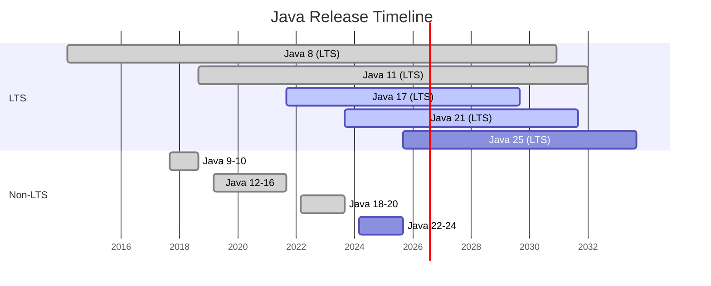

# 02 — Java Versions Timeline (8 → 21+)

## 1. Định nghĩa & vai trò

Từ Java 9 (tháng 9/2017), Oracle áp dụng **release cadence 6 tháng**: cứ 6 tháng có 1 bản Java mới. Trong đó, một số bản được đánh dấu **`LTS` (Long-Term Support)** — được vendor patch trong nhiều năm — phù hợp để chạy production.

> **Quy tắc**: dự án production luôn chọn **bản LTS gần nhất** mà ecosystem đã sẵn sàng (Spring, libraries, ...).

---

## 2. Timeline tóm tắt



Các bản **LTS**: `8` (2014), `11` (2018), `17` (2021), `21` (2023), `25` (2025), … (cứ 2 năm 1 LTS từ Java 17).

---

## 3. Feature highlights theo phiên bản

### Java 8 (LTS, 2014) — bước ngoặt functional

- **Lambda expressions** & **functional interfaces** (`@FunctionalInterface`).
- **Stream API** + **Collectors**.
- **`Optional<T>`**.
- **Method references** (`Class::method`).
- **Default & static methods** trong `interface`.
- **`java.time` API** (JSR-310) — thay `java.util.Date`/`Calendar`.
- **`CompletableFuture`**.
- **Nashorn** JavaScript engine (đã remove ở Java 15).
- **Type annotations** (`@NonNull`).
- **`PermGen` được thay bằng `Metaspace`**.

### Java 9 (2017) — Project Jigsaw

- **Module system** (`module-info.java`, `requires`, `exports`) — JEP 261.
- `jshell` REPL.
- `jlink` — tạo custom runtime image.
- `var handles`, `Stream` API mở rộng (`takeWhile`, `dropWhile`, `iterate(seed, hasNext, next)`).
- `Collection` factory: `List.of(...)`, `Map.of(...)`.
- **`G1` GC trở thành mặc định**.
- Tách `java.base`, `java.xml.bind` (JAXB) bị remove khỏi JDK.

### Java 10 (2018)

- **`var`** — local variable type inference (JEP 286).
- Application Class-Data Sharing (`AppCDS`) — JEP 310.

### Java 11 (LTS, 2018)

- **`HttpClient`** chính thức (`java.net.http`) — JEP 321.
- **Single-file source-code program** — `java Hello.java` không cần compile riêng (JEP 330).
- `String` API: `isBlank()`, `lines()`, `strip()`, `repeat()`.
- **Remove**: `Java EE` modules (`JAX-WS`, `JAXB`, `CORBA`), JavaFX (tách thành OpenJFX).
- **`ZGC` experimental**.

### Java 12-16 (non-LTS, 2019-2021)

- **Switch expressions** (preview J12, standard J14) — JEP 361.
- **Text blocks** (`"""..."""`) — preview J13, standard J15 — JEP 378.
- **`Records`** — preview J14, standard J16 — JEP 395.
- **Pattern matching for `instanceof`** — preview J14, standard J16 — JEP 394.
- **Sealed classes** — preview J15, standard J17 — JEP 409.
- **`Helpful NullPointerExceptions`** — JEP 358 (J14).
- **`ZGC` production** (J15), **`Shenandoah` production** (J15).
- **Strong encapsulation of JDK internals** (J16) — `--add-opens` mới truy cập được.

### Java 17 (LTS, 2021)

Tổng hợp các preview ở J12-16 thành standard:

- **Sealed classes** standard.
- **Pattern matching for `instanceof`** standard.
- **Switch pattern matching** preview.
- **Pseudo-Random Number Generators** mới (JEP 356).
- Strong encapsulation **mặc định** — không thể `--illegal-access`.
- Remove `Applet API`, RMI Activation.
- Foreign Function & Memory API (incubator).

### Java 18-20 (non-LTS, 2022-2023)

- Default charset: `UTF-8` (JEP 400, J18).
- Simple Web Server `jwebserver` (JEP 408, J18).
- **Virtual threads** preview (JEP 425, J19).
- **Pattern matching for `switch`** preview/second preview.
- **Record patterns** preview (J19).
- **Structured concurrency** incubator (JEP 428, J19).
- Sequenced Collections (JEP 431, J21 sau này).

### Java 21 (LTS, 2023) — bước ngoặt concurrency

- **Virtual threads** standard — JEP 444 (Project Loom).
- **Record patterns** standard — JEP 440.
- **Pattern matching for `switch`** standard — JEP 441.
- **Sequenced Collections** — JEP 431 (`SequencedCollection`, `SequencedSet`, `SequencedMap`).
- **Generational `ZGC`** — JEP 439.
- **Structured concurrency** preview — JEP 453.
- **Scoped Values** preview — JEP 446 (thay `ThreadLocal` cho virtual threads).
- **String templates** preview (đã remove ở Java 23 để redesign).
- **Unnamed patterns & variables** preview.

### Java 22-24 (non-LTS, 2024-2025)

- **Statements before `super(...)`** preview — JEP 447.
- **Stream gatherers** preview — JEP 461.
- **Class-File API** (JEP 457) — thay thư viện `ASM` cho việc đọc/ghi bytecode.
- **Foreign Function & Memory API** standard — JEP 454.
- **Region pinning for G1** — JEP 423.
- **Markdown documentation comments** — JEP 467.

### Java 25 (LTS, 9/2025)

- Hợp nhất các preview Java 21-24 thành standard:
- **Structured concurrency** standard (dự kiến).
- **Scoped Values** standard.
- **Stream gatherers** standard.
- Compact source files & instance main (`void main()` — JEP 477 preview).

---

## 4. Bảng feature thường hỏi

| Feature | Phiên bản | JEP |
|---------|-----------|-----|
| Lambda, Stream, `Optional` | Java 8 | — |
| Module system | Java 9 | 261 |
| `var` | Java 10 | 286 |
| `HttpClient` | Java 11 | 321 |
| Switch expressions | Java 14 | 361 |
| Text blocks | Java 15 | 378 |
| Records | Java 16 | 395 |
| Pattern matching `instanceof` | Java 16 | 394 |
| Sealed classes | Java 17 | 409 |
| `UTF-8` mặc định | Java 18 | 400 |
| Pattern matching `switch` | Java 21 | 441 |
| Record patterns | Java 21 | 440 |
| **Virtual threads** | **Java 21** | **444** |
| Sequenced Collections | Java 21 | 431 |
| Generational `ZGC` | Java 21 | 439 |
| Structured concurrency | Java 21 (preview) → Java 25 | 453 |
| Class-File API | Java 24 | 457 |

---

## 5. Demo — feature nhanh từng phiên bản

```java
// Java 8: Lambda + Stream
List<Integer> evens = List.of(1, 2, 3, 4)
        .stream()
        .filter(n -> n % 2 == 0)
        .toList();

// Java 10: var
var map = new HashMap<String, List<Integer>>();

// Java 14: switch expression
String size = switch (day) {
    case MON, TUE, WED, THU, FRI -> "weekday";
    case SAT, SUN -> "weekend";
};

// Java 15: text block
String json = """
        {
          "name": "Alice",
          "age": 30
        }
        """;

// Java 16: record + pattern matching
record Point(int x, int y) {}
Object o = new Point(1, 2);
if (o instanceof Point p) {
    System.out.println(p.x() + "," + p.y());
}

// Java 17: sealed
sealed interface Shape permits Circle, Square {}
record Circle(double r) implements Shape {}
record Square(double a) implements Shape {}

// Java 21: pattern matching for switch + record pattern
double area = switch (shape) {
    case Circle(double r) -> Math.PI * r * r;
    case Square(double a) -> a * a;
};

// Java 21: virtual threads
try (var executor = Executors.newVirtualThreadPerTaskExecutor()) {
    IntStream.range(0, 10_000).forEach(i ->
        executor.submit(() -> { Thread.sleep(1000); return i; }));
}
```

---

## 6. Pitfall & best practice (senior view)

- **Đừng kẹt ở Java 8** — mọi feature từ J9+ đều có giá trị (modules, `var`, records, pattern matching, virtual threads, GC mới). Spring Boot 3.x **yêu cầu Java 17+**.
- **Migration Java 8 → 17/21** thường vướng:
  - Internal API bị strong-encapsulated (cần `--add-opens`).
  - Library cũ (`Lombok`, ASM, CGLIB) chưa hỗ trợ bytecode version mới.
  - `JAXB`, `JAX-WS`, `Activation` đã bị tách khỏi JDK — cần khai báo dependency.
  - `sun.misc.Unsafe` deprecated — chuyển sang `VarHandle`.
- **Bytecode version**: file `.class` có `major_version` (Java 8 = 52, 11 = 55, 17 = 61, 21 = 65). Kiểm tra: `javap -v Foo.class | head -3` hoặc `file Foo.class`.
- **Compile target khác run target**: `javac --release 11` (an toàn) thay vì `-source 11 -target 11` (không kiểm tra API).
- **LTS cadence Oracle thay đổi**: từ Java 21, LTS xuất hiện mỗi 2 năm thay vì 3 năm.
- **Preview/Incubator features** — phải bật cờ `--enable-preview` khi compile & run; **không khuyến nghị production**.

---

## 7. Câu hỏi phỏng vấn điển hình

1. Java 21 có gì mới đáng giá nhất so với Java 17? (virtual threads, pattern matching for switch, sequenced collections, generational ZGC)
2. Virtual threads khác platform threads thế nào?
3. `Records` thay thế cho gì? Khi nào KHÔNG nên dùng record? (mutable state, kế thừa class, mock cho test)
4. `Sealed classes` giải quyết bài toán gì? (closed type hierarchy + exhaustive pattern matching)
5. Kể vài lý do migrate từ Java 8 lên Java 17/21.
6. `var` có làm code khó đọc không? Khi nào nên / không nên dùng?
7. Bytecode version là gì? Vì sao chạy class compile bằng JDK 21 trên JRE 17 lại lỗi?

---

## 8. Tham chiếu

- [JEP Index](https://openjdk.org/jeps/0)
- [Java Version History — Wikipedia](https://en.wikipedia.org/wiki/Java_version_history)
- [Oracle Java SE Support Roadmap](https://www.oracle.com/java/technologies/java-se-support-roadmap.html)
- [JEP 444: Virtual Threads](https://openjdk.org/jeps/444)
- [JEP 395: Records](https://openjdk.org/jeps/395), [JEP 409: Sealed Classes](https://openjdk.org/jeps/409)
- [JEP 441: Pattern Matching for switch](https://openjdk.org/jeps/441)
