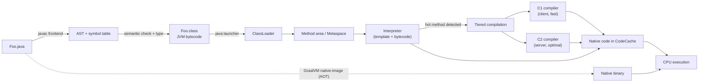
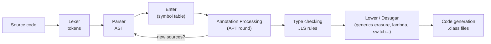
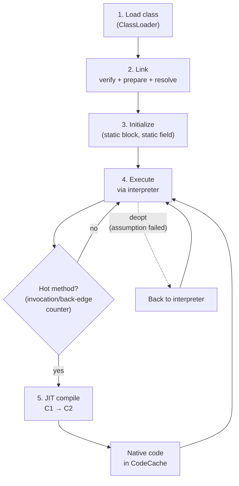

# 03 — Compilation Pipeline: `.java` → native code

## 1. Định nghĩa & vai trò

Java là ngôn ngữ **compile + interpret + JIT**:

1. `javac` biên dịch `.java` → `.class` (chứa **bytecode** trung gian).
2. JVM nạp `.class`, **interpret** bytecode để thực thi.
3. JVM phát hiện method "nóng" và **JIT compile** sang native code (mã máy CPU).
4. Tuỳ chọn: dùng **AOT** (Ahead-of-Time, GraalVM `native-image`) để biên dịch ra binary native ngay từ build time.

Đây là lý do Java vừa **portable** (bytecode chạy trên mọi JVM) vừa **nhanh dần** (JIT tối ưu sau warm-up).

---

## 2. Sơ đồ pipeline



---

## 3. Các giai đoạn của `javac`



- **Lexer/Parser** — tạo AST.
- **Enter** — xây symbol table, resolve type.
- **Annotation processing** (`-processor`) — round-based; có thể sinh source mới (`Lombok`, `Dagger`, `MapStruct`).
- **Type checking** — kiểm tra theo `JLS`.
- **Lower / Desugar** — biến đổi AST: generics erasure, lambda → `invokedynamic`, foreach → iterator, autoboxing, ...
- **Code generation** — sinh bytecode + constant pool + attributes.

> Quan trọng: **generics bị erase ở bước Lower** — runtime không biết `T` là gì. Xem [`11_generics_type_erasure.md`](11_generics_type_erasure.md).

---

## 4. Bytecode trung gian là gì?

`.class` chứa:

- Header (`magic 0xCAFEBABE`, `minor`, `major` — 65 = Java 21).
- Constant pool.
- Class info, fields, methods, attributes.
- Trong mỗi method: dãy bytecode (1 byte opcode + operand).

JVM là **stack-based VM**: lệnh push/pop trên operand stack, không phải register-based như x86.

```bash
$ javap -c -p Hello.class
public static void main(java.lang.String[]);
  Code:
    0: getstatic     #2  // Field java/lang/System.out
    3: ldc           #3  // String "hi"
    5: invokevirtual #4  // Method java/io/PrintStream.println
    8: return
```

Xem chi tiết tại [`04_bytecode_classfile.md`](04_bytecode_classfile.md).

---

## 5. JVM thực thi bytecode



- **Mixed mode**: vừa interpret vừa chạy code đã JIT.
- **Tiered compilation**: bytecode → C1 (level 1-3, nhanh, ít optimize) → C2 (level 4, chậm, tối ưu cao).
- **Deoptimization**: nếu giả định JIT (vd type) sai, JVM rollback về interpreter và recompile sau.

Chi tiết JIT: [`07_jit_compilation.md`](07_jit_compilation.md).

---

## 6. Demo

### 6.1. Quan sát compile

```bash
$ cat > Hello.java <<'EOF'
public class Hello {
    public static int add(int a, int b) { return a + b; }
    public static void main(String[] args) {
        long sum = 0;
        for (int i = 0; i < 1_000_000; i++) sum += add(i, i);
        System.out.println(sum);
    }
}
EOF

$ javac --release 21 Hello.java
$ ls -la Hello.class
$ javap -v Hello.class | head -40
```

### 6.2. Quan sát JIT compile real-time

```bash
# In ra method nào đang được JIT compile và ở level nào
$ java -XX:+PrintCompilation Hello
    65    1       3       java.lang.Object::<init> (1 bytes)
    66    2       3       java.lang.String::hashCode (49 bytes)
   ...
   123   42       4       Hello::add (4 bytes)        <- C2 level 4
```

Cờ thường dùng để debug compilation:

| Cờ | Tác dụng |
|----|---------|
| `-XX:+PrintCompilation` | log mỗi lần JIT compile |
| `-XX:+PrintInlining` | log method nào được inline (cần unlock diagnostic) |
| `-XX:+UnlockDiagnosticVMOptions` | mở khoá flag chẩn đoán |
| `-XX:+PrintAssembly` | dump assembly (cần `hsdis` plugin) |
| `-Xint` | ép interpreter only (debug, *chậm*) |
| `-Xcomp` | ép JIT mọi method ngay (load test) |
| `-XX:CompileThreshold=10000` | số lần invoke trước khi JIT |

### 6.3. Single-file run (Java 11+, JEP 330)

```bash
$ java Hello.java     # vừa compile vừa run, không sinh .class
```

### 6.4. AOT với GraalVM `native-image`

```bash
$ native-image -cp . Hello hello-bin
$ ./hello-bin         # khởi động ~10ms, không cần JVM
```

---

## 7. Class Data Sharing & AOT

| Cơ chế | Mô tả |
|--------|------|
| `CDS` / `AppCDS` (J10+) | Pre-process classes thành memory-mapped file để nhiều JVM share, giảm startup. Cờ `-XX:SharedArchiveFile=app.jsa`. |
| `JEP 310 Application CDS` | Cho phép share class của app, không chỉ JDK. |
| `JEP 483 Ahead-of-Time Class Loading & Linking` (J24) | Pre-link class ở build time để startup nhanh hơn. |
| GraalVM `native-image` | AOT toàn bộ binary, không cần JVM ở runtime. Hi sinh: dynamic class loading, một số reflection cần config. |
| Project Leyden | Dự án dài hạn của Oracle hợp nhất AOT/JIT. |

---

## 8. Pitfall & best practice (senior view)

- **Không nhầm lẫn `java -version` (run target) và `javac --release` (compile target)**. Compile bằng JDK 21, target Java 17 → dùng `javac --release 17`.
- **Avoid `-source/-target`** đơn lẻ — chúng không kiểm tra API mới có sẵn ở target version không. Dùng `--release` (J9+).
- **Build reproducible**: `javac -g:none --release 21 -encoding UTF-8` + `jar --date=...` để class output deterministic.
- **Đo performance phải sau warm-up**. Lần chạy đầu là interpreter — chậm. Dùng `JMH` để benchmark đúng cách.
- **AOT trade-off**: GraalVM `native-image` startup `<100ms`, RSS thấp, nhưng peak throughput thường thấp hơn HotSpot warmed-up; mất reflection/dynamic proxies trừ khi cấu hình.
- **Bytecode version mismatch** → `UnsupportedClassVersionError`. Kiểm tra: `javap -v Foo.class | head -3` (xem `major version`).

---

## 9. Câu hỏi phỏng vấn điển hình

1. Java là ngôn ngữ compile hay interpret?
2. `javac` làm gì? Có những giai đoạn nào?
3. Generics tồn tại ở runtime không? Vì sao?
4. JIT là gì? `C1` khác `C2` thế nào?
5. Tại sao đo benchmark phải có warm-up?
6. `Xint` và `Xcomp` để làm gì?
7. AOT với JIT khác nhau ra sao? Khi nào nên dùng GraalVM `native-image`?
8. Annotation processing chạy ở giai đoạn nào của `javac`?

---

## 10. Tham chiếu

- [JLS Chapter 13: Binary Compatibility](https://docs.oracle.com/javase/specs/jls/se21/html/jls-13.html)
- [JVMS Chapter 5: Loading, Linking, and Initializing](https://docs.oracle.com/javase/specs/jvms/se21/html/jvms-5.html)
- [JEP 330: Launch Single-File Source-Code Programs](https://openjdk.org/jeps/330)
- [JEP 483: Ahead-of-Time Class Loading & Linking](https://openjdk.org/jeps/483)
- [GraalVM Native Image](https://www.graalvm.org/latest/reference-manual/native-image/)
- [HotSpot Glossary](https://wiki.openjdk.org/display/HotSpot/Glossary)
