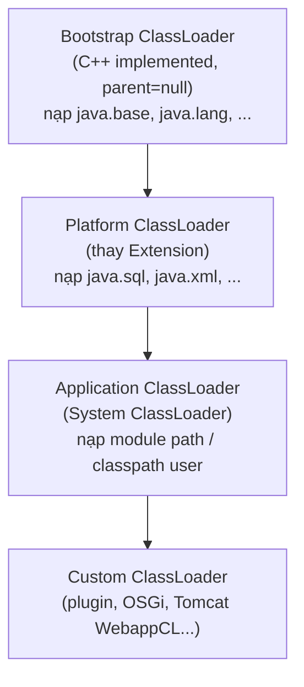
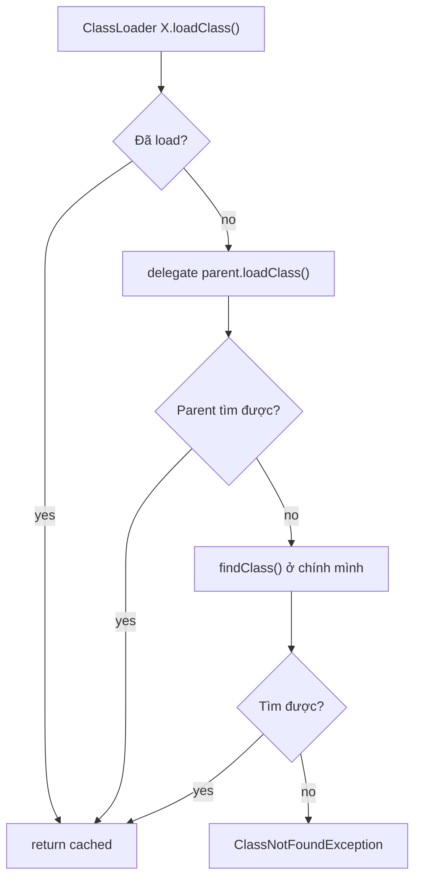
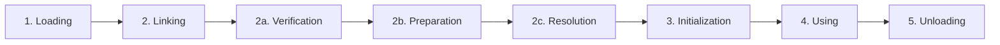

# 05 — ClassLoader & Class Loading

## 1. Định nghĩa & vai trò

`ClassLoader` là cơ chế nạp `.class` từ file system / network / memory **lười (lazy)** vào JVM. Thay vì nạp tất cả ngay khi start, JVM nạp class **đúng lúc cần** — khi gặp tham chiếu đầu tiên.

Vai trò:

- Tách biệt **namespace** (2 class cùng tên, khác classloader → là 2 class khác nhau).
- Hỗ trợ **plugin/hot-reload** (custom classloader).
- Nền tảng cho **isolation** trong app server (Tomcat, OSGi, Spring DevTools, JPMS).

---

## 2. Hierarchy ClassLoader

### 2.1. Java 8 (cũ)

```
Bootstrap (rt.jar, JDK core)
   │
Extension (jre/lib/ext)
   │
Application/System (-cp, -classpath)
   │
Custom (user-defined)
```

### 2.2. Java 9+ (sau JPMS)



| ClassLoader | Trả về `null` parent? | Nạp gì |
|-------------|----|-----|
| `Bootstrap` | yes | `java.base`, JDK core (modules `java.*` cốt lõi) |
| `Platform` | parent = Bootstrap | các module non-core: `java.sql`, `java.xml`, `java.logging`, JDBC SPI, ... |
| `Application` (System) | parent = Platform | module path & classpath của user; trả về bởi `ClassLoader.getSystemClassLoader()` |
| Custom | parent là gì cũng được | tuỳ ứng dụng (web server isolate webapp, plugin loader, ...) |

> **Java 8 dùng `URLClassLoader`** cho Application; Java 9+ dùng `Built-in AppClassLoader` (không còn cast về `URLClassLoader` được — đây là pitfall phổ biến khi migrate).

---

## 3. Parent Delegation Model

Khi cần class `X`:



**Lý do**: bảo đảm class core như `java.lang.String` luôn nạp bởi Bootstrap — không bị giả mạo. Nếu attacker đặt `java/lang/String.class` vào classpath user, vẫn không override được.

> Một vài framework **break delegation** (Tomcat, OSGi) cho mục đích isolation: webapp loader hỏi chính nó **trước** parent (đảo ngược) để app dùng phiên bản library riêng.

---

## 4. Các giai đoạn của Class Loading



| Giai đoạn | Việc thực hiện |
|-----------|---------------|
| **Loading** | Đọc bytecode `.class`, tạo `Class<?>` object trong heap, lưu metadata vào `Method Area` (Metaspace từ J8). |
| **Verification** | Kiểm tra bytecode hợp lệ (stack discipline, type, không truy cập memory bừa). Bảo đảm an toàn. |
| **Preparation** | Cấp phát memory cho **`static` field**, đặt giá trị **default** (`0`, `false`, `null`). **Chưa** chạy initializer. |
| **Resolution** | Thay symbolic reference (`#class/method`) thành reference trực tiếp. Có thể *lazy* (lúc lệnh `invoke*` chạy). |
| **Initialization** | Chạy `<clinit>` — `static` block + gán giá trị explicit cho `static` field. Đây là điểm **`static`** "thực sự chạy". |
| **Using** | Class sẵn sàng để new instance, gọi method. |
| **Unloading** | Khi class & classloader của nó không còn reachable, GC có thể unload (trên Metaspace). Hiếm gặp trừ trường hợp custom classloader. |

### 4.1. Khi nào class được initialize?

(JLS §12.4.1 — chỉ một trong các trường hợp sau:)

- `new T()`.
- Truy cập `static` field/method **không** phải hằng compile-time (`static final` literal được inline ở compile time).
- `Class.forName("T", true, loader)` (param 2 = `initialize=true`).
- Khởi tạo subclass kéo theo init superclass.
- Truy cập class qua reflection.
- Khi class là main class (chứa `main`).

**KHÔNG** init nếu chỉ:

- `T.class` (class literal).
- `Class.forName("T", false, loader)`.
- Truy cập `static final` hằng số compile-time.
- Khai báo array kiểu `T[]`.

---

## 5. `ClassNotFoundException` vs `NoClassDefFoundError`

| | `ClassNotFoundException` | `NoClassDefFoundError` |
|-|-------------------------|------------------------|
| Loại | **Checked exception** | **Error** |
| Khi nào ném | Lúc gọi `Class.forName`, `loadClass`, `loadClass`-based reflection — không tìm thấy class trong classpath. | Class **đã từng** được resolve thành công trước đây (compile time có), nhưng giờ runtime **không còn** trên classpath, hoặc lỗi trong `<clinit>` lần đầu. |
| Nguyên nhân điển hình | Sai classpath, JAR thiếu, dynamic load tên sai. | JAR thiếu một transitive dep, hoặc lần đầu init class throw → các lần sau ném `NoClassDefFoundError`. |
| Cách xử lý | Catch & fallback (vd plugin không có thì skip). | Fix dependency, kiểm tra `<clinit>`. |

> Pitfall thường gặp: `<clinit>` ném exception → JVM mark class **erroneous**. Lần truy cập sau đều ném `NoClassDefFoundError` mà không hiện root cause — phải xem log đầu tiên.

---

## 6. Custom ClassLoader

```java
public class MemoryClassLoader extends ClassLoader {
    private final Map<String, byte[]> classes;

    public MemoryClassLoader(Map<String, byte[]> classes, ClassLoader parent) {
        super(parent);
        this.classes = classes;
    }

    @Override
    protected Class<?> findClass(String name) throws ClassNotFoundException {
        byte[] bytes = classes.get(name);
        if (bytes == null) throw new ClassNotFoundException(name);
        return defineClass(name, bytes, 0, bytes.length);
    }
}
```

- Override `findClass`, **không** override `loadClass` (giữ parent delegation).
- Nếu cần **đảo delegation** (webapp isolation): override `loadClass`.

Use case:

- **Tomcat/Jetty**: mỗi webapp 1 `WebappClassLoader` — isolate JAR mỗi app, đảo parent delegation cho lớp app.
- **OSGi**: graph classloader phức tạp, mỗi bundle 1 loader, share theo `Import-Package`.
- **Spring DevTools**: `RestartClassLoader` reload code thay đổi mà không restart JVM.
- **Plugin system**: load plugin `.jar` runtime.
- **Hot-reload tool**: JRebel.

---

## 7. Demo

### 7.1. In hierarchy

```java
public class ClDemo {
    public static void main(String[] args) {
        ClassLoader cl = ClDemo.class.getClassLoader();
        while (cl != null) {
            System.out.println(cl);
            cl = cl.getParent();
        }
        System.out.println("Bootstrap: " + String.class.getClassLoader()); // null
        System.out.println("System CL: " + ClassLoader.getSystemClassLoader());
        System.out.println("Platform CL: " + ClassLoader.getPlatformClassLoader());
    }
}
```

```bash
$ java ClDemo
jdk.internal.loader.ClassLoaders$AppClassLoader@4c873330
jdk.internal.loader.ClassLoaders$PlatformClassLoader@1540e19d
Bootstrap: null
```

### 7.2. Quan sát thứ tự load class

```bash
$ java -verbose:class Hello | head -30
[0.012s][info][class,load] opened: /.../jrt-fs.jar
[0.030s][info][class,load] java.lang.Object source: jrt:/java.base
[0.030s][info][class,load] java.io.Serializable source: jrt:/java.base
...
```

### 7.3. Class identity = `(name, classloader)`

```java
URLClassLoader cl1 = new URLClassLoader(new URL[]{ jarUrl });
URLClassLoader cl2 = new URLClassLoader(new URL[]{ jarUrl });

Class<?> c1 = cl1.loadClass("com.acme.Plugin");
Class<?> c2 = cl2.loadClass("com.acme.Plugin");
System.out.println(c1 == c2);  // false! Hai lớp KHÁC NHAU
```

→ Cast giữa `c1` và `c2` ném `ClassCastException` mặc dù tên giống. Đây là gốc rễ memory leak khi reload web app: instance từ classloader cũ giữ classloader trong heap → toàn bộ class, static field cũ không bị unload.

---

## 8. Pitfall & best practice (senior view)

- **Đừng cast `Thread.currentThread().getContextClassLoader()` về `URLClassLoader`** ở Java 9+ — sẽ ném `ClassCastException`. Dùng `getResource`, `getResourceAsStream` thay vì.
- **Static field giữ reference** sau khi webapp undeploy là nguyên nhân classloader leak (xem [`13_memory_leaks_profiling.md`](13_memory_leaks_profiling.md)).
- **`Thread.contextClassLoader`** phải set đúng khi tạo thread trong app server — nhiều framework SPI (`ServiceLoader`, JDBC) dùng nó để load.
- **`ServiceLoader<T>`** nạp impl qua context classloader. Quan trọng khi viết library hỗ trợ plugin.
- **JPMS (Java 9+)** thay đổi quan trọng: chỉ class trong module `requires` mới truy cập được; sun internal bị strong-encapsulated. Library cũ cần `--add-opens` hoặc `Add-Opens` trong manifest.
- **Hot deployment** (Tomcat redeploy) hay leak vì `ThreadLocal` (xem 13), JDBC driver (`DriverManager` giữ ref class), logger handler.
- **Class identity** dựa trên `(name, classloader)` — không chỉ `name`. Nếu 2 classloader nạp cùng tên → 2 class khác nhau.

---

## 9. Câu hỏi phỏng vấn điển hình

1. Hierarchy ClassLoader trong Java 8 vs 9 khác nhau thế nào?
2. Parent delegation hoạt động ra sao? Vì sao phải có?
3. `ClassNotFoundException` khác `NoClassDefFoundError` chỗ nào? Nguyên nhân từng cái?
4. Class được initialize lúc nào? `T.class` có trigger init không?
5. Tomcat đảo parent delegation để làm gì?
6. Có 2 classloader nạp cùng class — chúng có equal không? `instanceof` ra sao?
7. Vì sao webapp redeploy nhiều lần thì OOM `Metaspace`?
8. Tại sao nạp `Driver` JDBC ngày xưa phải `Class.forName("com.mysql...")` còn giờ thì không?

---

## 10. Tham chiếu

- [JVMS Chapter 5: Loading, Linking and Initializing](https://docs.oracle.com/javase/specs/jvms/se21/html/jvms-5.html)
- [JLS §12.4: Initialization of Classes and Interfaces](https://docs.oracle.com/javase/specs/jls/se21/html/jls-12.html#jls-12.4)
- [JEP 261: Module System](https://openjdk.org/jeps/261)
- [Mark Reinhold — A New Era for ClassLoading (Java 9)](https://openjdk.org/projects/jigsaw/spec/issues/)
- [Tomcat Class Loading Reference](https://tomcat.apache.org/tomcat-10.1-doc/class-loader-howto.html)
