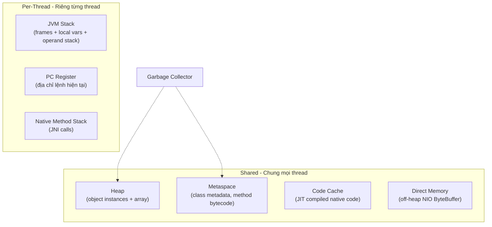
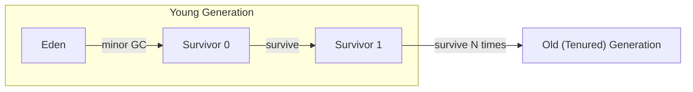
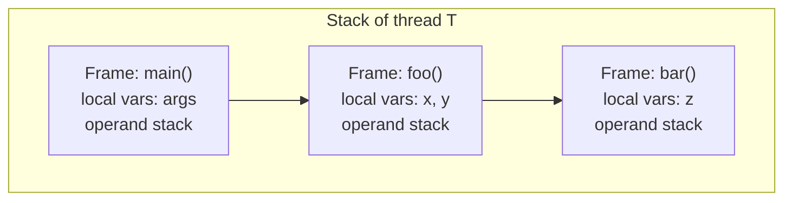

# 06 — JVM Runtime Memory Areas

## 1. Định nghĩa & vai trò

Khi JVM khởi động, nó cấp phát các **vùng nhớ runtime** theo đặc tả `JVMS §2.5`. Hiểu các vùng này là điều **bắt buộc** ở level senior để:

- Đọc heap dump, thread dump, GC log.
- Tuning `-Xmx`, `-Xms`, `-Xss`, `-XX:MetaspaceSize`, `-XX:MaxDirectMemorySize`.
- Phân tích `OutOfMemoryError` (heap, metaspace, direct, stack).
- Hiểu vì sao primitive vs object, escape analysis, JMM hoạt động.

---

## 2. Sơ đồ tổng quan (HotSpot)



Phân loại:

| Vùng | Phạm vi | GC quản lý? | OOM tương ứng |
|------|--------|-------------|---------------|
| `Heap` | Shared | yes | `Java heap space` |
| `Metaspace` | Shared (native memory) | partial | `Metaspace` |
| `Code Cache` | Shared (native memory) | no (managed by JIT) | `CodeCache is full` |
| `Direct Memory` | Shared (native memory) | qua `Cleaner` | `Direct buffer memory` |
| `JVM Stack` | Per-thread | no | `StackOverflowError` |
| `PC Register` | Per-thread | no | — |
| `Native Method Stack` | Per-thread | no | `unable to create new native thread` |

---

## 3. Heap

Vùng lưu **tất cả object instance & array** Java. Là vùng chính bị GC quản lý.

### 3.1. Cấu trúc generational (Serial, Parallel, G1)



- **Young**: object mới sinh. Đa số chết trẻ ("weak generational hypothesis").
  - **Eden**: nơi `new` cấp phát.
  - **Survivor 0/1**: 2 vùng tỉ lệ ~10% (`-XX:SurvivorRatio=8` mặc định: Eden:S0:S1 = 8:1:1). Object survive minor GC được copy giữa S0 ↔ S1.
- **Old**: object sống lâu (tuổi vượt `MaxTenuringThreshold` ~ 15 lần copy). Bị thu bởi major/full GC.

> **Từ G1**: chia heap thành **Region** ~ 1-32 MB, mỗi region được gắn nhãn Eden/Survivor/Old/Humongous động.

### 3.2. Cờ tuning Heap

| Cờ | Ý nghĩa |
|----|---------|
| `-Xms<size>` | initial heap |
| `-Xmx<size>` | max heap |
| `-Xmn<size>` | size young gen |
| `-XX:NewRatio=2` | tỉ lệ Old:Young (mặc định 2 → Old gấp 2 Young) |
| `-XX:SurvivorRatio=8` | Eden:S0:S1 |
| `-XX:MaxTenuringThreshold=15` | tuổi để promote Old |
| `-XX:+UseG1GC` / `+UseZGC` / `+UseParallelGC` | chọn GC |
| `-XX:MaxGCPauseMillis=200` | mục tiêu pause cho G1/ZGC |

### 3.3. Heap & Container

Khi chạy trong container (Docker, k8s), JVM 8u131+ tôn trọng cgroup limit:

- `-XX:+UseContainerSupport` (default từ JDK 10).
- `-XX:MaxRAMPercentage=75.0` — set heap theo % memory container.

---

## 4. JVM Stack (Per-thread)

Mỗi thread có 1 **Stack** riêng, chứa các **frame** — mỗi method call 1 frame.



Mỗi frame chứa:

- **Local variable table**: parameters + local variables (mỗi slot 32-bit; `long`/`double` chiếm 2 slot). Index vào table chính là biến `iload_1`, `aload_2` trong bytecode.
- **Operand stack**: stack tạm cho phép tính bytecode (`iadd`, `dup`, ...).
- **Frame data**: reference tới constant pool (cho `invoke*`), return address.

### 4.1. Object reference trên stack, object trên heap

```java
public void foo() {
    int x = 5;              // x ở stack frame
    String s = "hi";        // reference s ở stack, đối tượng String ở heap (interned pool)
    int[] arr = new int[10]; // reference arr ở stack, mảng ở heap
}
```

> **Escape analysis** (JIT) có thể "scalar replace" object không escape khỏi method → object thực ra nằm trên stack/register, không cấp phát heap. Xem [`07_jit_compilation.md`](07_jit_compilation.md).

### 4.2. `StackOverflowError`

Stack có giới hạn: `-Xss512k` (mặc định 512 KB → 1 MB tuỳ OS). Đệ quy quá sâu → SOE.

```bash
$ java -Xss256k Recursion        # giảm stack để test
```

### 4.3. Mỗi thread = 1 stack

→ Tạo nhiều thread quá → tốn RAM (mỗi thread `Xss` MB). Đây là lý do **virtual threads** (Java 21) không cấp phát stack cố định mà dùng heap "stack chunk" động.

---

## 5. PC Register (Per-thread)

Đơn giản: lưu **địa chỉ bytecode hiện tại** mà thread đang thực thi. Khi gọi native method, PC register `undefined`.

Rất nhỏ, không bao giờ là điểm OOM.

---

## 6. Native Method Stack (Per-thread)

Stack riêng cho **native method** (C/C++ qua `JNI`). Trên HotSpot, nó là 1 phần của thread native stack — quản lý bởi OS.

OOM `unable to create new native thread`: thường vì OS hết file descriptor hoặc memory để cấp thread native.

---

## 7. Method Area / Metaspace

**Method Area** là khái niệm trong JVMS — chứa metadata class: tên, supertype, methods (bytecode), field descriptor, constant pool runtime.

### 7.1. Lịch sử PermGen → Metaspace

| Phiên bản | Tên | Vị trí |
|-----------|-----|--------|
| Java 7 trở về trước | `PermGen` | trong heap, kích thước cố định (`-XX:MaxPermSize`) |
| **Java 8+** | **`Metaspace`** | **native memory** (off-heap), tự co dãn |

PermGen nổi tiếng vì hay OOM (`PermGen space`) khi nhiều class load. Metaspace giải quyết bằng cách dùng native memory không giới hạn (trừ khi đặt `-XX:MaxMetaspaceSize`).

### 7.2. Bên trong Metaspace

- **Class metadata**: `Klass` structure trong HotSpot.
- **Constant pool runtime**.
- **Method bytecode** (interpreter dùng).
- **Static field** lưu trên heap (J8+, đối tượng `Class<?>`), nhưng metadata lưu metaspace.

### 7.3. Cờ Metaspace

| Cờ | Ý nghĩa |
|----|---------|
| `-XX:MetaspaceSize=64m` | high-water mark trigger Full GC để uncommit |
| `-XX:MaxMetaspaceSize=256m` | giới hạn cứng |
| `-XX:CompressedClassSpaceSize=1g` | sub-region cho compressed klass pointers |

### 7.4. Khi nào OOM `Metaspace`?

- Webapp redeploy nhiều lần → custom classloader leak → class cũ không unload.
- Reflection sinh proxy class quá nhiều (`CGLib`, dynamic JSP).
- Code generation runtime (Hibernate enhancement, Lombok plugin runtime).

---

## 8. Code Cache

Vùng native memory chứa **code đã được JIT compile** (machine code).

| Cờ | Ý nghĩa |
|----|---------|
| `-XX:InitialCodeCacheSize=64m` | initial |
| `-XX:ReservedCodeCacheSize=240m` | max (JDK 9+ chia 3 segment) |
| `-XX:+UseCodeCacheFlushing` | cho phép flush method ít dùng |

OOM Code Cache → JIT bỏ compile → app rớt về interpreter, throughput giảm mạnh. Rare nhưng đáng sợ.

---

## 9. Direct Memory (off-heap)

`java.nio.ByteBuffer.allocateDirect(n)` cấp phát bộ nhớ **ngoài heap**, gần native — phục vụ I/O zero-copy (NIO, Netty).

- Quản lý bởi `Cleaner` (J9+) — khi `DirectByteBuffer` bị GC, cleaner free native memory.
- Cờ `-XX:MaxDirectMemorySize=1g` — limit. Nếu không đặt, mặc định ≈ `Xmx`.

OOM `Direct buffer memory` → kẹt do leak Netty/NIO không close `ByteBuf`. Rất phổ biến trong gateway, message broker.

---

## 10. Demo

### 10.1. In các vùng memory hiện tại

```bash
$ jcmd <pid> VM.native_memory summary
Native Memory Tracking:
Total: reserved=2570MB, committed=345MB
-                 Java Heap (reserved=2048MB, committed=128MB)
-                     Class (reserved=1056MB, committed=4MB)
-                    Thread (reserved=66MB, committed=66MB)
-                      Code (reserved=242MB, committed=8MB)
-                        GC (reserved=25MB, committed=10MB)
-                  Compiler (reserved=4MB, committed=4MB)
-                  Internal (reserved=1MB, committed=1MB)
-                    Symbol (reserved=2MB, committed=2MB)
-    Native Memory Tracking (reserved=1MB, committed=1MB)
-               Arena Chunk (reserved=0MB, committed=0MB)
```

(Cần khởi động JVM với `-XX:NativeMemoryTracking=summary`.)

### 10.2. In thông số heap qua `Runtime`

```java
public class MemInfo {
    public static void main(String[] args) {
        Runtime r = Runtime.getRuntime();
        System.out.printf("max=%d MB, total=%d MB, free=%d MB%n",
            r.maxMemory()  / 1_048_576,
            r.totalMemory()/ 1_048_576,
            r.freeMemory() / 1_048_576);
    }
}
```

### 10.3. Heap dump ở runtime

```bash
$ jcmd <pid> GC.heap_dump /tmp/heap.hprof
$ jmap -dump:format=b,file=heap.hprof <pid>
$ java -XX:+HeapDumpOnOutOfMemoryError -XX:HeapDumpPath=/tmp Foo
```

Mở bằng `Eclipse MAT` hoặc `VisualVM`.

---

## 11. Pitfall & best practice (senior view)

- **Production luôn set `-Xms = -Xmx`** để tránh resize heap (JVM phải zero-fill khi grow → pause).
- **Container**: thay vì `-Xmx2g`, dùng `-XX:MaxRAMPercentage=75` để JVM tự tính theo limit cgroup.
- **Bật heap dump on OOM**: `-XX:+HeapDumpOnOutOfMemoryError -XX:HeapDumpPath=/var/log/heap`. Bắt buộc trong production.
- **GC log**: `-Xlog:gc*:file=gc.log:time,uptime,level,tags` (J9+, thay flag `-Xloggc` cũ).
- **Metaspace**: nên giới hạn `-XX:MaxMetaspaceSize` để OOM sớm thay vì swap chết server.
- **Direct Memory**: monitor `BufferPoolMXBean` — `direct` pool sẽ thấy memory thực sự bị giữ.
- **Stack size**: `-Xss` ảnh hưởng số thread tối đa. Microservice nhiều thread thì giảm `-Xss=256k`.
- **Compressed Oops** (J6+): với heap < 32 GB, JVM nén pointer 64-bit về 32-bit → tiết kiệm RAM. Đó là lý do "đặt heap dưới 32 GB" được khuyến nghị.
- **Object header**: ~12 bytes (compressed) hoặc 16 (uncompressed). Object có 1 field `int` thực ra tốn 16 bytes do alignment.
- **Card Table / Remembered Set** (G1): cấu trúc nội bộ hỗ trợ GC, tốn ~5-10% heap.

---

## 12. Câu hỏi phỏng vấn điển hình

1. Liệt kê các vùng memory của JVM. Vùng nào shared, vùng nào per-thread?
2. `Metaspace` khác `PermGen` chỗ nào?
3. Object cấp phát ở đâu? Object reference ở đâu?
4. `StackOverflowError` xảy ra khi nào? Cách giảm?
5. Heap young/old hoạt động ra sao? Tại sao cần Survivor space?
6. `-Xmx` và `-Xms` nên đặt thế nào trong production?
7. Direct memory là gì? Ai dùng?
8. `OutOfMemoryError: Metaspace` thường do nguyên nhân gì?
9. Trong container Docker/k8s, JVM tự nhận memory limit thế nào?
10. Compressed Oops là gì? Tại sao heap nên < 32 GB?

---

## 13. Tham chiếu

- [JVMS §2.5 Run-Time Data Areas](https://docs.oracle.com/javase/specs/jvms/se21/html/jvms-2.html#jvms-2.5)
- [Java HotSpot VM Options](https://docs.oracle.com/en/java/javase/21/docs/specs/man/java.html)
- [JEP 122: Remove the Permanent Generation](https://openjdk.org/jeps/122)
- [JEP 197: Segmented Code Cache](https://openjdk.org/jeps/197)
- [Aleksey Shipilev — Java Object Layout (JOL)](https://shipilev.net/jvm/objects-inside-out/)
