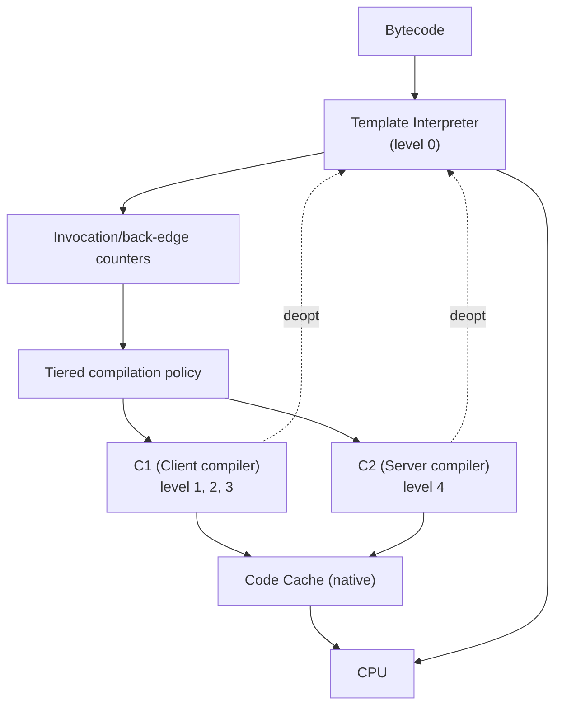

# 07 — JIT Compilation

## 1. Định nghĩa & vai trò

`JIT` (Just-In-Time) compiler là thành phần của `Execution Engine` chuyển **bytecode → native code** *tại runtime*, dựa trên dữ liệu profiling thật.

**Triết lý**: 90% thời gian chạy nằm trong 10% code. Thay vì compile mọi method (như AOT), JVM chạy interpreter trước, profile để biết method nào "nóng", rồi compile riêng method đó với mức tối ưu cao.

→ Tận dụng được **profile thực tế** mà AOT không có (loại receiver thực tế, branch nào hay đi, virtual call có monomorphic không).

---

## 2. Cây kiến trúc Execution Engine HotSpot



5 levels:

| Level | Compiler | Đặc điểm |
|-------|----------|---------|
| 0 | Interpreter | Thực thi bytecode trực tiếp; thu profile |
| 1 | C1 | Compile rất nhanh, không profile, dùng cho method "trivial" |
| 2 | C1 | Compile + thu invocation/back-edge profile cơ bản |
| 3 | C1 | Compile + full profile (type, branch frequency) — feed cho C2 |
| 4 | **C2** | Compile chậm nhưng tối ưu rất sâu (peak performance) |

→ Path điển hình: `0 → 3 → 4`. Method bùng nổ "nóng" rất nhanh sẽ skip 3, đi thẳng 0 → 1.

---

## 3. C1 vs C2

### 3.1. C1 (Client compiler — `c1.cpp`)

- Mục tiêu: **startup nhanh**, latency thấp, optimization vừa phải.
- Có inlining cơ bản, constant folding, dead code elimination.
- Compile time ngắn (~10-50 µs/method).

### 3.2. C2 (Server compiler — `c2.cpp`, `opto`)

- Mục tiêu: **peak throughput**.
- Tối ưu sâu: aggressive inlining, escape analysis, scalar replacement, loop unrolling, vectorization (SuperWord), branch prediction, intrinsics.
- Compile time dài (ms-scale) → background thread.

### 3.3. Graal JIT (alternative)

`-XX:+UseJVMCICompiler` thay C2 bằng **Graal** (viết bằng Java). Tối ưu tương đương / tốt hơn cho dynamic code (Scala, Kotlin coroutine). Dùng trong GraalVM.

---

## 4. Các kỹ thuật tối ưu chính

### 4.1. Method inlining

Thay call site bằng body method. Là kỹ thuật **quan trọng nhất** — mở khoá mọi optimization khác.

- C2 inline method nhỏ (`-XX:MaxInlineSize=35` bytes mặc định).
- Method "hot" có thể inline đến 325 bytes (`-XX:FreqInlineSize`).
- Final/static/private dễ inline; virtual call cần **CHA** (Class Hierarchy Analysis) hoặc inline cache.

```bash
$ java -XX:+UnlockDiagnosticVMOptions -XX:+PrintInlining Foo
@ 5   Foo::add (4 bytes)   inline (hot)
@ 12  Foo::log (50 bytes)  too big
```

### 4.2. Inline cache (call site polymorphism)

| Loại | Mô tả |
|------|------|
| **Monomorphic** | 1 receiver type duy nhất → inline trực tiếp, nhanh nhất |
| **Bimorphic** | 2 receiver type → if-else check |
| **Megamorphic** | 3+ → fallback vtable lookup, không inline |

→ Code "1 implementation chiếm > 90%" thì JIT optimize cực tốt. Khuyến nghị: tránh deeply polymorphic hot path.

### 4.3. Escape analysis & Scalar replacement

C2 phân tích object có "escape" khỏi method không:

- **NoEscape**: object không thoát → có thể **scalar replace** (tách field thành biến local trên stack/register, bỏ allocate trên heap).
- **ArgEscape**: chỉ thoát qua method argument.
- **GlobalEscape**: thoát ra heap chung → phải allocate.

```java
public int distance() {
    Point p = new Point(3, 4);  // có thể không cấp phát heap thật!
    return (int) Math.sqrt(p.x * p.x + p.y * p.y);
}
```

→ Lý do `new` trong vòng lặp đôi khi không tốn GC pressure.

Cờ: `-XX:+DoEscapeAnalysis` (default on), `-XX:+PrintEscapeAnalysis`.

### 4.4. Loop optimizations

- **Unrolling**: lặp 4/8 lần trong 1 iteration.
- **Range check elimination**: `arr[i]` trong vòng lặp `i < arr.length` không cần check bound mỗi iteration.
- **Loop invariant code motion**: chuyển expression không đổi ra ngoài loop.
- **Vectorization (SuperWord, AVX)**: gộp `for (i; +1)` thành 1 lệnh SIMD `vpaddd`.

### 4.5. Intrinsics

Method được JVM nhận diện và thay bằng implementation tay tối ưu:

- `System.arraycopy` → `memcpy`.
- `String.indexOf` → vectorized.
- `Integer.bitCount` → `popcnt`.
- `Math.sqrt`, `Math.fma`, `Math.log` → x87/AVX.
- `Object.hashCode` (default).

Xem danh sách: `-XX:+PrintIntrinsics`.

### 4.6. On-Stack Replacement (`OSR`)

Khi 1 vòng lặp dài chạy trong 1 method chưa được JIT compile (ví dụ `main` chứa loop benchmark), interpreter trigger OSR: compile **giữa chừng** vòng lặp, swap stack frame để chạy native code mà không cần thoát method.

→ Đó là lý do benchmark có pause khoảng 1-2 giây sau khi start (OSR + tier transitions).

### 4.7. Speculative optimizations & Deoptimization

C2 *giả định* (vd "class này không có subclass") để inline. Nếu sau đó load 1 subclass → **deoptimize**: throw away native code, rollback về interpreter, recompile sau.

→ Code load class lazily (Spring, Hibernate) thường có vài đợt deopt ban đầu.

Xem: `-XX:+TraceDeoptimization`.

---

## 5. Cờ JVM thường dùng để debug JIT

| Cờ | Tác dụng |
|----|----------|
| `-XX:+PrintCompilation` | log mỗi compilation |
| `-XX:+UnlockDiagnosticVMOptions` | mở flag chẩn đoán |
| `-XX:+PrintInlining` | log inline decisions |
| `-XX:+PrintAssembly` | dump assembly (cần `hsdis`) |
| `-XX:+PrintCompilation -XX:+LogCompilation` | XML log chi tiết (`hotspot_pid.log`) — phân tích bằng `JITWatch` |
| `-XX:CompileThreshold=N` | số lần invoke trigger compile (default 10000) |
| `-XX:+TieredCompilation` | bật tiered (default on) |
| `-XX:TieredStopAtLevel=1` | dừng ở C1 (giảm warm-up CPU) |
| `-Xint` | interpreter only |
| `-Xcomp` | force compile mọi method |
| `-XX:ReservedCodeCacheSize=256m` | size code cache |

---

## 6. Demo

### 6.1. Quan sát hiệu ứng warm-up

```java
public class Warmup {
    static int sum(int n) {
        int s = 0;
        for (int i = 0; i < n; i++) s += i * 7 % 31;
        return s;
    }

    public static void main(String[] args) {
        for (int run = 0; run < 5; run++) {
            long t0 = System.nanoTime();
            long acc = 0;
            for (int i = 0; i < 1_000_000; i++) acc += sum(1000);
            long ns = (System.nanoTime() - t0) / 1_000_000;
            System.out.printf("run=%d %d ms (acc=%d)%n", run, ns, acc);
        }
    }
}
```

```bash
$ java Warmup
run=0 720 ms        # interpreter + C1
run=1 110 ms        # C2 active
run=2 105 ms
run=3 105 ms        # peak
```

### 6.2. So sánh `Xint` vs `Xcomp` vs default

```bash
$ java -Xint  Warmup    # ~ 30x slower
$ java -Xcomp Warmup    # warm-up dài đầu, peak tương đương
$ java        Warmup    # default tiered
```

### 6.3. Xem method nào bị inline

```bash
$ java -XX:+UnlockDiagnosticVMOptions -XX:+PrintInlining Warmup 2>&1 | grep Warmup
@ 7   Warmup::sum (24 bytes)   inline (hot)
```

### 6.4. JMH — benchmark đúng cách

JIT khiến viết benchmark "ngây thơ" cho kết quả sai (DCE, constant folding). Dùng [`JMH`](https://github.com/openjdk/jmh):

```java
@Benchmark
public int sumLoop(Blackhole bh) {
    int s = 0;
    for (int i = 0; i < 1000; i++) s += i;
    bh.consume(s);
    return s;
}
```

`@Warmup`, `@Measurement`, `@Fork`, `@BenchmarkMode`, `Blackhole` — tất cả để chống compiler bài toán.

---

## 7. Pitfall & best practice (senior view)

- **Đo benchmark phải có warm-up** (≥10 giây hoặc ≥10k lần run hot path). Không dùng `System.nanoTime` raw — dùng `JMH`.
- **Code path "lạnh" trên production có thể chưa được JIT compile** (vd error path hiếm khi chạy → chậm khi cuối cùng cũng vào). Đôi khi muốn pre-warm bằng cách *probe* các path quan trọng lúc start.
- **Megamorphic call** rất chậm. Nếu hot path call `interface.method()` mà có 5+ implementation thực sự → JIT không inline → hiệu năng tệ. Kotlin coroutine hay vướng case này, nên Graal JIT thường tốt hơn.
- **`-Xcomp` không khuyến nghị production** — startup rất chậm vì compile mọi thứ ngay.
- **`-Xint` chỉ để debug** — chậm 10-50x.
- **Code cache đầy** (`CodeCache is full. Compiler has been disabled.`) → cấu hình `-XX:ReservedCodeCacheSize=512m`. Phổ biến với app reload classloader nhiều hoặc Quarkus dev mode.
- **Tiered off** (`-XX:-TieredCompilation`) trong tools/CI nếu cần startup nhanh và không cần peak (bình thường tier 4 mất ~10s).
- **Inline budget**: method quá lớn (>325 bytes hot) sẽ không được inline → tách method ra. Đặc biệt quan trọng với hot loop body.
- **`final`/`@HotSpotIntrinsicCandidate`** không phải lúc nào cũng giúp — JIT đã tự nhận. Đừng micro-optimize chưa đo.
- **JFR cho production**: bật `-XX:StartFlightRecording=duration=60s,filename=app.jfr` để capture `Compilation`, `OldObjectSample`, `JITCompilerLogs`.

---

## 8. Câu hỏi phỏng vấn điển hình

1. JIT compilation hoạt động ra sao? Vì sao Java không AOT toàn bộ?
2. Tiered compilation là gì? Khác C1 và C2 thế nào?
3. Escape analysis là gì? Scalar replacement?
4. Inline cache: monomorphic vs megamorphic — khác biệt hiệu năng?
5. Deoptimization là gì? Khi nào xảy ra?
6. `OSR` là gì?
7. Vì sao benchmark microbench cần warm-up?
8. `-Xint` và `-Xcomp` để làm gì?
9. JIT vs AOT (GraalVM native-image) — trade-off?
10. Intrinsics là gì? Cho ví dụ.

---

## 9. Tham chiếu

- [HotSpot Glossary — Tiered Compilation](https://wiki.openjdk.org/display/HotSpot/Tiered+Compilation)
- [HotSpot Compiler Source](https://github.com/openjdk/jdk/tree/master/src/hotspot/share/c1)
- [JEP 165: Compiler Control](https://openjdk.org/jeps/165)
- [JITWatch — visual analyzer](https://github.com/AdoptOpenJDK/jitwatch)
- [JMH — Java Microbenchmark Harness](https://github.com/openjdk/jmh)
- [Aleksey Shipilev — JVM Anatomy Quarks](https://shipilev.net/jvm/anatomy-quarks/)
- [Cliff Click — A Crash Course in Modern Hardware](https://www.youtube.com/watch?v=OFgxAFdxYAQ)
