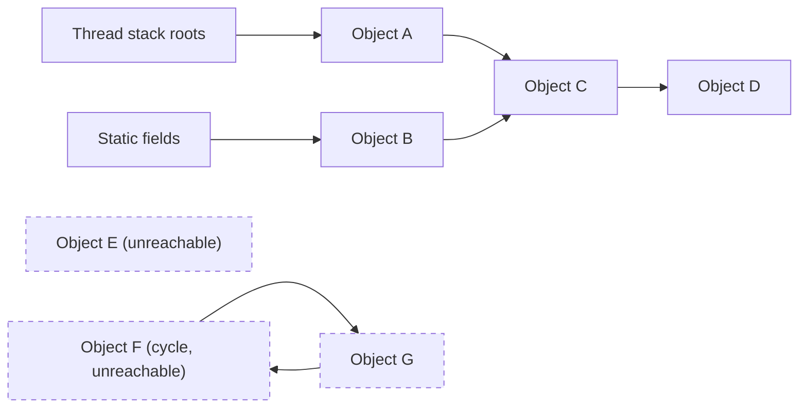
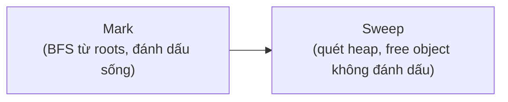
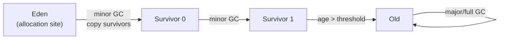
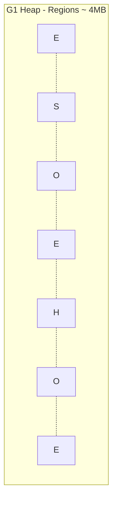
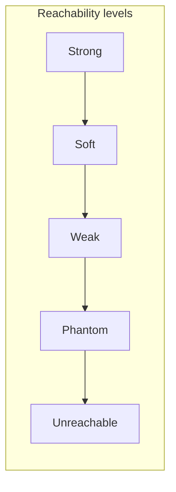

# 08 — Garbage Collection

## 1. Định nghĩa & vai trò

`GC` (Garbage Collector) là cơ chế **tự động thu hồi memory** của object trên Heap không còn được tham chiếu. Người viết Java không cần `free()`/`delete` thủ công.

**Lợi ích**: tránh memory leak thủ công, dangling pointer, double-free.
**Cái giá**: pause GC (stop-the-world), CPU overhead, khó dự đoán latency.

Bài toán cốt lõi của GC:

1. **Tìm** object nào còn sống (reachability).
2. **Thu hồi** object chết, chống fragmentation (mark-sweep, copying, compacting).
3. Làm việc 1 + 2 với **pause ngắn nhất có thể**.

---

## 2. Reachability & GC Roots

Object **sống** nếu có đường dẫn reference đi từ **GC root** đến nó. Mọi thứ khác đều rác.

GC roots gồm:

- **Local variable** & **operand stack** trong frame của thread đang chạy.
- **Static field** của class đã load (ngoại trừ class bị unload).
- **JNI references** (object được giữ bởi native code).
- **Active thread**.
- **Synchronization monitors**.
- **Class object** của class đang load.



> **Cycle** không cản trở GC vì JVM không đếm reference (`reference counting`) mà *trace* từ root.

---

## 3. Thuật toán nền tảng

### 3.1. Mark-and-Sweep



Vấn đề: heap fragment hoá → cần compact.

### 3.2. Mark-Sweep-Compact

Thêm bước **compact**: dồn object sống về 1 đầu heap → free space liền khối, allocation nhanh (bump-pointer).

### 3.3. Copying (Cheney)

Chia heap thành 2 nửa `from-space` và `to-space`. Mark + copy luôn từ from sang to. Hết, swap. Đơn giản, không fragment, nhưng tốn 50% space.

→ Dùng cho **Young generation** (đa số chết trẻ, copy ít, hiệu quả).

### 3.4. Generational Hypothesis

> **"Most objects die young."** — Trên 90% object Java sinh ra rồi chết trong vài ms.

Hệ quả: chia heap thành **Young + Old**, dùng thuật toán khác nhau:

- **Young**: copying GC (nhanh).
- **Old**: mark-sweep-compact (chậm, ít chạy).

→ Đó là cấu trúc của Serial, Parallel, G1.



---

## 4. Các thuật toán GC trong HotSpot

### 4.1. Serial GC (`-XX:+UseSerialGC`)

- Single-threaded, stop-the-world cho cả minor lẫn major.
- Heap nhỏ (< 100 MB), CLI tool, embedded.
- Default trên client class machine; trong container nhỏ vẫn có thể là default.

### 4.2. Parallel GC (`-XX:+UseParallelGC`)

- Multi-threaded cho cả minor & major.
- Throughput cao nhất, nhưng pause **dài** (proportional với heap).
- Default Java 8 trên server.

### 4.3. CMS (`-XX:+UseConcMarkSweepGC`) — **deprecated từ J9, removed J14**

- Concurrent mark-sweep cho Old gen, vẫn STW lúc init mark + remark.
- Không compact → fragment, đôi khi rớt về Full GC serial (rất chậm).
- Đã thay thế bởi G1.

### 4.4. G1 (`-XX:+UseG1GC`) — default từ Java 9

- Heap chia thành **Region** (1-32 MB).
- Mỗi region được gán nhãn động: Eden / Survivor / Old / **Humongous** (object > 50% region size).
- Concurrent marking + STW evacuation pause: chọn các region "có nhiều rác nhất" để thu trước (**Garbage-First**).
- Mục tiêu pause: `-XX:MaxGCPauseMillis=200` (default).
- Throughput xấp xỉ Parallel, pause ngắn hơn nhiều.
- **Ideal**: heap 4-32 GB, latency < 200 ms.



### 4.5. ZGC (`-XX:+UseZGC`) — production từ Java 15

- **Low-latency GC**: pause **< 1 ms** cho heap đến **16 TB**.
- Concurrent **mọi giai đoạn** (mark, relocate, remap) — STW chỉ vài µs.
- Dùng **colored pointers** (8 bit metadata trong reference 64-bit) để đánh dấu trạng thái object.
- Generational ZGC từ Java 21 (JEP 439) — chia young/old, throughput tốt hơn.
- Heap lớn, latency-critical (trading, gaming).

### 4.6. Shenandoah (`-XX:+UseShenandoahGC`)

- Tương tự ZGC: concurrent compaction, pause < 10 ms.
- Phát triển bởi Red Hat.
- Ổn định production, có sẵn trong OpenJDK.

### 4.7. Epsilon (`-XX:+UseEpsilonGC`) — `no-op` GC

- "GC giả" — chỉ allocate, không thu. App OOM khi hết heap.
- Dùng cho test allocation rate, benchmark, batch ngắn.

### 4.8. Bảng so sánh nhanh

| GC | Latency | Throughput | Heap size lý tưởng | Mặc định |
|----|---------|-----------|--------------------|----------|
| Serial | dài | thấp | < 100 MB | embedded |
| Parallel | dài | cao nhất | 1-8 GB | Java 8 server |
| CMS | trung | trung | — | deprecated |
| **G1** | trung-thấp | tốt | 4-32 GB | **Java 9+** |
| **ZGC** | **rất thấp (<1 ms)** | tốt | 8 GB - 16 TB | latency-critical |
| Shenandoah | rất thấp | tốt | 4 GB - hàng TB | Red Hat |
| Epsilon | none | none | test only | — |

---

## 5. Các loại GC pause

| Tên | Mô tả |
|-----|------|
| **Minor GC / Young GC** | Thu Eden + Survivor. Nhanh (~10-50 ms). Frequent. |
| **Major GC / Old GC** | Thu Old gen. Chậm (~100 ms - vài giây). |
| **Mixed GC** (G1) | Thu cả Young + 1 phần Old region. |
| **Full GC** | STW thu toàn bộ heap. Tránh bằng mọi giá trong production. Trigger: `System.gc()`, OOM trước throw, `Metaspace` full, heap fragment. |

**Cờ chống `System.gc()` quấy phá**: `-XX:+DisableExplicitGC` (vô hiệu) hoặc `-XX:+ExplicitGCInvokesConcurrent` (G1, đỡ STW).

---

## 6. Reference Types (`java.lang.ref`)

Java có **5 mức** reference, JVM xử lý khác nhau khi GC:



| Loại | Class | GC giữ lại không? | Use case |
|------|-------|---------------------|---------|
| **Strong** | `Object o = new Object()` | Có, miễn còn reachable | Dùng mặc định |
| **Soft** | `SoftReference<T>` | Giữ đến khi sắp OOM | Cache đơn giản (giảm khi thiếu RAM) |
| **Weak** | `WeakReference<T>` | **Không** giữ — bị thu khi minor GC | `WeakHashMap`, `ThreadLocal`, listener cache |
| **Phantom** | `PhantomReference<T>` + `ReferenceQueue` | Không truy cập `get()`; chỉ biết khi object đã bị GC | Resource cleanup post-finalize, NIO Cleaner |
| **Final-reachable** (internal) | object có `finalize()` non-trivial | giữ thêm 1 cycle để chạy `finalize` | **Đừng dùng `finalize()`** |

> **`finalize()` deprecated từ J9**, removed từ J21. Thay bằng `Cleaner` API:

```java
private static final Cleaner cleaner = Cleaner.create();
public Foo() {
    cleaner.register(this, () -> close()); // chạy khi `this` thành phantom-reachable
}
```

---

## 7. Cờ JVM thường dùng

### 7.1. Chọn GC

```bash
-XX:+UseG1GC                # Java 9+ default
-XX:+UseZGC -XX:+ZGenerational   # ZGC + generational (J21+)
-XX:+UseShenandoahGC
-XX:+UseParallelGC          # legacy throughput
-XX:+UseSerialGC            # tiny heap
-XX:+UseEpsilonGC           # no-op
```

### 7.2. Sizing

```bash
-Xms2g -Xmx2g                  # set bằng nhau, tránh resize
-XX:MaxRAMPercentage=75        # container-aware
-XX:NewRatio=2                 # Old:Young
-XX:MaxGCPauseMillis=200       # G1 target pause
-XX:G1HeapRegionSize=8m
```

### 7.3. Logging (Java 9+ unified logging)

```bash
-Xlog:gc*:file=gc.log:time,uptime,level,tags:filecount=10,filesize=20M
-Xlog:gc+heap=debug
-Xlog:gc+ergo=trace
```

Phân tích bằng [`GCViewer`](https://github.com/chewiebug/GCViewer), [`GCEasy`](https://gceasy.io/).

### 7.4. Diagnostic

```bash
-XX:+HeapDumpOnOutOfMemoryError
-XX:HeapDumpPath=/var/log/heap
-XX:+PrintFlagsFinal           # in toàn bộ flag effective
-XX:+PrintGCDetails            # legacy (J8) — J9+ dùng -Xlog:gc*
```

---

## 8. Demo

### 8.1. Quan sát GC bằng `jstat`

```bash
$ jstat -gc <pid> 1000
 S0C    S1C    S0U    S1U     EC       EU        OC         OU       MC      MU    CCSC   CCSU   YGC     YGCT    FGC    FGCT    CGC    CGCT     GCT
1024.0 1024.0  0.0    0.0   8192.0   3500.0   20480.0   12000.0  18432.0 17800   2304.0  2200.0   45    0.812   2     0.405    0     0.000    1.217
```

Cột chính:

- `EU` — Eden used.
- `OU` — Old used.
- `YGC`/`YGCT` — số minor GC + tổng thời gian.
- `FGC`/`FGCT` — số full GC + tổng thời gian.

### 8.2. Code minh hoạ GC roots

```java
public class GCRootsDemo {
    static List<byte[]> CACHE = new ArrayList<>();   // static -> GC root
    public static void main(String[] args) throws Exception {
        for (int i = 0; i < 1000; i++) {
            CACHE.add(new byte[1024 * 1024]);   // giữ object -> Old gen, OOM cuối cùng
        }
    }
}

// chạy với -Xmx256m -Xlog:gc để thấy minor + full GC -> OOM
```

### 8.3. WeakHashMap demo

```java
WeakHashMap<Object, String> map = new WeakHashMap<>();
Object key = new Object();
map.put(key, "value");
System.out.println(map.size()); // 1
key = null;                     // bỏ strong reference
System.gc();
System.out.println(map.size()); // 0 (entry bị xoá tự động)
```

### 8.4. `Cleaner` thay `finalize()`

```java
class Resource implements AutoCloseable {
    private static final Cleaner CLEANER = Cleaner.create();
    private final Cleaner.Cleanable cleanable;
    private final State state;

    static class State implements Runnable {
        public void run() { /* close native */ }
    }
    public Resource() {
        this.state = new State();
        this.cleanable = CLEANER.register(this, state);
    }
    @Override public void close() { cleanable.clean(); }
}
```

---

## 9. Pitfall & best practice (senior view)

- **Đừng gọi `System.gc()`** — không bảo đảm chạy, gây Full GC ngẫu nhiên. Dùng `-XX:+ExplicitGCInvokesConcurrent` để giảm hại nếu library nào đó gọi.
- **Tuning GC theo data, không theo cảm tính**. Bật GC log, đo p99 pause, allocation rate. `gceasy.io` là tool free tốt.
- **Allocation rate cao** (vài GB/s) là dấu hiệu code tạo object trong hot loop → tối ưu code, không tăng heap.
- **Heap quá lớn không phải lúc nào cũng tốt**: heap to → mark dài → pause dài. ZGC khắc phục, G1 thì hữu hạn.
- **Container memory** = heap + metaspace + code cache + direct + thread stacks + native (~30% overhead). Đừng set `-Xmx = container_limit`.
- **Đừng dùng `finalize()`** (deprecated). Dùng `try-with-resources` + `Cleaner`.
- **Reference types nâng cao**: `WeakHashMap` cho cache key-by-identity; `ConcurrentHashMap` thuần thì không tự thu — cần manual eviction.
- **Humongous allocation** (G1): object > 50% region → cấp luôn vào Old. Tránh allocate `byte[]` rất to trong hot path.
- **GC log size**: rotate qua `filecount`, `filesize`. Mất GC log = mất 50% khả năng debug production.
- **JFR thay GC log** trong production hiện đại: `-XX:StartFlightRecording=duration=120s,filename=app.jfr,settings=profile`.
- **Choose GC theo workload**:
  - Throughput batch → Parallel.
  - Service web latency-quan trọng heap < 32 GB → G1.
  - Latency-quan trọng heap > 32 GB hoặc < 1 ms pause → ZGC (Generational).

---

## 10. Câu hỏi phỏng vấn điển hình

1. GC dùng cơ chế gì để xác định object còn sống? (reachability từ GC roots, không phải reference counting)
2. GC roots gồm những gì?
3. Generational hypothesis là gì? Vì sao chia young/old?
4. Minor GC vs Major GC vs Full GC khác nhau thế nào?
5. G1 hoạt động ra sao? Khác CMS chỗ nào?
6. ZGC pause ngắn nhờ kỹ thuật gì? (concurrent compaction + colored pointers + load barriers)
7. Liệt kê các reference type trong Java. `WeakHashMap` dùng loại nào?
8. `finalize()` deprecated vì sao? Thay bằng gì?
9. Tại sao không nên gọi `System.gc()`?
10. Trong container, heap nên config thế nào để tránh OOM kill?
11. STW (Stop-the-World) là gì? GC nào tránh được nhiều nhất?
12. Allocation rate quá cao gây ra vấn đề gì? Cách giảm?

---

## 11. Tham chiếu

- [HotSpot Garbage Collector Tuning](https://docs.oracle.com/en/java/javase/21/gctuning/)
- [JEP 248: Make G1 the Default GC](https://openjdk.org/jeps/248)
- [JEP 333: ZGC](https://openjdk.org/jeps/333)
- [JEP 439: Generational ZGC](https://openjdk.org/jeps/439)
- [JEP 421: Deprecate Finalization](https://openjdk.org/jeps/421)
- [Aleksey Shipilev — GC Sequential Phases](https://shipilev.net/jvm/anatomy-quarks/)
- [Plumbr Handbook of Java GC](https://plumbr.io/handbook/garbage-collection-in-java)
