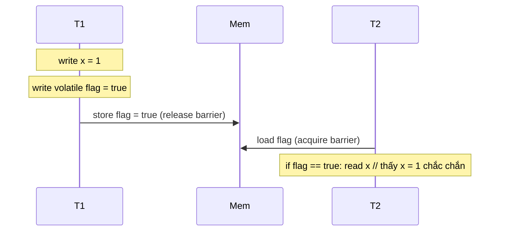

# 09 — Java Memory Model (`JMM`)

## 1. Định nghĩa & vai trò

`JMM` là phần của `JLS §17` định nghĩa **các bảo đảm** (guarantees) về thứ tự thấy nhau giữa các thread trong chương trình đa luồng.

Vấn đề `JMM` giải quyết:

- CPU hiện đại có **nhiều cache level** (L1/L2/L3) — write của thread T1 trên CPU0 chưa chắc thread T2 trên CPU1 thấy ngay.
- **Compiler reorder** lệnh để tối ưu (instruction-level parallelism, register caching).
- Không có quy ước → mỗi JVM/CPU sẽ chạy khác nhau → đa luồng không portable.

`JMM` định nghĩa **3 thuộc tính** mọi shared state phải đảm bảo trong concurrent code:

| Thuộc tính | Ý nghĩa |
|------------|--------|
| **Atomicity** | Thao tác xảy ra "nguyên" hoặc "không" — không thấy trạng thái nửa chừng |
| **Visibility** | Write của 1 thread sẽ được thread khác thấy được sau đồng bộ |
| **Ordering** | Thứ tự lệnh quan sát từ thread khác phù hợp với program order |

> JMM là chủ đề khó nhất của Java. Đa số bug đa luồng là vì lập trình viên **giả định visibility / ordering miễn phí** — sai!

---

## 2. Vấn đề concurrency: 3 ví dụ kinh điển

### 2.1. Visibility — không có `volatile`

```java
class StopFlag {
    boolean stop = false;          // KHÔNG volatile
    void run() {
        while (!stop) { /* work */ }   // có thể KHÔNG BAO GIỜ thấy stop=true
    }
}
```

JIT có thể nâng `stop` thành register loop-invariant → đọc 1 lần, lặp vô hạn. Đây là bug rất phổ biến.

**Fix**: `volatile boolean stop;`

### 2.2. Atomicity — race condition `i++`

```java
int counter = 0;
void inc() { counter++; }   // 3 lệnh: read, add 1, write — KHÔNG atomic
```

2 thread cùng `inc()` 1000 lần → kết quả < 2000.

**Fix**: `synchronized`, `AtomicInteger`, `LongAdder`.

### 2.3. Ordering — DCL sai (Double-Checked Locking)

```java
class Lazy {
    private static Singleton instance;   // KHÔNG volatile
    public static Singleton get() {
        if (instance == null) {
            synchronized (Lazy.class) {
                if (instance == null) instance = new Singleton(); // (*)
            }
        }
        return instance;
    }
}
```

Bug: bytecode `new` chia 3 bước (1) cấp phát, (2) gán vào `instance`, (3) chạy constructor. JIT/CPU có thể reorder thành `1 → 2 → 3` — thread khác thấy `instance != null` nhưng object **chưa khởi tạo xong**.

**Fix**: `private static volatile Singleton instance;` — `volatile` cấm reorder ở store.

---

## 3. `happens-before` — quy tắc trung tâm

Toàn bộ JMM xoay quanh quan hệ **`happens-before` (HB)**: nếu `A hb B`, kết quả của `A` đảm bảo visible cho thread đọc `B`.

Các nguồn HB chính (theo JLS §17.4.5):

1. **Program order** trong cùng 1 thread: lệnh trước HB lệnh sau.
2. **Monitor lock**: `unlock` HB mọi `lock` cùng monitor sau đó.
3. **`volatile` write** HB mọi **`volatile` read** field đó sau đó.
4. **`Thread.start()`** HB mọi action trong thread mới.
5. **Mọi action** trong thread T HB **`Thread.join()`** trên T.
6. **Constructor** HB mọi `finalizer` (legacy).
7. **`Interrupt`** trên T HB phát hiện interrupt trong T.
8. **Default initialization** (`0`/`null`) HB action đầu tiên trong thread.
9. **`AtomicX.set`** + `set` semantics tương đương `volatile` write; tương tự với `get`.
10. **Transitivity**: A hb B & B hb C → A hb C.



---

## 4. `volatile`

`volatile` field đảm bảo:

- **Visibility**: write thấy được ngay với mọi thread đọc sau đó.
- **Ordering**: cấm compiler/CPU reorder qua write/read volatile (acquire-release semantics).
- **Atomic** cho `int`/`long`/reference (kể cả `long` 64-bit, vốn không atomic mặc định trên 32-bit JVM).

`volatile` **không** cấp:

- Atomic cho compound operation (`v++`, `v = v + 1`). Cần `AtomicInteger`/`synchronized`.

Use case:

- Cờ `stop` cho thread.
- Reference được publish 1 chiều (DCL singleton).
- Counter cờ debug (không cần chính xác).

```java
class CleanShutdown {
    private volatile boolean running = true;
    void worker() { while (running) { /* ... */ } }
    void stop()   { running = false; }
}
```

---

## 5. `synchronized`

Khi vào block `synchronized(lock)`:

- Thread giành **monitor** của `lock`.
- Đọc lại biến từ main memory (cache invalidate).
- Khi ra: flush write ra main memory.
- Tạo **`mutual exclusion`** + **happens-before** giữa unlock và lock sau.

```java
synchronized (this) { /* atomic + visibility + ordering */ }
```

Đặc tính:

- **Reentrant**: thread đã giữ lock có thể vào lại block khác cùng monitor.
- **Mọi object** đều có monitor (synchronized header bit).
- **Lock contention** lớn → bottleneck. JDK có `Lock` API (`ReentrantLock`, `ReadWriteLock`, `StampedLock`) cho fine-grained control.

Khi nào prefer `synchronized` vs `ReentrantLock`:

| | `synchronized` | `ReentrantLock` |
|-|----------------|------------------|
| Cú pháp | Gọn | Phải `try-finally` unlock |
| Fairness | không | có thể `new ReentrantLock(true)` |
| TryLock / timeout | không | có |
| Interruptible | không | có (`lockInterruptibly`) |
| Multiple condition | 1 (wait/notify) | nhiều `Condition` |
| Performance | tốt từ J6 (biased, lightweight, heavy locking) | tương đương |

→ Default dùng `synchronized`, chỉ chuyển sang `ReentrantLock` khi cần feature đặc biệt.

---

## 6. `final` field semantics

Theo JLS §17.5: `final` field được **publish an toàn** sau constructor. Cụ thể:

- Constructor xong → mọi thread thấy `final` field giá trị đúng (kể cả khi reference được publish bằng race).

Đó là lý do **immutable object luôn an toàn** với mọi thread (`String`, `Integer`, `LocalDate`, record).

```java
class ImmutablePoint {
    final int x, y;
    ImmutablePoint(int x, int y) { this.x = x; this.y = y; }
}
```

Pitfall: nếu publish `this` ra ngoài *trong* constructor (vd `register(this)` rồi setter sau), `final` không bảo vệ — thread khác có thể thấy field default.

---

## 7. Memory barriers (fences)

Dưới capo, JMM được implement bằng **memory barrier** — lệnh CPU cấm reorder qua nó.

| Barrier | Cấm reorder |
|---------|------------|
| `LoadLoad` | load1; load2 — load1 không thể bị reorder sau load2 |
| `StoreStore` | store1; store2 — store1 không thể bị reorder sau store2 |
| `LoadStore` | load1; store2 |
| `StoreLoad` | store1; load2 — barrier mạnh nhất, đắt nhất |

Mapping:

- `volatile read` ≈ `LoadLoad` + `LoadStore` (acquire).
- `volatile write` ≈ `LoadStore` + `StoreStore` (release) **và** `StoreLoad` sau (full fence trên x86).
- `synchronized enter` ≈ acquire; `exit` ≈ release.

Java 9+ có **`VarHandle`** API expose các fence:

```java
VarHandle.fullFence();
VarHandle.acquireFence();
VarHandle.releaseFence();
VarHandle.loadLoadFence();
VarHandle.storeStoreFence();
```

> Trên x86, `LoadLoad`/`LoadStore`/`StoreStore` đều miễn phí (TSO model). Chỉ `StoreLoad` tốn ~10 cycle. ARM/POWER yếu hơn nên `volatile` đắt hơn.

---

## 8. `java.util.concurrent` & `Atomic*`

JMM được build cho thư viện `java.util.concurrent` (Doug Lea) hoạt động đúng:

- **`AtomicInteger`**, `AtomicLong`, `AtomicReference`: CAS (compare-and-swap) operations atomic + happens-before tương đương `volatile`.
- **`LongAdder`/`LongAccumulator`** (J8): striped để tránh false sharing — nhanh hơn `AtomicLong` cho high-contention.
- **`ConcurrentHashMap`**: lock-striping (J7) → CAS bin (J8). Reads thường lock-free.
- **`CopyOnWriteArrayList`**: reads lock-free, writes copy.
- **`Locks`**: `ReentrantLock`, `ReadWriteLock`, `StampedLock`.
- **Sync utils**: `CountDownLatch`, `CyclicBarrier`, `Semaphore`, `Phaser`, `Exchanger`.
- **Executors**: `ThreadPoolExecutor`, `ForkJoinPool`, `ScheduledExecutorService`.

> Đọc *Java Concurrency in Practice* (Brian Goetz) — chương 16 nói về JMM đầy đủ.

---

## 9. Demo

### 9.1. Visibility bug

```java
public class Visibility {
    static boolean stop = false;          // KHÔNG volatile — buggy
    public static void main(String[] args) throws Exception {
        Thread t = new Thread(() -> {
            int i = 0;
            while (!stop) i++;            // có thể infinite loop trên server JVM
            System.out.println(i);
        });
        t.start();
        Thread.sleep(1000);
        stop = true;
        t.join(2000);
        System.out.println("joined? " + !t.isAlive());
    }
}
```

→ Server JIT (-server, default) thường cache `stop` trong register, vòng lặp không bao giờ thoát.

**Fix**: `volatile boolean stop`.

### 9.2. DCL Singleton (đúng)

```java
public final class Singleton {
    private static volatile Singleton instance;
    private Singleton() {}
    public static Singleton get() {
        Singleton ref = instance;
        if (ref == null) {
            synchronized (Singleton.class) {
                ref = instance;
                if (ref == null) instance = ref = new Singleton();
            }
        }
        return ref;
    }
}
```

> Hoặc đơn giản hơn — **Holder idiom**:

```java
public final class Singleton {
    private static class Holder { static final Singleton INSTANCE = new Singleton(); }
    public static Singleton get() { return Holder.INSTANCE; }
}
```

JVM bảo đảm class init thread-safe → an toàn, **lazy**, không cần `volatile`.

### 9.3. Project Loom & JMM

Virtual threads (J21) không thay đổi JMM — `synchronized`/`volatile` vẫn hoạt động giống hệt với platform threads. Nhưng:

- `synchronized` ở virtual thread vẫn pin carrier thread (đến J21 chưa fix; J22+ JEP 491 sẽ fix).
- `ReentrantLock` không pin → khuyến nghị dùng cho virtual threads.

---

## 10. Pitfall & best practice (senior view)

- **Đa luồng = visibility + atomicity + ordering**, không chỉ "đúng output 1 lần". Test single-thread không phát hiện được bug đa luồng.
- **`volatile` không thay thế `synchronized`** cho compound op.
- **`synchronized(this)`** là antipattern — bất cứ ai cũng có thể lock object → deadlock. Dùng private final lock object: `private final Object lock = new Object();`.
- **`synchronized(String.intern())`** sai — interned string global, bị lock cross-app.
- **`Thread.sleep`/`yield`** không phải tool đồng bộ — chỉ test/wait. Không có HB.
- **Không bao giờ tự build lock-free data structure** trừ khi đã đọc *The Art of Multiprocessor Programming*. Dùng JDK utilities.
- **`Hashtable`/`Vector` synchronized chỗ gọi method**, vẫn race khi compose. Dùng `ConcurrentHashMap`/`CopyOnWriteArrayList`.
- **`Collections.synchronizedMap(map)`** lock cả map — trong vòng lặp phải `synchronized(map)` thủ công cho atomic snapshot.
- **`ConcurrentHashMap.compute`/`merge`** atomic — dùng nó thay vì `if (!contains) put`.
- **Test concurrency**: `jcstress` (Aleksey Shipilev) — frame work test JMM bằng cách chạy hàng tỉ lần để bắt edge.
- **Đọc gì**: *JCIP*, *JLS §17*, jcstress test cases.

---

## 11. Câu hỏi phỏng vấn điển hình

1. JMM giải quyết vấn đề gì? Visibility, atomicity, ordering nghĩa là gì?
2. `volatile` đảm bảo gì? Không đảm bảo gì? Khi nào dùng?
3. `synchronized` cung cấp những guarantee gì?
4. `happens-before` là gì? Cho 5 ví dụ.
5. Vì sao Double-Checked Locking cần `volatile`?
6. `final` field semantics — vì sao immutable object an toàn?
7. `synchronized` vs `ReentrantLock` — khi nào chọn cái nào?
8. Sự khác nhau giữa `AtomicInteger` và `LongAdder`?
9. `ConcurrentHashMap` thread-safe nhờ kỹ thuật gì? Java 7 vs 8?
10. Tại sao `i++` không atomic dù `int` < 4 bytes?
11. Memory barrier là gì? `LoadLoad` vs `StoreLoad`?
12. Pin carrier thread là gì trong virtual threads?
13. Holder idiom singleton vs DCL — ưu nhược?

---

## 12. Tham chiếu

- [JLS §17 — Threads and Locks](https://docs.oracle.com/javase/specs/jls/se21/html/jls-17.html)
- [JSR 133: Java Memory Model](https://www.cs.umd.edu/~pugh/java/memoryModel/)
- [Brian Goetz — *Java Concurrency in Practice*](https://jcip.net/)
- [Doug Lea — Synchronization Primitives](https://gee.cs.oswego.edu/dl/cpj/)
- [JEP 188: Java Memory Model Update](https://openjdk.org/jeps/188)
- [Aleksey Shipilev — Java Memory Model Pragmatics](https://shipilev.net/blog/2014/jmm-pragmatics/)
- [`jcstress`](https://github.com/openjdk/jcstress)
