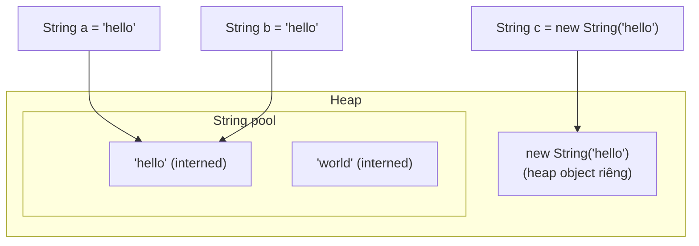
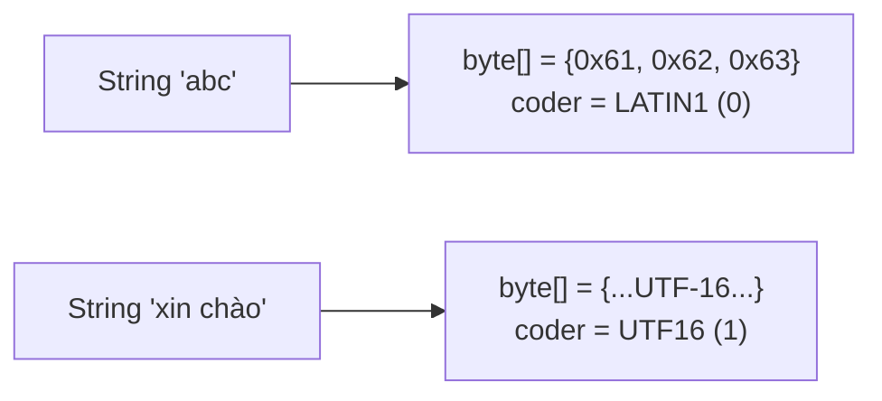

# 10 — String, String Pool & Interning

## 1. Định nghĩa & vai trò

`String` là class đặc biệt nhất trong Java vì:

- **Immutable** — sau khi tạo, content không đổi.
- **Có pool riêng** trong heap (Java 7+) để chia sẻ instance String literal.
- Có cú pháp đặc biệt (`"abc"`) và operator `+` (đường tắt cho `StringBuilder`).
- Là key phổ biến nhất trong `HashMap` → cần `hashCode` đáng tin cậy.

Hiểu sâu `String`/pool quan trọng vì:

- Là nguồn gốc bug `==` vs `equals`.
- Cấu trúc cache vào hot path memory: chuỗi 1 GB log có thể chiếm hết heap.
- Đa luồng share string an toàn miễn phí (immutable).

---

## 2. Immutability của String

```java
String s = "hello";
s = s + " world";   // KHÔNG sửa s — tạo String mới, gán lại reference
```

Tại sao immutable?

1. **Thread-safe** miễn phí — share giữa thread không cần đồng bộ.
2. **Hash code có thể cache** lazily (`String.hash` field).
3. **Pool an toàn** — nhiều reference cùng instance không bị 1 ai đó "sửa".
4. **Security** — class loading, file path, network address không bị reset giữa check và use.

Internal (Java 8): `private final char[] value`. Java 9+: `private final byte[] value` + `byte coder` (compact strings, JEP 254).

---

## 3. String Pool

`String pool` (a.k.a. **String table**, `StringTable`) là **hash table** trong heap (J7+, trước đó ở PermGen) chứa các String literal được dedup.

```java
String a = "hello";          // tạo / lấy literal "hello" trong pool
String b = "hello";          // cùng object với a
String c = new String("hello");  // tạo object MỚI trên heap, content giống

System.out.println(a == b);            // true — cùng instance pool
System.out.println(a == c);            // false — khác instance
System.out.println(a.equals(c));       // true
System.out.println(a == c.intern());   // true — intern() trả về instance trong pool
```



### 3.1. `intern()`

`String.intern()` trả về phiên bản **canonical** của String trong pool. Nếu chưa có, push thêm vào pool; nếu có rồi, trả về instance đó.

```java
String s = new String("dynamic").intern();   // bây giờ s là pool instance
```

### 3.2. Sizing pool (Java 8+)

Pool là `StringTable` với buckets; tuning:

| Cờ | Tác dụng |
|----|----------|
| `-XX:StringTableSize=60013` | số bucket pool (mặc định ~60013 từ J11+) |
| `-XX:+PrintStringTableStatistics` | in stats khi shutdown |
| `-XX:+UseStringDeduplication` | (G1, J8+) **dedup** giá trị `byte[]` khi GC nếu trùng — không cần `intern()` thủ công |

Quá tải pool (đặc biệt `intern()` data người dùng) → bucket dài, lookup chậm. Nguyên nhân memory leak: pool nằm trong heap nhưng entries ít khi unload.

---

## 4. Compact Strings (Java 9, JEP 254)

Trước J9: `char[] value` — mỗi char 2 bytes (UTF-16).

Java 9+: nếu mọi ký tự là `Latin-1` (ASCII + ký tự Tây Âu), lưu `byte[] value` (1 byte/char) + `byte coder=0`. Nếu có ký tự `BMP` ngoài Latin-1, dùng `coder=1` (UTF-16, 2 bytes/char).



→ App nhiều ASCII string giảm 50% memory String. Đó là 1 trong những cải tiến lớn của Java 9.

Cờ disable: `-XX:-CompactStrings` (chỉ debug, đừng tắt production).

---

## 5. String concatenation

### 5.1. Java 8 trở về trước

`a + b + c` → `new StringBuilder().append(a).append(b).append(c).toString()` — `javac` desugar.

Trong vòng lặp:

```java
String s = "";
for (int i = 0; i < n; i++) s += i;     // tạo n StringBuilder, n^2 cost
```

→ Phải tự dùng `StringBuilder` rõ ràng.

### 5.2. Java 9+ (JEP 280) — `invokedynamic` + `StringConcatFactory`

`a + b + c` được compile thành `invokedynamic` gọi `StringConcatFactory.makeConcatWithConstants`. Runtime tự chọn strategy tối ưu nhất (tùy phiên bản JDK):

- `MH_INLINE_SIZED_EXACT` (default) — tính chính xác size, allocate 1 lần `byte[]` rồi copy.
- Tránh box `int → Integer → toString` không cần thiết.

→ Một số trường hợp thậm chí **nhanh hơn** `StringBuilder` thủ công. Nhưng trong vòng lặp vẫn nên dùng `StringBuilder` (mỗi `+` vẫn là 1 call).

### 5.3. `StringBuilder` vs `StringBuffer`

| | `StringBuilder` (J5+) | `StringBuffer` (J1+) |
|-|-----------------------|---------------------|
| Thread-safe | không | yes (`synchronized`) |
| Performance | nhanh hơn | overhead lock |
| Use case | local builder (default) | legacy, hiếm cần |

→ Mặc định **luôn** `StringBuilder`. `StringBuffer` chỉ tồn tại vì lý do legacy.

---

## 6. Text Blocks (Java 13/15, JEP 378)

```java
String json = """
        {
          "name": "Alice",
          "age": 30
        }
        """;
```

- Mở/đóng bằng `"""` + newline.
- Indent chung (đến cột tối thiểu) bị strip — gọi là *incidental whitespace*.
- Hỗ trợ escape: `\s` (space), `\` cuối dòng (line continuation).
- Type vẫn là `String`, không phải class mới.

→ Thay thế nhu cầu `+ "\n" +` cho JSON, SQL, HTML.

---

## 7. Demo

### 7.1. `==` vs `equals`

```java
public class StringEquality {
    public static void main(String[] args) {
        String a = "java";
        String b = "java";
        String c = new String("java");
        String d = c.intern();
        String e = "ja" + "va";          // compile-time constant -> pool
        String f = "ja";
        String g = f + "va";              // runtime concat -> heap object

        System.out.println(a == b); // true
        System.out.println(a == c); // false
        System.out.println(a == d); // true
        System.out.println(a == e); // true (constant folding)
        System.out.println(a == g); // false
        System.out.println(a == g.intern()); // true
    }
}
```

### 7.2. Đo memory với compact strings

```bash
$ java -XX:+PrintStringTableStatistics -version 2>&1 | tail -10
StringTable statistics:
Number of buckets       :     65536 = 524288 bytes, each 8
Number of entries       :     16234 = ...
Average bucket size     :     0.247
...
```

### 7.3. Build chuỗi đúng cách

```java
// SAI - n^2 trong loop
String result = "";
for (var item : items) result += item.toString() + ",";

// ĐÚNG
StringBuilder sb = new StringBuilder(items.size() * 8);
for (var item : items) sb.append(item).append(',');
String result = sb.toString();

// HOẶC stream
String result = items.stream().map(Object::toString).collect(Collectors.joining(","));
```

### 7.4. `String.intern()` cẩn trọng

```java
// MEMORY LEAK pattern: intern user data
Map<String, X> cache = new HashMap<>();
cache.put(userInputString.intern(), value);  // pool tăng vô hạn!
```

→ Không bao giờ `intern()` data từ user. Pool entries không tự xoá theo cache.

---

## 8. `String` API quan trọng (Java 11+)

| Method | Phiên bản | Tác dụng |
|--------|-----------|---------|
| `isBlank()` | J11 | empty hoặc chỉ whitespace |
| `lines()` | J11 | `Stream<String>` từng dòng |
| `strip()` | J11 | trim + Unicode whitespace |
| `repeat(n)` | J11 | `"ab".repeat(3)` → `"ababab"` |
| `chars()`, `codePoints()` | J8 | `IntStream` |
| `formatted(args...)` | J15 | shortcut `String.format` |
| `indent(n)`, `stripIndent()`, `translateEscapes()` | J15 | text block helpers |
| `String.join` | J8 | `String.join(",", list)` |

`String.format` rất chậm (parser regex). Dùng `+` hoặc `StringBuilder` cho hot path.

---

## 9. Pitfall & best practice (senior view)

- **Dùng `equals`, không dùng `==`** cho so sánh String. Trừ khi *chắc chắn* cả 2 đều interned (literal hoặc pool).
- **Đừng `intern()` data người dùng** — pool tăng vô hạn, nằm trong heap.
- **`-XX:+UseStringDeduplication`** (G1) gần như miễn phí — bật trong app web có nhiều String trùng (response JSON cache, log).
- **`new String(...)`** là antipattern trừ khi cần copy `char[]` chia sẻ. Đa số trường hợp `String literal` đủ.
- **`+=` trong loop** — `javac` mới có thể dùng `invokedynamic` tối ưu, nhưng vẫn tốt hơn `StringBuilder` rõ ràng (size hint).
- **`String.format` chậm** — chỉ dùng cho non-hot-path (logging cẩn thận, format error).
- **Logging**: `log.info("user={}, action={}", user, action)` dùng `{}` placeholder — chỉ format khi level enable. Tránh `log.info("user=" + user)`.
- **`String.intern()` pool ở Java 7+** trong heap. Trước J7 ở PermGen → quá nhiều intern → `OutOfMemoryError: PermGen`.
- **`StringTokenizer` legacy** — dùng `String.split` hoặc `Pattern`/`Matcher`.
- **Multi-line literal**: ưu tiên text block thay vì `\n` concat.
- **`String.codePoints`** quan trọng cho emoji/CJK 4-byte UTF-16 surrogate pair. `s.length()` đếm `char` (2 bytes), không phải code point.
- **`hashCode`** của String được cache trong field `int hash` — gọi nhiều lần miễn phí.

---

## 10. Câu hỏi phỏng vấn điển hình

1. Vì sao String immutable?
2. String pool nằm ở đâu? Khi nào pool được populate?
3. `==` và `.equals()` khác nhau thế nào với String?
4. `String s = new String("a")` tạo bao nhiêu object? (Tối đa 2: 1 trong pool nếu chưa có, 1 ngoài heap.)
5. Compact strings (Java 9) làm gì? Tiết kiệm memory ra sao?
6. `intern()` để làm gì? Risk?
7. `StringBuilder` vs `StringBuffer` — khi nào dùng?
8. Tại sao Java 9+ dùng `invokedynamic` cho `+`?
9. Text block khác String thường ở đâu? (Chỉ là cú pháp; runtime giống.)
10. `String.split` có dùng regex không? (Có, mọi argument là regex pattern.)
11. `s.length()` có đếm đúng số ký tự với emoji không? (Không nếu surrogate pair.)
12. `-XX:+UseStringDeduplication` làm gì? Có đáng bật?

---

## 11. Tham chiếu

- [JLS §3.10.5: String Literals](https://docs.oracle.com/javase/specs/jls/se21/html/jls-3.html#jls-3.10.5)
- [JEP 254: Compact Strings](https://openjdk.org/jeps/254)
- [JEP 280: Indify String Concatenation](https://openjdk.org/jeps/280)
- [JEP 378: Text Blocks](https://openjdk.org/jeps/378)
- [Aleksey Shipilev — Compact Strings](https://shipilev.net/jvm/anatomy-quarks/19-compact-strings/)
- [`String` Javadoc — Java 21](https://docs.oracle.com/en/java/javase/21/docs/api/java.base/java/lang/String.html)
