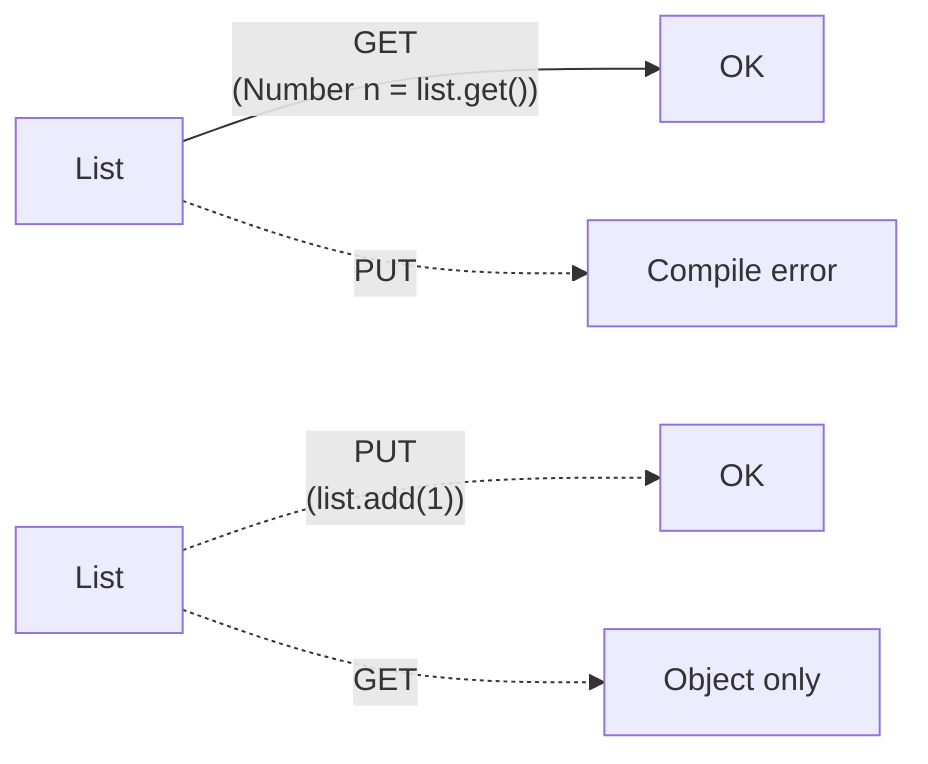

# 11 — Generics & Type Erasure

## 1. Định nghĩa & vai trò

Generics (JSR 14, Java 5) cho phép viết class/method **parameterized theo type**:

```java
List<String> names = new ArrayList<>();
public <T> T identity(T x) { return x; }
```

Mục tiêu:

- **Type safety** ở compile time — không còn `(String) list.get(0)` cast thủ công.
- **Code reuse** — 1 implementation cho mọi type.
- **Self-documenting** — signature thể hiện ý đồ.

Đặc điểm quan trọng nhất ở Java: **type erasure** — generics chỉ là *compile-time check*; runtime gần như không biết `T` là gì. Đây là quyết định kiến trúc để giữ **tương thích bytecode** với code Java pre-5.

---

## 2. Erasure là gì

`javac` xoá thông tin generics ở bước Lower:

```java
// Source
public class Box<T extends Number> {
    T value;
    public T get() { return value; }
}

// Bytecode tương đương (sau erasure)
public class Box {
    Number value;                      // T extends Number → erase thành Number
    public Number get() { return value; }
}
```

```java
List<String> ls = new ArrayList<>();
List<Integer> li = new ArrayList<>();
System.out.println(ls.getClass() == li.getClass());  // true!
```

Cùng class `ArrayList`. Generic info bị **erase**.

### Tại sao chọn erasure?

- **Migration compatibility**: code Java 1.4 (raw `List`) chạy tiếp trên Java 5+, ngược lại.
- **Không cần tăng size class file** với metadata generic.
- Trade-off: mất runtime info → reflection/array/instanceof có nhiều hạn chế.

> Một số ngôn ngữ JVM khác (Kotlin với `inline reified`, Scala với manifest, .NET) **reify** generics — biết type ở runtime. Java *gần như* không có (trừ qua trick hoặc `TypeReference`).

---

## 3. `Signature` attribute & bridge method

### 3.1. `Signature` attribute

Mặc dù bytecode erase, `.class` vẫn lưu generics qua attribute `Signature` (JLS §4.7.9). Reflection (`Method.getGenericReturnType()`, `Class.getTypeParameters()`) đọc được attribute này.

```bash
$ javap -p -v Box.class | grep -A1 Signature
Signature: #N // <T:Ljava/lang/Number;>Ljava/lang/Object;
```

### 3.2. Bridge method

Cần để giữ polymorphism khi erase type khác signature:

```java
class Node<T> {
    public T get() { return null; }
}
class IntNode extends Node<Integer> {
    @Override public Integer get() { return 42; }
}
```

Sau erasure, `Node.get()` trả `Object`. `IntNode.get()` trả `Integer` → khác signature → không override theo bytecode rule.

→ `javac` sinh **bridge method**:

```java
class IntNode {
    public Integer get() { return 42; }
    // bridge synthetic
    public Object get() { return get(); }   // gọi đúng method bên trên
}
```

`javap -c IntNode` thấy 2 method `get` — 1 thật, 1 `ACC_BRIDGE | ACC_SYNTHETIC`.

---

## 4. Wildcards & PECS

### 4.1. Bounded type parameter

```java
public <T extends Comparable<T>> T max(List<T> list)
```

`T extends Number` — chỉ nhận subclass `Number`.

### 4.2. Wildcards (`?`)

```java
List<?> any;                  // unknown type — không add được (trừ null)
List<? extends Number> nums;  // covariant — chỉ READ
List<? super Integer> ints;   // contravariant — chỉ WRITE
```



### 4.3. **PECS rule** (Joshua Bloch, *Effective Java*)

> **`P`roducer **`E`**xtends, `C`onsumer `S`uper**

- Method **đọc** từ collection (collection sản xuất giá trị) → `<? extends T>`.
- Method **ghi** vào collection (collection tiêu thụ giá trị) → `<? super T>`.

Ví dụ kinh điển:

```java
public static <T> void copy(List<? super T> dst, List<? extends T> src) {
    for (T t : src) dst.add(t);
}
```

`Collections.copy`, `Stream.collect(Collector<? super T,A,R>)`, ... đều theo PECS.

### 4.4. Hệ quả invariance

Generic là **invariant** — `List<Integer>` **không là** `List<Number>` dù `Integer` là `Number`.

```java
List<Integer> li = new ArrayList<>();
List<Number> ln = li;  // COMPILE ERROR
```

(Nếu cho phép → có thể `ln.add(3.14)` rồi sau đó `Integer i = li.get(0)` → ClassCastException.)

Wildcard giúp linh hoạt:

```java
List<? extends Number> ln = li;  // OK — covariant
```

Array thì khác — array là **covariant** nhưng *không an toàn* (ArrayStoreException ở runtime).

---

## 5. Hạn chế của erasure

| Không thể | Vì sao |
|-----------|------|
| `new T()` | runtime không biết `T` để gọi constructor |
| `new T[10]` | không biết component type → không tạo array |
| `if (x instanceof List<String>)` | runtime erase — phải `instanceof List<?>` |
| `T.class` | không tồn tại |
| `class A<T> extends Throwable` | không thể catch theo `T` |
| `static T field` | T scope theo instance, không phải class |
| `void m(List<String> a, List<Integer> b)` overload | erase ra cùng `List` — collision |

→ Workaround: nhận `Class<T> clazz` làm parameter:

```java
public <T> T create(Class<T> clazz) throws Exception {
    return clazz.getDeclaredConstructor().newInstance();
}
T[] arr = (T[]) Array.newInstance(clazz, 10);
```

---

## 6. `@SafeVarargs` & heap pollution

```java
public static <T> List<T> listOf(T... items) { return Arrays.asList(items); }
```

Compile cảnh báo "unchecked generic array creation" — vì runtime tạo `Object[]` rồi cast về `T[]`.

Annotate `@SafeVarargs` (yêu cầu `final` hoặc `static`) để tự khai báo "tôi chỉ đọc, không pollute":

```java
@SafeVarargs
public static <T> List<T> listOf(T... items) { ... }
```

> **Heap pollution**: khi reference cast về generic không khớp type thật → ClassCastException sau khi đọc. Erasure cho phép việc này lọt qua.

---

## 7. Reified generics workaround — `TypeReference`

Để truyền `Class<T>` cho generic phức tạp như `List<String>`, dùng pattern `super type token` (Gafter):

```java
public abstract class TypeRef<T> {
    private final Type type;
    protected TypeRef() {
        Type st = getClass().getGenericSuperclass();
        type = ((ParameterizedType) st).getActualTypeArguments()[0];
    }
    public Type getType() { return type; }
}

TypeRef<List<String>> ref = new TypeRef<List<String>>() {};   // anonymous subclass
```

→ Class anonymous subclass giữ `Signature` của `T` qua attribute → reflection đọc được.

Frameworks dùng pattern này: Jackson `TypeReference`, Spring `ParameterizedTypeReference`, Guice `TypeLiteral`.

---

## 8. Demo

### 8.1. Erasure thực tế

```java
public class Erasure {
    public static void main(String[] args) {
        List<String> ls = new ArrayList<>();
        List<Integer> li = new ArrayList<>();
        System.out.println(ls.getClass() == li.getClass());   // true

        ls.add("a");
        // raw type bypass
        List raw = ls;
        raw.add(42);                                    // hợp lệ ở runtime!
        for (Object o : ls) System.out.println(o);      // "a", 42
        for (String s : ls) System.out.println(s);      // ClassCastException ở 42!
    }
}
```

### 8.2. Bridge method

```java
$ javac IntNode.java
$ javap -p -c IntNode
public class IntNode extends Node<java.lang.Integer> {
  public java.lang.Integer get();
    Code: ldc #2; areturn;

  public java.lang.Object get();      // BRIDGE
    Code:
       0: aload_0
       1: invokevirtual #6  // IntNode.get():Integer
       4: areturn
}
```

### 8.3. PECS

```java
public class CopyDemo {
    static <T> void copy(List<? extends T> src, List<? super T> dst) {
        for (T t : src) dst.add(t);
    }
    public static void main(String[] args) {
        List<Integer> ints = List.of(1, 2, 3);
        List<Number> nums = new ArrayList<>();
        List<Object> objs = new ArrayList<>();
        copy(ints, nums);   // src: List<Integer>, dst: List<Number> — ok
        copy(ints, objs);   // src: List<Integer>, dst: List<Object> — ok
    }
}
```

### 8.4. `TypeReference`

```java
TypeRef<Map<String, List<Integer>>> ref = new TypeRef<>(){};
System.out.println(ref.getType());
// java.util.Map<java.lang.String, java.util.List<java.lang.Integer>>
```

---

## 9. Pitfall & best practice (senior view)

- **Tránh raw type** (`List` thay vì `List<String>`) — chỉ tồn tại để tương thích pre-Java 5. Modern code không nên dùng.
- **Dùng `<>` diamond** (Java 7+): `new ArrayList<String>()` → `new ArrayList<>()`.
- **Đặt tên type parameter ngắn gọn**: `T` (Type), `E` (Element), `K`/`V` (Key/Value), `R` (Result), `N` (Number). Đa ký tự khi cần đặc biệt: `<TLeft, TRight>`.
- **PECS** ngấm trong API của bạn:
  - `Function<? super T, ? extends R>` — Stream `map`.
  - `Consumer<? super T>` — `forEach`.
  - `Comparator<? super T>` — `Collections.sort`.
- **`<T extends Comparable<? super T>>`** thay `<T extends Comparable<T>>` để chấp nhận supertype comparator.
- **Tránh `Class<? extends T>` lạm dụng** trong API public — nếu thực sự cần, dùng builder/factory pattern.
- **Generic method vs generic class**: nếu type chỉ dùng ở 1 method, dùng `<T> T m()` thay vì class.
- **Đừng cast `(T)` mù quáng** trong generic — `(List<String>) obj` chỉ check `List`, không check `String`. JIT vẫn ném ClassCastException sau đó.
- **Generic exception** cấm — dùng `throws Exception` rồi catch chuyên biệt.
- **`Optional<T>`** không nên là field hoặc parameter — chỉ là return type. Generic của nó hay bị lạm dụng.
- **Records + generics** combo tốt: `record Pair<A, B>(A first, B second) {}`.

---

## 10. Câu hỏi phỏng vấn điển hình

1. Erasure là gì? Vì sao Java chọn erasure thay vì reify?
2. Bridge method là gì? Khi nào sinh ra?
3. Wildcard `?` khác type parameter `T` thế nào?
4. PECS đọc tên: `Producer Extends, Consumer Super` — giải thích.
5. Vì sao `List<Integer>` không phải `List<Number>`?
6. Vì sao `new T()` không hợp lệ? Workaround?
7. `@SafeVarargs` để làm gì?
8. Heap pollution là gì?
9. Cách lấy thông tin `T` ở runtime? (`Class<T>`, super type token)
10. Cho 2 method overload `void m(List<String>)` và `void m(List<Integer>)` — compile được không? (Không.)
11. Array vs List — covariance khác nhau ra sao?
12. `Comparable<? super T>` vì sao thường dùng thay vì `Comparable<T>`?

---

## 11. Tham chiếu

- [JLS §4.6 Type Erasure](https://docs.oracle.com/javase/specs/jls/se21/html/jls-4.html#jls-4.6)
- [JLS §4.5 Parameterized Types](https://docs.oracle.com/javase/specs/jls/se21/html/jls-4.html#jls-4.5)
- [JEP 8043488: Project Valhalla](https://openjdk.org/projects/valhalla/) — reified generics tương lai
- *Effective Java* (3rd ed.) — Items 26-33 về Generics.
- [Angelika Langer — Java Generics FAQ](https://angelikalanger.com/GenericsFAQ/JavaGenericsFAQ.html)
- [Neal Gafter — Super Type Tokens](http://gafter.blogspot.com/2006/12/super-type-tokens.html)
