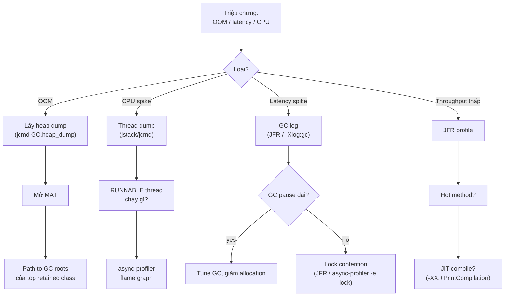

# 13 — Memory Leaks & Profiling

## 1. Định nghĩa & vai trò

Java có GC, nhưng **vẫn leak** được. Memory leak ở Java = object **vẫn còn reachable từ GC root**, nhưng app **không còn cần** đến nó. GC không thu được, heap tăng dần đến khi `OutOfMemoryError`.

Nắm vững leak patterns + profiling tools là kỹ năng senior bắt buộc — đa số production incident đều xoay quanh 4 nhóm vấn đề:

1. Memory leak → OOM.
2. CPU spike → thread / GC vấn đề.
3. Latency spike → GC pause / lock contention.
4. Throughput thấp → tối ưu code.

---

## 2. 8 patterns leak phổ biến

### 2.1. `static` collection / cache không bounded

```java
public class GlobalCache {
    public static final Map<String, byte[]> CACHE = new HashMap<>();
}
```

`static` field = GC root. Cache lớn dần → heap đầy.

**Fix**: dùng cache có policy (`Caffeine`, `Guava`), hoặc `WeakHashMap`/`SoftReference` cho cache giảm khi thiếu RAM, hoặc đặt limit + LRU.

### 2.2. `ThreadLocal` không cleanup

```java
private static final ThreadLocal<Connection> TL = new ThreadLocal<>();
```

Nếu thread sống lâu (thread pool!) — `Connection` không được set lại → giữ luôn. Khi webapp redeploy, `ThreadLocal` của classloader cũ vẫn còn trên thread pool của container → giữ classloader → leak metaspace.

**Fix**: gọi `tl.remove()` ở `finally`. Hoặc dùng pattern try-with-resources / interceptor cleanup.

### 2.3. Listener / callback không unregister

```java
eventBus.register(this);
// ... never unregister
```

Caller bị giữ qua eventBus reference. Common ở Swing, Spring `ApplicationListener`.

**Fix**: explicit `unregister`, hoặc weak listener pattern.

### 2.4. Internal class giữ reference outer

```java
class Outer {
    class Inner { ... }      // implicit reference Outer.this
    // hoặc anonymous: new Runnable() {}
    // hoặc lambda capture biến outer
}
```

Inner instance giữ Outer alive. Anonymous listener / Runnable submit vào thread pool sẽ giữ enclosing class hết life.

**Fix**: dùng `static` nested class khi không cần outer; lambda chỉ capture giá trị cần thiết.

### 2.5. JDBC `Driver` & app server redeploy

`DriverManager` giữ `Driver` qua `static` field. Khi redeploy webapp, app server không deregister driver → classloader webapp cũ không unload → leak Metaspace.

**Fix**: `ServletContextListener.contextDestroyed` deregister driver, hoặc dùng connection pool managed bởi app server (HikariCP).

### 2.6. Custom classloader (plugin, hot-reload)

Class instance giữ `Class<?>` → giữ `ClassLoader` → giữ mọi class & static field cũ.

**Fix**: clear mọi reference trước khi drop classloader; dùng `WeakReference` cho cache key bằng `Class<?>`.

### 2.7. Logging / String concatenation lưu trong appender buffer

`Logback`/`Log4j` giữ `Marker` per thread, MDC context — không clear → leak.

**Fix**: clear MDC trong filter/interceptor.

### 2.8. Direct buffer / NIO

`ByteBuffer.allocateDirect` cấp phát native. `Cleaner` chỉ chạy khi `DirectByteBuffer` bị GC. Nếu giữ reference (Netty `ByteBuf` không release) → tăng off-heap mãi.

**Fix**: gọi `ByteBuf.release()` đúng (Netty), set `-XX:MaxDirectMemorySize` để OOM sớm.

---

## 3. Các loại `OutOfMemoryError`

| Message | Vùng | Thường do |
|---------|------|----------|
| `Java heap space` | Heap | leak nói chung, allocation rate quá lớn so với `Xmx` |
| `GC overhead limit exceeded` | Heap | GC tốn > 98% CPU mà thu được < 2% heap → JVM bỏ cuộc |
| `Metaspace` | Metaspace | classloader leak, sinh proxy/CGLib quá nhiều |
| `Compressed class space` | Metaspace sub | giống trên, > 1 GB compressed klass |
| `Direct buffer memory` | Off-heap | NIO / Netty không release ByteBuf |
| `unable to create new native thread` | OS | hết FD/RAM/ulimit, thread pool quá nhiều |
| `Requested array size exceeds VM limit` | — | `new int[Integer.MAX_VALUE]` |
| `Out of swap space` | OS | hết RAM physical + swap |

Cờ bắt buộc trong production:

```bash
-XX:+HeapDumpOnOutOfMemoryError
-XX:HeapDumpPath=/var/log/heap-${HOSTNAME}-%p.hprof
-XX:OnOutOfMemoryError="kill -3 %p; /usr/local/bin/post-oom.sh %p"
```

---

## 4. Tool để chẩn đoán

### 4.1. Built-in CLI (đi kèm JDK)

| Tool | Use case |
|------|---------|
| `jps` | List JVM process & main class |
| `jstat` | Stats GC, class loading, JIT theo interval |
| `jstack` | Thread dump |
| `jmap` | Heap dump, histogram |
| `jcmd` | Multi-tool — gọi mọi diagnostic command |
| `jhsdb` | HotSpot Serviceability Agent — xem internal JVM (live hoặc core dump) |
| `jdeps` | Phụ thuộc giữa class/module |
| `jinfo` | In flag JVM của process |
| `jconsole` | GUI MBean monitor (built-in, đơn giản) |

### 4.2. `jcmd` — tool đa năng quan trọng nhất

```bash
$ jcmd <pid> help                                  # liệt kê command
$ jcmd <pid> VM.version
$ jcmd <pid> VM.flags                              # flag effective
$ jcmd <pid> VM.system_properties
$ jcmd <pid> Thread.print                          # thread dump (như jstack)
$ jcmd <pid> GC.heap_info                          # heap usage
$ jcmd <pid> GC.heap_dump /tmp/heap.hprof          # heap dump
$ jcmd <pid> GC.class_histogram                    # top class theo size/count
$ jcmd <pid> JFR.start duration=60s filename=app.jfr settings=profile
$ jcmd <pid> JFR.dump filename=now.jfr
$ jcmd <pid> JFR.stop
$ jcmd <pid> VM.native_memory summary             # NMT (cần khởi động với -XX:NativeMemoryTracking=summary)
$ jcmd <pid> Compiler.codecache                    # code cache stats
$ jcmd <pid> VM.classloader_stats                  # classloader leak debug
```

### 4.3. `jstat` — quan sát GC live

```bash
$ jstat -gcutil <pid> 1000
  S0     S1     E      O      M     CCS    YGC     YGCT    FGC    FGCT    GCT
  0.00  78.32  45.13  18.62  98.50  92.15    20    0.245     0    0.000   0.245
```

- `E`/`O`/`M` — % usage của Eden/Old/Metaspace.
- `YGC`/`YGCT` — số minor GC + thời gian.
- `FGC`/`FGCT` — full GC.

→ Nếu `O` tăng dần đến 100% rồi `FGC` liên tục mà `O` vẫn cao → leak.

### 4.4. Heap dump analysis

```bash
$ jcmd <pid> GC.heap_dump /tmp/heap.hprof
```

Mở bằng:

- **Eclipse MAT** (`Memory Analyzer Tool`) — best free tool. Tính năng:
  - **Histogram**: top class theo retained size.
  - **Dominator Tree**: cây ai giữ gì.
  - **Path to GC Roots**: vì sao object còn sống.
  - **Leak Suspects** report — auto suggest.
- **VisualVM** — built-in, GUI thân thiện hơn.
- **YourKit**, **JProfiler** — commercial, đầy đủ feature nhất.

### 4.5. Java Flight Recorder (`JFR`) + Mission Control (`JMC`)

`JFR` là profiler **always-on** của HotSpot, overhead < 1%. Ghi event:

- GC, allocation, method sample.
- Thread state, monitor contention.
- I/O, JIT, classloader.
- Custom event (app sinh).

```bash
$ jcmd <pid> JFR.start duration=2m filename=app.jfr settings=profile
$ jcmd <pid> JFR.stop
$ jmc app.jfr      # mở trong Mission Control
```

→ Là **first tool** cho production performance issue.

### 4.6. `async-profiler` (community)

[`async-profiler`](https://github.com/async-profiler/async-profiler) dùng AsyncGetCallTrace + perf events → không bị "safepoint bias" như `JFR sampler`.

```bash
$ ./profiler.sh -d 30 -f flame.html <pid>     # flame graph 30s
$ ./profiler.sh -e alloc -d 30 -f alloc.html <pid>   # allocation profile
$ ./profiler.sh -e lock -d 30 <pid>            # lock contention
```

→ Sinh **flame graph** SVG/HTML — đọc trực quan: trục X = thời gian, trục Y = call stack.

### 4.7. Tool khác

- **`jol`** — Java Object Layout. Đo size object, padding, header. `jol-cli`.
- **`jcstress`** — concurrency test framework.
- **`Arthas`** (Alibaba) — CLI diagnostic gắn vào JVM live, khám class/method/CPU/heap.
- **`BTrace`** — instrumentation runtime.
- **OS tools**: `top`, `htop`, `vmstat`, `iostat`, `pmap`, `lsof`, `strace`.
- **APM**: Datadog, Dynatrace, New Relic, Elastic APM, OpenTelemetry — production observability.

---

## 5. Demo: phát hiện & fix leak

### 5.1. Tạo leak

```java
public class Leak {
    static List<byte[]> CACHE = new ArrayList<>();

    public static void main(String[] args) throws Exception {
        for (int i = 0; ; i++) {
            CACHE.add(new byte[1024 * 1024]);   // 1 MB mỗi vòng
            if (i % 100 == 0) System.out.println("added " + i);
            Thread.sleep(10);
        }
    }
}
```

### 5.2. Quan sát

```bash
$ java -Xmx512m -Xlog:gc*:file=gc.log -XX:+HeapDumpOnOutOfMemoryError -XX:HeapDumpPath=/tmp Leak &
$ jps                              # tìm pid
$ jstat -gcutil <pid> 1000
```

→ `O` tăng dần đến 100% → GC overhead → OOM. JVM dump file `/tmp/java_pidXXX.hprof`.

### 5.3. Phân tích

Mở file `.hprof` trong MAT:

- **Leak Suspects** report → "Class `Leak` keeps `java.util.ArrayList` retaining ~512 MB".
- **Path to GC Roots** → `static` field `Leak.CACHE`.
- **Histogram** → `byte[]` retained 510 MB.

→ Fix: bound size, dùng cache library.

### 5.4. CPU profile với async-profiler

```bash
$ ./profiler.sh -d 30 -f cpu.html <pid>
```

Xem flame graph để biết hot path.

---

## 6. Thread dump analysis

```bash
$ jstack <pid> > thread.dump
$ jcmd <pid> Thread.print
```

Mỗi thread có state:

- `RUNNABLE` — đang chạy / đợi I/O.
- `BLOCKED` — đợi monitor.
- `WAITING` — `Object.wait`, `LockSupport.park`.
- `TIMED_WAITING` — `Thread.sleep`, `wait(ms)`.
- `NEW`, `TERMINATED`.

**Phát hiện deadlock**: `jstack` log ra `Found one Java-level deadlock:` + thread A đợi lock B, thread B đợi lock A.

**Tool**: [`fastthread.io`](https://fastthread.io) phân tích thread dump tự động — gắp deadlock, BLOCKED hot, thread leak.

---

## 7. Production checklist (senior view)

JVM flag mọi production app phải có:

```bash
# Heap
-Xms2g -Xmx2g                          # set bằng nhau
# hoặc trong container
-XX:MaxRAMPercentage=75.0
-XX:InitialRAMPercentage=75.0

# GC
-XX:+UseG1GC                           # hoặc ZGC/Generational
-XX:MaxGCPauseMillis=200

# OOM diagnostics
-XX:+HeapDumpOnOutOfMemoryError
-XX:HeapDumpPath=/var/log/heap

# Logging (J9+ unified)
-Xlog:gc*:file=/var/log/gc.log:time,uptime,level,tags:filecount=10,filesize=20M

# Optional: JFR always-on
-XX:StartFlightRecording=disk=true,maxsize=200m,maxage=1h,settings=profile

# Optional: Native Memory Tracking
-XX:NativeMemoryTracking=summary
```

Monitoring:

- **GC**: count, pause p50/p99, allocation rate.
- **Heap**: used / committed / max.
- **Threads**: count, BLOCKED count.
- **Latency**: p50/p95/p99 endpoint.
- **Error rate**: 5xx, exception count.

Alert ngưỡng:

- GC pause p99 > 500 ms.
- Heap used > 85% sau Full GC (gần OOM).
- Thread count tăng dần (leak).
- Metaspace > 80% limit.

---

## 8. Methodology — debug performance



---

## 9. Pitfall & best practice (senior view)

- **Heap dump trong production** tốn 1-2x heap size disk + freeze JVM vài giây. Kế hoạch trước: dump ở 1 node, không phải prod live. Hoặc dùng `jcmd GC.heap_dump_writer ...` (J17+) cho async dump nhỏ hơn.
- **Đừng restart server khi gặp OOM** — mất evidence. Cấu hình `HeapDumpOnOutOfMemoryError` để JVM dump trước khi chết.
- **Always-on JFR** với overhead < 1% — bật trong production.
- **APM tool** không thay thế JFR/async-profiler khi điều tra sâu.
- **Đừng kết luận từ 1 dump** — chụp 2 dump cách 5-10 phút, so sánh retained size.
- **Cache `Method`/`Field`** reflection.
- **Bound mọi cache** — không bao giờ `HashMap` không size limit. Dùng [Caffeine](https://github.com/ben-manes/caffeine).
- **`ThreadLocal.remove()`** trong filter/interceptor — đặc biệt khi dùng thread pool.
- **`DirectByteBuffer`**: monitor `BufferPoolMXBean` (`java.nio.BufferPool`).
- **GC log** rotate, lưu dài (≥ 7 ngày). Khi incident, đó là evidence sống còn.
- **Thread dump** chụp 3-5 lần cách 1-2 giây — thấy thread *sleep* 1 lần thì có thể trùng, *sleep* 5 lần thì nó đang stuck.

---

## 10. Câu hỏi phỏng vấn điển hình

1. Java có GC, sao vẫn leak được?
2. Liệt kê 5 patterns memory leak phổ biến.
3. `OOM Heap space` khác `OOM Metaspace` thế nào?
4. `ThreadLocal` leak xảy ra khi nào? Cách fix?
5. Webapp redeploy 10 lần OOM Metaspace — cause & fix?
6. Bạn chẩn đoán latency spike production thế nào?
7. JFR là gì? Nên bật trong production không?
8. `async-profiler` khác `JFR` ở điểm nào? (samping bias / safepoint)
9. Heap dump phân tích bằng tool gì? Đọc thế nào?
10. Lock contention chẩn đoán bằng cách nào?
11. Direct buffer leak phát hiện ra sao?
12. `jcmd` so với `jmap`/`jstack` — vì sao prefer `jcmd`?

---

## 11. Tham chiếu

- [Eclipse MAT](https://www.eclipse.org/mat/)
- [JDK Mission Control](https://jdk.java.net/jmc/)
- [`async-profiler`](https://github.com/async-profiler/async-profiler)
- [JFR Tutorial — Inside Java](https://inside.java/2020/06/29/event-streaming/)
- [JEP 328: Flight Recorder](https://openjdk.org/jeps/328)
- [JEP 349: JFR Event Streaming](https://openjdk.org/jeps/349)
- [JEP 519: Compact Object Headers (preview)](https://openjdk.org/jeps/519)
- *Java Performance: The Definitive Guide* (Scott Oaks).
- *Optimizing Java* (Ben Evans, James Gough, Chris Newland).
- [fastthread.io](https://fastthread.io), [gceasy.io](https://gceasy.io) — analyze online miễn phí.
