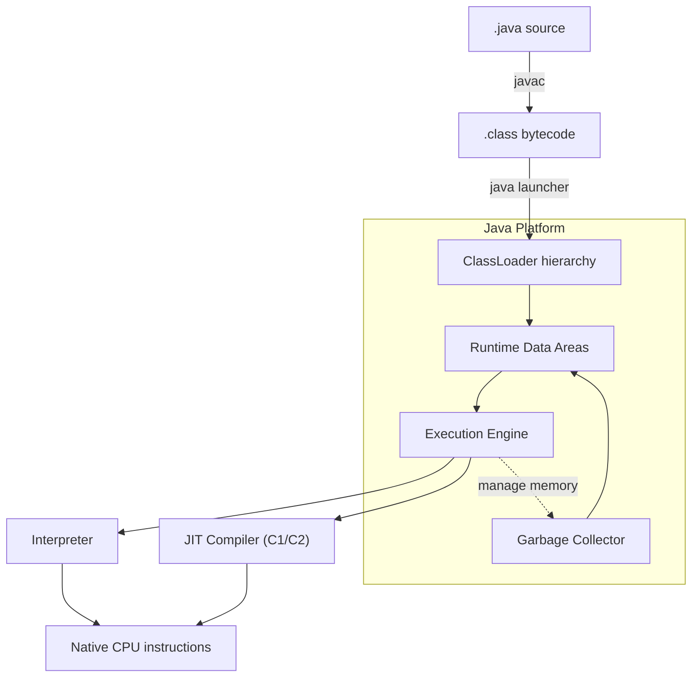
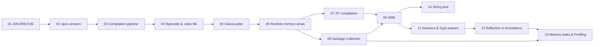

# Module 1 — Java Platform & JVM Concepts

> Bộ tài liệu nền tảng giúp bạn hiểu sâu cách Java vận hành **bên dưới** cú pháp — từ lúc viết `.java` đến khi code chạy trên CPU. Đây là phần kiến thức bắt buộc ở level **senior**.

---

## 1. Sơ đồ tổng quan Java Platform

**Quy trình tóm tắt**

1. `javac` biên dịch source `.java` ra `.class` chứa **JVM bytecode** (platform-independent).
2. Lệnh `java` khởi động **JVM**: nạp class qua `ClassLoader`, cấp phát các vùng nhớ (`Heap`, `Stack`, `Metaspace`, ...).
3. `Execution Engine` chạy bytecode — ban đầu **interpret**, sau đó các method "nóng" được `JIT` biên dịch sang native code.
4. `Garbage Collector` thu hồi object không còn reference trong `Heap`.

---

## 2. Mục lục — 13 chuyên đề

| # | File | Chủ đề | Độ ưu tiên |
|---|------|--------|------------|
| 01 | [01_jdk_jre_jvm.md](01_jdk_jre_jvm.md) | `JDK` vs `JRE` vs `JVM`, các bản phân phối | ★★★ |
| 02 | [02_java_versions.md](02_java_versions.md) | Timeline Java 8 → 21+, `LTS`, feature highlights | ★★★ |
| 03 | [03_compilation_pipeline.md](03_compilation_pipeline.md) | `.java` → `.class` → bytecode → JIT → native | ★★★ |
| 04 | [04_bytecode_classfile.md](04_bytecode_classfile.md) | Cấu trúc class file, `javap`, bytecode mnemonics | ★★ |
| 05 | [05_classloader.md](05_classloader.md) | `ClassLoader` hierarchy, parent delegation, class loading phases | ★★★ |
| 06 | [06_runtime_memory_areas.md](06_runtime_memory_areas.md) | `Heap`, `Stack`, `Metaspace`, `PC Register`, `Direct Memory` | ★★★ |
| 07 | [07_jit_compilation.md](07_jit_compilation.md) | Tiered compilation, inlining, escape analysis, `OSR` | ★★ |
| 08 | [08_garbage_collection.md](08_garbage_collection.md) | GC roots, generational, `Serial`/`Parallel`/`G1`/`ZGC`, reference types | ★★★ |
| 09 | [09_jmm.md](09_jmm.md) | Java Memory Model, `happens-before`, `volatile`, memory barriers | ★★★ |
| 10 | [10_string_pool.md](10_string_pool.md) | `String pool`, interning, immutability, compact strings | ★★ |
| 11 | [11_generics_type_erasure.md](11_generics_type_erasure.md) | Generics, `PECS`, wildcards, type erasure, bridge methods | ★★★ |
| 12 | [12_reflection_annotations.md](12_reflection_annotations.md) | Reflection API, custom annotations, annotation processing | ★★ |
| 13 | [13_memory_leaks_profiling.md](13_memory_leaks_profiling.md) | Memory leak patterns, OOM types, `jstat`/`jmap`/`JFR`/`async-profiler` | ★★★ |

---

## 3. Lộ trình học gợi ý

**Khuyến nghị**

- **Tuần 1**: 01 → 04 (làm chủ pipeline biên dịch & class file).
- **Tuần 2**: 05 → 08 (ClassLoader, memory areas, JIT, GC).
- **Tuần 3**: 09 → 13 (JMM, generics, reflection, profiling thực chiến).

---

## 4. Cấu trúc mỗi file

Mọi file con đều theo template thống nhất:

1. **Định nghĩa & vai trò** — câu trả lời ngắn gọn cho phỏng vấn.
2. **Cơ chế hoạt động** — sơ đồ + giải thích chi tiết.
3. **Code / CLI minh hoạ** — Java snippet, lệnh `javap`/`jstat`/`jmap`/...
4. **Pitfall & best practice** — góc nhìn senior, lỗi thường gặp.
5. **Câu hỏi phỏng vấn** — danh sách câu hỏi điển hình.
6. **Tham chiếu** — JEP, JLS, JVM spec.

---

## 5. Tài liệu tham chiếu chính

- *The Java Virtual Machine Specification* (JVMS) — Oracle.
- *The Java Language Specification* (JLS) — Oracle.
- *Effective Java* (3rd ed.) — Joshua Bloch.
- *Java Concurrency in Practice* — Brian Goetz.
- *Optimizing Java* — Benjamin Evans, James Gough, Chris Newland.
- [OpenJDK Wiki](https://wiki.openjdk.org/), [Inside Java](https://inside.java/), [JEPs](https://openjdk.org/jeps/).

> Sau khi đọc xong module 1, hãy chuyển sang [`SENIOR_ROADMAP.md`](../../SENIOR_ROADMAP.md) ở root project để xem các kiến thức bổ sung cần làm chủ ở module 2-9.
